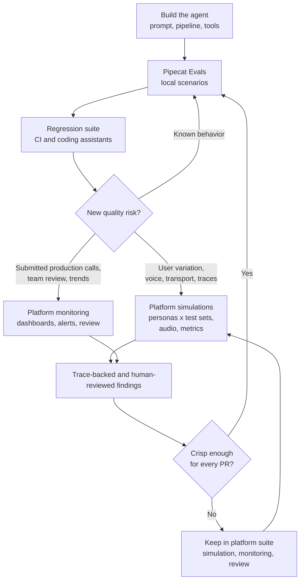

Pipecat Evals gives you a durable first layer for agent quality: fast, local,
repeatable checks for the behavior your agent should preserve as code, prompts,
models, and tools change. As the agent moves toward production, the evaluation
surface expands. You still keep local scenarios, but you may also add realistic
simulations, audio-signal metrics, trace-backed checks, submitted production
calls, and review workflows that product, QA, and operations teams can use.

The goal is not to replace local evals. The strongest teams keep both layers:

- **Pipecat Evals** for executable specifications close to the codebase.
- **An evaluation platform such as [Coval](/pipecat/evals/platforms/coval)** for
  production-like conversations, richer voice analysis, dashboards, monitoring,
  human review, and longitudinal quality trends. See the full [Third-party
  Platforms](/pipecat/evals/overview#production-evaluation) group for the
  available platform integrations.

## Lifecycle at a glance



## Start local

Use Pipecat Evals as soon as the agent has behavior you do not want to break.
This usually starts before deployment, while the agent still runs on a laptop or
in a pull request.

Good local evals look like small executable specs:

- "The agent greets on connect."
- "The agent remembers the user's name two turns later."
- "The agent calls `lookup_order` before answering an order-status question."
- "The agent recovers when the user interrupts a long answer."
- "The first response starts within the expected latency budget."

This is where Pipecat Evals is strongest. Text mode keeps the loop fast and
cheap while you iterate on prompts, logic, and function calling. Audio mode adds
an end-to-end check for VAD, STT, TTS, turn-taking, and speech transcription
before you merge or release.

Pipecat itself uses this kind of signal before every release: an eval suite
drives 100+ example agents end to end. The same pass/fail result is also useful
for coding assistants because it gives them a concrete command to run and a
clear failure artifact to fix against.

## Put local evals in CI

Once a few scenarios exist, run them on every meaningful change. The suite does
not have to be large to be useful. A small set of behavior-critical scenarios
gives engineers and coding assistants a clear pass/fail signal.

Use Pipecat Evals in CI when:

- The agent is still changing quickly.
- The question is "did this code or prompt change preserve a known behavior?"
- The expected behavior can be expressed as a scripted conversation.
- The failure should block a pull request.
- The debug artifact should live next to the code as a log or trace file.

As a rule of thumb, local evals should cover the sharp edges that are easy to
state and expensive to rediscover manually.

## When to add a platform

You are ready to add a platform when the risk you need to test no longer fits
entirely inside a small local scenario. Keep the Pipecat suite in place; the
platform complements it with broader coverage, shared workflows, and production
feedback.

| Signal                                                   | What is outside a local scenario's scope                                                                                                                          | What to add                                                                                                                    |
| -------------------------------------------------------- | ----------------------------------------------------------------------------------------------------------------------------------------------------------------- | ------------------------------------------------------------------------------------------------------------------------------ |
| The user path depends on realistic caller behavior       | Scripted turns prove one path, but they do not explore how different users phrase, interrupt, misunderstand, or recover                                           | Run simulated conversations with personas, edge cases, and adversarial behaviors                                               |
| Voice behavior is part of the product                    | A transcript can look correct even when the call had TTS loops, clipping, signal dropout, phoneme stretching, voice identity or timbre drift, or anomalous pauses | Add audio-signal metrics, Speech Artifact Score-style checks, and Audio LLM Judge-style metrics that evaluate the audio itself |
| The deployed transport matters                           | The local eval transport is ideal for development, but it is not the same as a deployed WebSocket, Pipecat Cloud, SIP, or telephony path                          | Test the deployed agent over the same integration path users will hit                                                          |
| The answer depends on hidden execution state             | The transcript shows what the agent said, not whether a tool actually succeeded, what arguments it used, or whether a downstream system failed                    | Evaluate traces, tool calls, span attributes, errors, timing, and custom numerical metrics from OpenTelemetry                  |
| Product, QA, or Operations need to participate           | YAML files and CI logs are engineer-friendly, but they are not a shared review workspace                                                                          | Use review queues, per-reviewer assignments, annotations, agreement scores, dashboards, and reports                            |
| The agent is live with users                             | Pre-merge checks do not tell you whether production quality is drifting or a new real-world failure mode appeared                                                 | Send production conversations to monitoring, score them over time, and alert on regressions                                    |
| You need deterministic audio regression                  | Synthesized audio mode is useful for the pipeline, but it does not replay the exact call or wording that exposed a previous issue                                 | Replay exact transcripts and pre-recorded audio test sets as fixed regression cases                                            |
| You need to compare releases, vendors, or configurations | A local pass/fail result is not enough for trend analysis or bake-offs                                                                                            | Persist runs, metrics, recordings, traces, and score distributions across versions                                             |

## Keep the boundary clear

Think of local evals as **behavioral unit tests for the agent**. Think of an
evaluation platform as **system testing and quality operations for the agent in
the world**.

<CardGroup cols={2}>
  <Card title="Use Pipecat Evals for" icon="terminal" iconType="duotone">
    Local development, pull-request gates, coding-assistant loops, scripted
    behavioral specs, function-call assertions, latency budgets, and fast text
    mode iteration.
  </Card>

  <Card
    title="Use an evaluation platform for"
    icon="flask-vial"
    iconType="duotone"
  >
    Multi-turn simulations, persona x test-set coverage, realistic voice and
    telephony paths, audio-signal metrics, trace metrics, submitted production
    calls, dashboards, human review, scheduled runs, and agent-native CLI, MCP,
    or skill-based workflows.
  </Card>
</CardGroup>

## Example: appointment booking

Suppose your Pipecat agent books appointments. Start with a local scenario that
protects the core behavior:

```yaml appointment_booking.yaml
name: appointment_booking

turns:
  - user: "Can you book me for Tuesday at 3 PM Pacific?"
    expect:
      - event: function_call
        calls:
          - name: book_appointment
            args:
              day: "Tuesday"
              time: "3 PM"
              timezone: "America/Los_Angeles"
      - event: response
        eval: "confirms the appointment request with the user"
```

This is exactly the kind of check you want in your repository. If a prompt edit
stops the tool call, CI should fail.

But before this agent handles real users, the quality question gets broader:

- What happens when the caller changes the time three turns later?
- Can the agent handle an impatient caller who interrupts while it is checking
  availability?
- Does the agent still work when the caller is in a noisy room?
- Did the booking API actually succeed, or did the agent only say that it did?
- Are users getting frustrated when the available slots are limited?
- Is the booking-success rate drifting after a model or voice-provider change?

Those are platform-level questions. The same booking flow can become a
simulation suite with multiple personas, test sets, voice conditions,
trace-backed tool metrics, dashboards, and submitted production-call monitoring.

## Use simulations for variation

Local scenarios are intentionally crisp. Platform simulations are useful when
you need many realistic variations around the same intent.

A persona defines **who** is calling: voice, accent, personality, background
sound, interruption rate, and emotional progression. A test set defines **what**
the caller is trying to do: book an appointment, recover a failed payment, or
attempt a system-prompt exfiltration. Composing persona and test-set coverage
turns one behavior into a realistic set of normal, edge-case, and adversarial
conversations.

For regressions that must be exact, use deterministic test sets: replay the
same transcript, scripted user turns, or pre-recorded audio that exposed the
issue.

## Validate traces, not just transcripts

Transcript-only evaluation is useful, but it can miss the most important class
of failures: the agent says the right thing while the underlying action failed.

For the appointment agent, a transcript might show:

> "You're all set for Tuesday at 3 PM."

That sentence is not enough evidence. A production-grade evaluation should also
verify that:

- `book_appointment` was called.
- The arguments matched the user's requested day, time, and timezone.
- The tool returned success before the agent confirmed the booking.
- No later span recorded an error, retry failure, or cancellation.

Send [OpenTelemetry](/api-reference/server/utilities/opentelemetry) traces to
the evaluation platform when you need this level of confidence. Trace-backed
metrics can evaluate tool-call counts, timing, error rates, span attributes, and
custom success criteria that are invisible from the transcript alone. Custom
trace metrics are especially useful for tool-heavy agents because they can pull
numerical values from any OpenTelemetry span and aggregate the same signal
across simulations and submitted production calls.

## Add human review when judgment matters

Automated judges are useful, but some quality bars need human calibration:

- Was the agent empathetic enough for a sensitive workflow?
- Did the conversation feel natural, not just correct?
- Was a borderline failure acceptable for launch?
- Are automated metrics aligned with how QA or Operations would score the call?

At that point, keep Pipecat Evals for the deterministic regression set and use a
platform workflow for review queues, per-reviewer assignments, and human
annotations. A mature review loop supports binary, numerical, categorical,
sentiment, and per-message labels; programmatic review creation through an API;
and agreement scores that show whether automated metrics match human judgment.

Human review should not replace automated evals. It should improve them by
turning ambiguous calls into better metrics, tighter ground truth, and better
future test cases.

## Close the loop

The lifecycle is circular:

1. Write local Pipecat scenarios for the behaviors you know.
2. Run them locally, in CI, and through coding-assistant loops.
3. Use platform simulations to explore broader user behavior, adversarial
   behaviors, and voice conditions.
4. Use traces and metrics to understand failures beneath the transcript.
5. Send production calls to monitoring to catch real-world regressions.
6. Promote stable lessons back into local Pipecat scenarios when they become
   crisp enough to test on every change.

Not every production failure should become a local YAML scenario. Some belong in
a scheduled simulation suite, a monitoring metric, or a human review project.
The useful question is: "Where will this failure be caught earliest next time?"

## Practical adoption path

Start small and grow in layers:

1. **Create 5-10 Pipecat scenarios** for the agent's most important scripted
   behaviors.
2. **Run the suite in CI** and require it before merging prompt, model, tool, or
   pipeline changes.
3. **Add audio-mode checks** before release for the flows most sensitive to STT,
   TTS, VAD, and turn-taking.
4. **Add platform simulations** when you need realistic multi-turn behavior,
   persona x test-set coverage, telephony or WebSocket coverage, dashboards, and
   audio-signal metrics.
5. **Instrument traces** for tool-heavy workflows so evaluations can verify what
   happened under the hood.
6. **Expose platform controls to your coding assistant** through CLI, MCP, or
   agent-skill surfaces so the same assistant that fixes local evals can launch
   simulations, inspect failures, and triage monitoring results.
7. **Send production calls to monitoring** once users are live, then turn
   recurring failures into new simulations, metrics, human-review projects, or
   local scenarios.

## Next steps

<CardGroup cols={2}>
  <Card
    title="Pipecat Evals Quickstart"
    icon="rocket"
    iconType="duotone"
    href="/pipecat/evals/quickstart"
  >
    Write and run the first local scenario against an existing agent.
  </Card>

<Card
  title="Third-party Platforms"
  icon="flask-vial"
  iconType="duotone"
  href="/pipecat/evals/overview#production-evaluation"
>
  Review the available platform integrations for simulation and monitoring.
</Card>

<Card
  title="Writing Scenarios"
  icon="file-pen"
  iconType="duotone"
  href="/pipecat/evals/scenarios"
>
  Learn the YAML format for turns, expectations, function calls, interruptions,
  latency budgets, and audio mode.
</Card>

  <Card
    title="Example Platform Setup"
    icon="diagram-project"
    iconType="duotone"
    href="/pipecat/evals/platforms/coval"
  >
    See one concrete setup path for simulations, monitoring, traces, and team
    review workflows.
  </Card>
</CardGroup>
