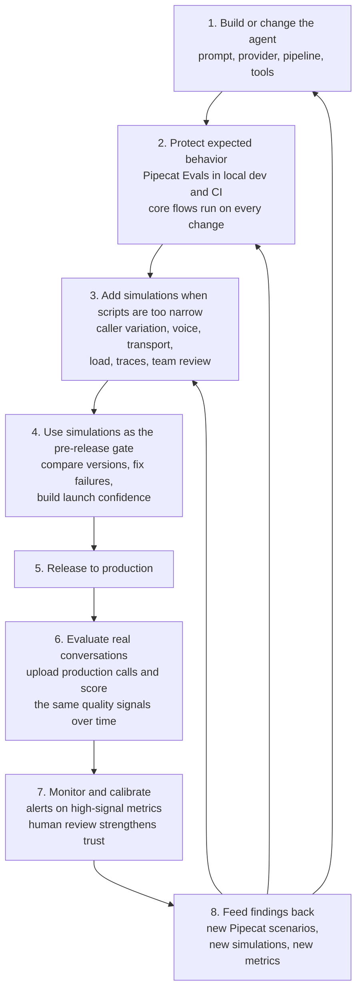

Pipecat Evals gives you a durable first layer for agent quality: fast, local,
repeatable checks for the behavior your agent should preserve as code, prompts,
models, and tools change. As the agent moves toward production, the evaluation
surface expands: local scenarios stay active, and realistic simulations,
audio-signal metrics, trace-backed checks, submitted production calls, and
review workflows give product, QA, and operations teams shared quality signals.

Strong evaluation programs keep both layers active:

- **Pipecat Evals** for executable specifications close to the codebase.
- **An evaluation platform such as [Coval](/pipecat/evals/platforms/coval)** for
  production-like conversations, richer voice analysis, dashboards, monitoring,
  human review, and longitudinal quality trends. See the full [Third-party
  Platforms](/pipecat/evals/overview#production-evaluation) group for the
  available platform integrations.

## Lifecycle at a glance



Read the loop from top to bottom. Pipecat Evals protect expected behaviors every
time the agent changes. Add simulations when confidence depends on coverage that
is hard to script locally: user phrasing, voice conditions, deployed transport,
load, traces, or cross-functional review. After release, evaluate production
conversations against the same quality signals, alert on high-signal metrics,
use human review to calibrate them, and turn production findings into the next
local scenarios, simulations, and metrics.

## Start local

Use Pipecat Evals as soon as the agent has behavior worth preserving.
This usually starts before deployment, while the agent still runs on a laptop or
in a pull request.

Good local evals look like small executable specs:

- "The agent greets on connect."
- "The agent remembers the user's name two turns later."
- "The agent calls `lookup_order` before answering an order-status question."
- "The agent recovers when the user interrupts a long answer."
- "The first response starts within the expected latency budget."

This is where Pipecat Evals is strongest. Text mode keeps the loop fast and
cheap while you iterate on prompts, logic, and function calling. Audio mode adds
an end-to-end check for VAD, STT, TTS, turn-taking, and speech transcription
before you merge or release.

The [Eval Suites](/pipecat/evals/suites) page describes Pipecat's own release
evals as a manifest with 100+ example agents. The same pass/fail result is also
useful for coding assistants because it gives them a concrete command to run and
a clear failure artifact to fix against.

## Put local evals in CI

Once a few scenarios exist, run them on every meaningful change. A small set of
behavior-critical scenarios gives engineers and coding assistants a clear
pass/fail signal.

Use Pipecat Evals in CI when:

- The agent is still changing quickly.
- The question is "did this code or prompt change preserve an expected behavior?"
- The expected behavior can be expressed as a scripted conversation.
- The failure should block a pull request.
- The debug artifact should live next to the code as a log or trace file.

As a rule of thumb, local evals should cover the sharp edges that are easy to
state and expensive to rediscover manually.

## When to add a simulation and evaluation platform

Add a platform when the risk you need to test extends beyond a small local
scenario. Keep the Pipecat suite in place, then layer on broader coverage,
shared workflows, and production feedback.

| Signal                                                   | What is outside Pipecat Evals scope                                                                                                                               | What to add                                                                                                                    |
| -------------------------------------------------------- | ----------------------------------------------------------------------------------------------------------------------------------------------------------------- | ------------------------------------------------------------------------------------------------------------------------------ |
| The user path depends on realistic caller behavior       | Scripted turns prove one path while leaving user phrasing, interruptions, misunderstandings, and recovery behavior open                                           | Expand coverage with varied caller behavior, edge-case scenarios, and abuse attempts                                           |
| Voice behavior is part of the product                    | A transcript can look correct even when the call had TTS loops, clipping, signal dropout, phoneme stretching, voice identity or timbre drift, or anomalous pauses | Add audio-signal metrics, Speech Artifact Score-style checks, and Audio LLM Judge-style metrics that evaluate the audio itself |
| The deployed transport matters                           | The local eval transport is ideal for development; deployed WebSocket, Pipecat Cloud, SIP, and telephony paths add integration behavior                           | Test the deployed agent over the same integration path users will hit                                                          |
| Traffic volume and concurrency matter                    | Local suites give fast release feedback; launch readiness also depends on sustained sessions, burst traffic, queueing, and service limits                         | Load test the production-like path and track concurrency, latency, error rates, queueing, and resource saturation              |
| The answer depends on hidden execution state             | The transcript shows what the agent said, while traces show tool success, arguments, downstream errors, and timing                                                | Evaluate traces, tool calls, span attributes, errors, timing, and custom numerical metrics from OpenTelemetry                  |
| Product, QA, or Operations need to participate           | YAML files and CI logs serve engineers best; shared review workspaces serve cross-functional teams                                                                | Use review queues, per-reviewer assignments, annotations, agreement scores, dashboards, and reports                            |
| The agent is live with users                             | Pre-merge checks leave production quality drift and new real-world failure modes for production monitoring                                                        | Send production conversations to monitoring, score them over time, and alert on regressions                                    |
| You need deterministic audio regression                  | Synthesized audio mode exercises the pipeline; exact transcripts and recorded audio preserve the call or wording that exposed a previous issue                    | Replay exact transcripts and pre-recorded audio as fixed regression cases                                                      |
| You need to compare releases, vendors, or configurations | Local pass/fail results give release gates; trend analysis and bake-offs need persisted history                                                                   | Persist runs, metrics, recordings, traces, and score distributions across versions                                             |

## Choose the right layer

Think of local evals as **behavioral unit tests for the agent**. Think of an
evaluation platform as **system testing and quality operations for the agent in
the world**.

<CardGroup cols={2}>
  <Card title="Use Pipecat Evals for" icon="terminal" iconType="duotone">
    Local development, pull-request gates, coding-assistant loops, scripted
    behavioral specs, function-call assertions, latency budgets, and fast text
    mode iteration.
  </Card>

  <Card
    title="Use an evaluation platform for"
    icon="flask-vial"
    iconType="duotone"
  >
    Multi-turn simulations, caller variation, realistic voice and telephony
    paths, audio-signal metrics, trace metrics, submitted production calls,
    dashboards, human review, scheduled runs, and agent-native CLI, MCP, or
    skill-based workflows.
  </Card>
</CardGroup>

## Example: appointment booking

Suppose your Pipecat agent books appointments. Start with a local scenario that
protects the core behavior:

```yaml appointment_booking.yaml
name: appointment_booking

turns:
  - user: "Can you book me for Tuesday at 3 PM Pacific?"
    expect:
      - event: function_call
        calls:
          - name: book_appointment
            args:
              day: "Tuesday"
              time: "3 PM"
              timezone: "America/Los_Angeles"
      - event: response
        eval: "confirms the appointment request with the user"
```

This is exactly the kind of check you want in your repository. If a prompt edit
stops the tool call, CI should fail.

Before this agent handles real users, the quality question gets broader:

- What happens when the caller changes the time three turns later?
- Can the agent handle an impatient caller who interrupts while it is checking
  availability?
- Does the agent still work when the caller is in a noisy room?
- Did the booking API actually succeed, or did the agent only say that it did?
- Are users getting frustrated when the available slots are limited?
- Is the booking-success rate drifting after a model or voice-provider change?

Those are platform-level questions. The same booking flow can become a
simulation suite that varies caller goals, phrasing, interruptions, voice
conditions, transport paths, load, and tool outcomes before launch. After
launch, production conversations can feed monitoring, review, and future
regression coverage.

## Simulate before launch

Local scenarios are intentionally crisp. Platform simulations broaden the same
flow across realistic user variation, voice conditions, transport paths, load,
abuse attempts, and tool behavior.

For regressions that need exact replay, use fixed transcripts, scripted turns,
or pre-recorded audio. For tool-heavy flows, include traces so evaluation can
check what happened under the transcript: tool calls, arguments, span
attributes, errors, timing, and custom numerical metrics from
[OpenTelemetry](/api-reference/server/utilities/opentelemetry).

For the appointment agent, a transcript might show:

> "You're all set for Tuesday at 3 PM."

A simulation can also check that `book_appointment` was called with the
requested day, time, and timezone, that the tool returned success, and that later
spans stayed clear of errors, retry failures, and cancellations.

When judgment matters, route selected conversations to human review. Review
queues, labels, assignments, and agreement scores turn ambiguous calls into
better metrics, tighter ground truth, and better future cases.

## Monitor production conversations

Once users are live, send completed production conversations to the platform for
monitoring. Score the same quality signals over time, route ambiguous calls into
review, and track trends by agent version, transport, scenario, and customer
segment.

## Feed findings back into tests

Production monitoring and human review should create the next evaluation inputs:
new local Pipecat scenarios for crisp regressions, new simulation cases for
broader user behavior, new trace metrics for hidden tool failures, and new
monitoring metrics for recurring production patterns.

## Practical adoption path

Start small and grow in layers:

1. **Create 5-10 Pipecat scenarios** for the agent's most important scripted
   behaviors.
2. **Run the suite in CI** and require it before merging prompt, model, tool, or
   pipeline changes.
3. **Add audio-mode checks** before release for the flows most sensitive to STT,
   TTS, VAD, and turn-taking.
4. **Add platform simulations** when you need realistic multi-turn behavior,
   varied callers, telephony or WebSocket coverage, load testing, trace checks,
   and audio-signal metrics.
5. **Instrument traces** for tool-heavy workflows so evaluations can verify what
   happened under the hood.
6. **Expose platform controls to your coding assistant** through CLI, MCP, or
   agent-skill surfaces so the same assistant that fixes local evals can launch
   simulations, inspect failures, and triage monitoring results.
7. **Send production calls to monitoring** once users are live, then turn
   recurring failures into new simulations, metrics, human-review projects, or
   local scenarios.

## Next steps

<CardGroup cols={2}>
  <Card
    title="Pipecat Evals Quickstart"
    icon="rocket"
    iconType="duotone"
    href="/pipecat/evals/quickstart"
  >
    Write and run the first local scenario against an existing agent.
  </Card>

<Card
  title="Third-party Platforms"
  icon="flask-vial"
  iconType="duotone"
  href="/pipecat/evals/overview#production-evaluation"
>
  Review the available platform integrations for simulation and monitoring.
</Card>

<Card
  title="Writing Scenarios"
  icon="file-pen"
  iconType="duotone"
  href="/pipecat/evals/scenarios"
>
  Learn the YAML format for turns, expectations, function calls, interruptions,
  latency budgets, and audio mode.
</Card>

  <Card
    title="Example Platform Setup"
    icon="diagram-project"
    iconType="duotone"
    href="/pipecat/evals/platforms/coval"
  >
    See one concrete setup path for simulations, monitoring, traces, and team
    review workflows.
  </Card>
</CardGroup>
