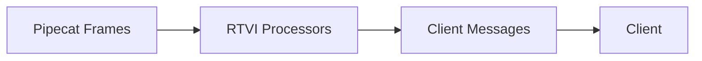

Pipecat's client SDKs and server implement the RTVI (Real-Time Voice Interaction) standard for real-time voice and multimodal applications. RTVI provides a common protocol for handling voice, text, and other multimodal interactions between clients and servers.

<CardGroup cols={2}>
  <Card title="Speaking States" icon="microphone">
    Track when users and bots start/stop speaking for natural turn-taking
  </Card>

<Card title="Transcription" icon="closed-captioning">
  Handle real-time transcriptions from both users and bots
</Card>

<Card title="LLM Processing" icon="brain">
  Manage LLM responses and function calls with proper client notifications
</Card>

  <Card title="TTS Management" icon="waveform-lines">
    Control text-to-speech state and audio delivery
  </Card>
</CardGroup>

## How It Works

RTVI uses a pipeline of specialized processors to convert internal Pipecat frames into standardized messages that clients can understand:



Each processor handles a specific aspect of the conversation:

1. **Speaking State** - Tracks when users and bots are speaking
2. **Transcription** - Converts speech to text in real-time
3. **LLM** - Append or replace LLM context
4. **Metrics** - Collects performance data

## Basic Example

Here's a simple example showing how to set up RTVI processors:

```python
from pipecat.processors.rtvi import (
    RTVIProcessor,
    RTVISpeakingProcessor,
    RTVIUserTranscriptionProcessor,
    RTVIBotLLMProcessor,
    RTVIBotTTSProcessor
)

# Create processors
rtvi_speaking = RTVISpeakingProcessor() # Speaking state changes
rtvi_user_transcription = RTVIUserTranscriptionProcessor() # User speech transcription
rtvi_bot_transcription = RTVIBotTranscriptionProcessor() # Bot speech transcription

# Chain them together in a pipeline
processors = [
    transport.input(),
    rtvi_speaking,
    stt,                      # Speech-to-text
    rtvi_user_transcription,  # User transcription
    user_aggregator,          # User context aggregation
    llm,                      # Language model
    rtvi_bot_transcription,   # Bot transcription
    tts,                      # Text-to-speech
    transport.output()
]

pipeline = Pipeline(processors)

# Start the bot
await rtvi.set_bot_ready()
```

## Key Components

### RTVIProcessor

The main coordinator that manages:

- Client communication
- Service configuration
- Action execution
- Function calls

[Learn more about RTVIProcessor →](/guides/rtvi/rtvi-processor)

### Frame Processors

Specialized processors that handle different aspects of the conversation:

- `RTVISpeakingProcessor` - Speaking state changes
- `RTVIUserTranscriptionProcessor` - User speech transcription
- `RTVIBotTranscriptionProcessor` - Bot speech transcription
- `RTVIBotLLMProcessor` - Language model responses
- `RTVIBotTTSProcessor` - Text-to-speech processing
- `RTVIMetricsProcessor` - Performance metrics

[Learn more about Frame Processors →](/guides/rtvi/frame-processors)

## Next Steps

<CardGroup cols={2}>
  <Card 
    title="RTVIProcessor" 
    icon="gear"
    href="/server/frameworks/rtvi/rtvi-processor">
    Learn how to configure and manage RTVI services and actions
  </Card>

  <Card 
    title="Frame Processors" 
    icon="microchip"
    href="/server/frameworks/rtvi/frame-processors">
    Explore the specialized processors for handling different conversation aspects
  </Card>
</CardGroup>
