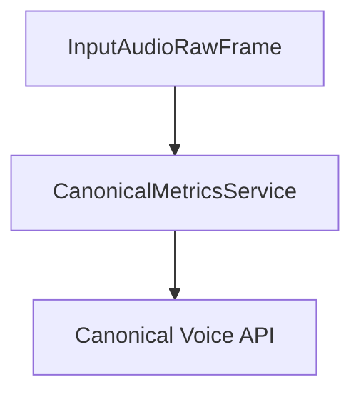

## Overview

`CanonicalMetricsService` processes conversation audio and uploads it to Canonical Voice API for analysis. It works in conjunction with an `AudioBufferProcessor` to capture and process the conversation audio.

## Installation

To use `CanonicalMetricsService`, install the required dependencies:

```bash
pip install "pipecat-ai[canonical]"
```

You'll also need to set up your Canonical API key as an environment variable: `CANONICAL_API_KEY`

<Tip>
  You can obtain a Daily API key by signing up at [Canonical
  AI](https://voice.canonical.chat/).
</Tip>

## Configuration

### Constructor Parameters

<ParamField path="aiohttp_session" type="aiohttp.ClientSession" required>
  HTTP client session for API communication
</ParamField>

<ParamField path="audio_buffer_processor" type="AudioBufferProcessor" required>
  Processor instance for handling audio buffers
</ParamField>

<ParamField path="call_id" type="str" required>
  Unique identifier for the call, used to match calls in Canonical Voice system
</ParamField>

<ParamField path="assistant" type="str" required>
  Identifier for the AI assistant, used for grouping and distinguishing between
  different assistants
</ParamField>

<ParamField path="api_key" type="str" required>
  Canonical Voice API key
</ParamField>

<ParamField
  path="api_url"
  type="str"
  default="https://voiceapp.canonical.chat/api/v1"
>
  Canonical Voice API endpoint
</ParamField>

<ParamField path="assistant_speaks_first" type="bool" default="True">
  Indicates if the assistant speaks first in the conversation
</ParamField>

<ParamField path="output_dir" type="str" default="recordings">
  Directory to save temporary audio files
</ParamField>

<ParamField path="context" type="OpenAILLMContext" default="None">
  Context for the conversation, including messages and transcript
</ParamField>

## Usage Example

```python
from pipecat.processors.audio.audio_buffer_processor import AudioBufferProcessor
from pipecat.services.canonical.metrics import CanonicalMetricsService
from pipecat.services.openai.llm import OpenAILLMService
from pipecat.services.elevenlabs.tts import ElevenLabsTTSService
from pipecat.processors.aggregators.openai_llm_context import OpenAILLMContext
from pipecat.transports.services.daily import DailyParams, DailyTransport

async def create_analytics_pipeline():

    # Configure session
    async with aiohttp.ClientSession() as session:

    transport = DailyTransport(
        room_url,
        token,
        "Chatbot",
        DailyParams(
            audio_out_enabled=True,
            audio_in_enabled=True,
            video_out_enabled=False,
            vad_analyzer=SileroVADAnalyzer(),
            transcription_enabled=True,
        ),
    )

    tts = ElevenLabsTTSService(
        api_key=os.getenv("ELEVENLABS_API_KEY"),
    )

    llm = OpenAILLMService(api_key=os.getenv("OPENAI_API_KEY"), model="gpt-4o")

    messages = [
        {
            "role": "system",
            "content": "You are Chatbot, a friendly, helpful robot. Your goal is to demonstrate your capabilities in a succinct way. Your output will be converted to audio so don't include special characters in your answers. Respond to what the user said in a creative and helpful way, but keep your responses brief. Start by introducing yourself. Keep all your responses to 12 words or fewer.",
        },
    ]

    context = OpenAILLMContext(messages)
    context_aggregator = llm.create_context_aggregator(context)

    # Create audio buffer processor
    audio_buffer = AudioBufferProcessor(num_channels=2)

    # Configure service
    metrics_service = CanonicalMetricsService(
        aiohttp_session=session,
        audio_buffer_processor=audio_buffer,
        call_id="unique-call-id",
        assistant="assistant-name",
        api_key="your-canonical-api-key",
        assistant_speaks_first=True,
        context=context,
    )

    # Use in pipeline
    pipeline = Pipeline([
        transport.input(),
        context_aggregator.user(),
        llm,
        tts,
        transport.output(),
        audio_buffer,          # Capture audio
        metrics_service,       # Process and upload recordings
        context_aggregator.assistant(),
    ])
```

## File Management

The service manages audio files in the following way:

1. Creates temporary WAV files in the specified output directory
2. Uses multipart upload for efficient file transfer
3. Automatically cleans up temporary files after successful upload

### File Naming Convention

```python
# Format: YYYYMMDD_HHMMSS-{uuid}.wav
"20240315_143022-a1b2c3d4e5f6.wav"
```

## Upload Process

The service uses a three-step upload process:

1. **Request Upload**

   - Requests presigned URLs for multipart upload
   - Calculates required parts based on file size

2. **Upload Parts**

   - Splits file into 5MB chunks
   - Uploads each part using presigned URLs
   - Collects ETags for verification

3. **Complete Upload**
   - Finalizes the upload
   - Associates recording with call and assistant metadata

## Frame Flow



## Error Handling

The service includes comprehensive error handling:

- Validates API responses
- Handles upload failures
- Manages temporary file cleanup
- Reports errors through logging

```python
try:
    await metrics_service.process_frame(frame)
except Exception as e:
    logger.error(f"Metrics processing error: {e}")
```

## Notes

- Requires sufficient disk space for temporary files
- Uses multipart upload for files larger than 5MB
- Automatically manages temporary file cleanup
- Supports conversation analysis and metrics
- Handles both assistant and user audio
- Includes metadata about conversation flow
