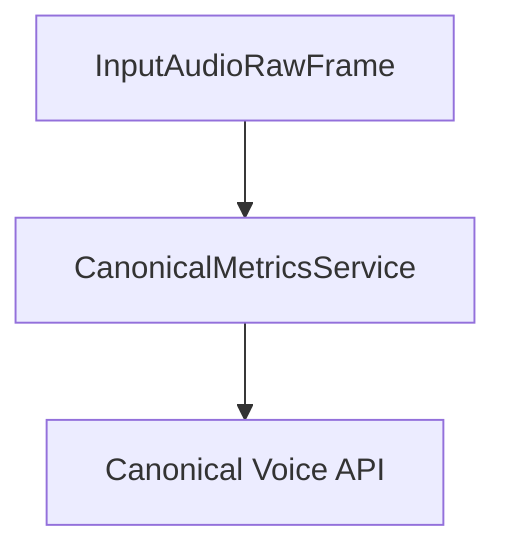

## Overview

`CanonicalMetricsService` processes conversation audio and uploads it to Canonical Voice API for analysis. It works in conjunction with an `AudioBufferProcessor` to capture and process the conversation audio.

## Installation

To use `CanonicalMetricsService`, install the required dependencies:

```bash
pip install pipecat-ai[canonical]
```

You'll also need to set up your Canonical API key as an environment variable: `CANONICAL_API_KEY`

<Tip>
  You can obtain a Daily API key by signing up at [Canonical
  AI](https://voice.canonical.chat/).
</Tip>

## Configuration

### Constructor Parameters

<ParamField path="aiohttp_session" type="aiohttp.ClientSession" required>
  HTTP client session for API communication
</ParamField>

<ParamField path="audio_buffer_processor" type="AudioBufferProcessor" required>
  Processor instance for handling audio buffers
</ParamField>

<ParamField path="call_id" type="str" required>
  Unique identifier for the call, used to match calls in Canonical Voice system
</ParamField>

<ParamField path="assistant" type="str" required>
  Identifier for the AI assistant, used for grouping and distinguishing between
  different assistants
</ParamField>

<ParamField path="api_key" type="str" required>
  Canonical Voice API key
</ParamField>

<ParamField
  path="api_url"
  type="str"
  default="https://voiceapp.canonical.chat/api/v1"
>
  Canonical Voice API endpoint
</ParamField>

<ParamField path="assistant_speaks_first" type="bool" default="True">
  Indicates if the assistant speaks first in the conversation
</ParamField>

<ParamField path="output_dir" type="str" default="recordings">
  Directory to save temporary audio files
</ParamField>

## Usage Example

```python
from pipecat.services.analytics import CanonicalMetricsService
from pipecat.processors.audio import AudioBufferProcessor

async def create_analytics_pipeline():
    # Configure session
    async with aiohttp.ClientSession() as session:
        # Create audio buffer processor
        audio_buffer = AudioBufferProcessor()

        # Configure service
        metrics_service = CanonicalMetricsService(
            aiohttp_session=session,
            audio_buffer_processor=audio_buffer,
            call_id="unique-call-id",
            assistant="assistant-name",
            api_key="your-canonical-api-key",
            assistant_speaks_first=True
        )

        # Use in pipeline
        pipeline = Pipeline([
            transport.input(),
            audio_buffer,          # Capture audio
            stt_service,
            llm_service,
            tts_service,
            metrics_service,       # Process and upload recordings
            transport.output()
        ])
```

## File Management

The service manages audio files in the following way:

1. Creates temporary WAV files in the specified output directory
2. Uses multipart upload for efficient file transfer
3. Automatically cleans up temporary files after successful upload

### File Naming Convention

```python
# Format: YYYYMMDD_HHMMSS-{uuid}.wav
"20240315_143022-a1b2c3d4e5f6.wav"
```

## Upload Process

The service uses a three-step upload process:

1. **Request Upload**

   - Requests presigned URLs for multipart upload
   - Calculates required parts based on file size

2. **Upload Parts**

   - Splits file into 5MB chunks
   - Uploads each part using presigned URLs
   - Collects ETags for verification

3. **Complete Upload**
   - Finalizes the upload
   - Associates recording with call and assistant metadata

## Frame Flow



## Error Handling

The service includes comprehensive error handling:

- Validates API responses
- Handles upload failures
- Manages temporary file cleanup
- Reports errors through logging

```python
try:
    await metrics_service.process_frame(frame)
except Exception as e:
    logger.error(f"Metrics processing error: {e}")
```

## Notes

- Requires sufficient disk space for temporary files
- Uses multipart upload for files larger than 5MB
- Automatically manages temporary file cleanup
- Supports conversation analysis and metrics
- Handles both assistant and user audio
- Includes metadata about conversation flow
