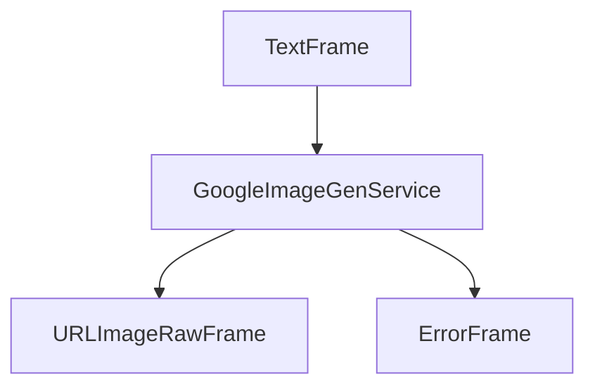

## Overview

`GoogleImageGenService` provides high-quality image generation capabilities using Google's Imagen models. It supports generating multiple images from text prompts with various customization options.

## Installation

To use `GoogleImageGenService`, install the required dependencies:

```bash
pip install pipecat-ai[google]
```

You'll also need to set up your Google API key as an environment variable: `GOOGLE_API_KEY`

## Configuration

### Constructor Parameters

<ParamField path="params" type="InputParams" default="InputParams()">
  Generation parameters configuration
</ParamField>

<ParamField path="api_key" type="str" required>
  Google API key for authentication
</ParamField>

### Input Parameters

<ParamField path="number_of_images" type="int" default="1">
  Number of images to generate (1-8)
</ParamField>

<ParamField path="model" type="str" default="imagen-3.0-generate-002">
  Model identifier
</ParamField>

<ParamField path="negative_prompt" type="str" default="None">
  Elements to exclude from generation
</ParamField>

## Input

The service accepts text prompts through its image generation pipeline.

## Output Frames

### URLImageRawFrame

<ParamField path="url" type="string">
  Generated image URL (null for Google implementation as it returns raw bytes)
</ParamField>

<ParamField path="image" type="bytes">
  Raw image data
</ParamField>

<ParamField path="size" type="tuple">
  Image dimensions (width, height)
</ParamField>

<ParamField path="format" type="string">
  Image format (e.g., 'JPEG')
</ParamField>

### ErrorFrame

<ParamField path="error" type="string">
  Error information if generation fails
</ParamField>

## Usage Example

```python
from pipecat.services.google import GoogleImageGenService

# Configure service
image_gen = GoogleImageGenService(
    api_key="your-google-api-key",
    params=GoogleImageGenService.InputParams(
        number_of_images=2,
        model="imagen-3.0-generate-002",
        negative_prompt="blurry, distorted, low quality"
    )
)

# Use in pipeline
main_pipeline = Pipeline(
    [
        transport.input(),
        context_aggregator.user(),
        llm_service,
        image_gen,
        tts_service,
        transport.output(),
        context_aggregator.assistant(),
    ]
)
```

## Frame Flow



## Metrics Support

The service supports metrics collection:

- Time to First Byte (TTFB)
- Processing duration
- API response metrics

## Model Support

Google's Imagen service offers different model variants:

| Model ID                | Description                                   |
| ----------------------- | --------------------------------------------- |
| imagen-3.0-generate-002 | Latest Imagen model with high-quality outputs |

See other available models in [Google's Imagen documentation](https://cloud.google.com/vertex-ai/generative-ai/docs/model-reference/imagen-api).

## Error Handling

```python
try:
    async for frame in service.run_image_gen(prompt):
        if isinstance(frame, ErrorFrame):
            handle_error(frame.error)
except Exception as e:
    logger.error(f"Image generation error: {e}")
```
