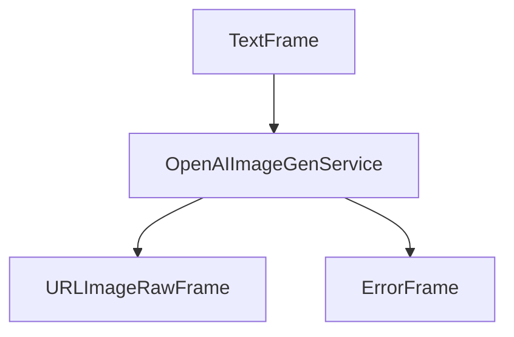

## Overview

`OpenAIImageGenService` provides high-quality image generation capabilities using OpenAI's DALL-E models. It transforms text prompts into images with various size options and model configurations.

## Installation

No additional installation is required for the `OpenAIImageGenService` as it is part of the Pipecat AI package.

You'll also need an OpenAI API key for authentication.

## Configuration

### Constructor Parameters

<ParamField path="api_key" type="str" required>
  OpenAI API key for authentication
</ParamField>

<ParamField path="base_url" type="str" default="None">
  Optional base URL for OpenAI API requests
</ParamField>

<ParamField path="aiohttp_session" type="aiohttp.ClientSession" required>
  HTTP session for making requests
</ParamField>

<ParamField path="image_size" type="str" required>
  Image dimensions - one of "256x256", "512x512", "1024x1024", "1792x1024",
  "1024x1792"
</ParamField>

<ParamField path="model" type="str" default="dall-e-3">
  OpenAI model identifier for image generation
</ParamField>

## Input

The service accepts text prompts through its image generation pipeline.

## Output Frames

### URLImageRawFrame

<ParamField path="url" type="string">
  Generated image URL from OpenAI
</ParamField>

<ParamField path="image" type="bytes">
  Raw image data
</ParamField>

<ParamField path="size" type="tuple">
  Image dimensions (width, height)
</ParamField>

<ParamField path="format" type="string">
  Image format (e.g., 'JPEG')
</ParamField>

### ErrorFrame

<ParamField path="error" type="string">
  Error information if generation fails
</ParamField>

## Usage Example

```python
import aiohttp
from pipecat.pipeline.pipeline import Pipeline
from pipecat.services.openai.image import OpenAIImageGenService

# Create an aiohttp session
aiohttp_session = aiohttp.ClientSession()

# Configure service
image_gen = OpenAIImageGenService(
    api_key="your-openai-api-key",
    aiohttp_session=aiohttp_session,
    image_size="1024x1024",
    model="dall-e-3"
)

# Use in pipeline
main_pipeline = Pipeline(
    [
        transport.input(),
        context_aggregator.user(),
        llm_service,
        image_gen,
        tts_service,
        transport.output(),
        context_aggregator.assistant(),
    ]
)
```

## Frame Flow



## Metrics Support

The service supports metrics collection:

- Time to First Byte (TTFB)
- Processing duration
- API response metrics

## Model Support

OpenAI's image generation service offers different model variants:

| Model ID | Description                                                         |
| -------- | ------------------------------------------------------------------- |
| dall-e-3 | Latest DALL-E model with higher quality and better prompt following |
| dall-e-2 | Previous generation model with good quality and lower cost          |

## Image Size Options

| Size Option | Aspect Ratio | Description                      |
| ----------- | ------------ | -------------------------------- |
| 256x256     | 1:1          | Small square image               |
| 512x512     | 1:1          | Medium square image              |
| 1024x1024   | 1:1          | Large square image               |
| 1792x1024   | 16:9         | Horizontal/landscape orientation |
| 1024x1792   | 9:16         | Vertical/portrait orientation    |

## Error Handling

```python
try:
    async for frame in image_gen.run_image_gen(prompt):
        if isinstance(frame, ErrorFrame):
            logger.error(f"Image generation error: {frame.error}")
        else:
            # Process successful image generation
            pass
except Exception as e:
    logger.error(f"Unexpected error during image generation: {e}")
```
