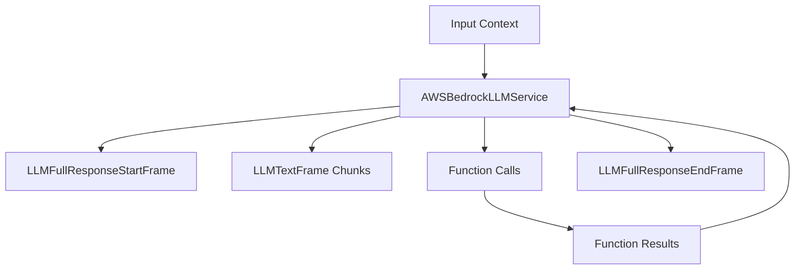

## Overview

`AWSBedrockLLMService` provides integration with Amazon Bedrock models, including Anthropic Claude and Amazon Titan models. It supports streaming responses, function calling, and multimodal inputs with specialized context handling for AWS Bedrock's message format while maintaining compatibility with OpenAI-style contexts.

## Installation

To use `AWSBedrockLLMService`, install the required dependencies:

```bash
pip install "pipecat-ai[aws]"
```

You'll also need to set up your AWS credentials as environment variables:

- `AWS_ACCESS_KEY_ID`
- `AWS_SECRET_ACCESS_KEY`
- `AWS_SESSION_TOKEN` (if using temporary credentials)
- `AWS_REGION` (defaults to "us-east-1")

<Tip>
  You can obtain AWS credentials by setting up an IAM user with access to Amazon
  Bedrock in your AWS account.
</Tip>

## Configuration

### Constructor Parameters

<ParamField path="aws_access_key" type="str" optional>
  Your AWS access key ID (can also use environment variable)
</ParamField>

<ParamField path="aws_secret_key" type="str" optional>
  Your AWS secret access key (can also use environment variable)
</ParamField>

<ParamField path="aws_session_token" type="str" optional>
  Your AWS session token for temporary credentials (can also use environment
  variable)
</ParamField>

<ParamField path="aws_region" type="str" default="us-east-1">
  AWS region to use for Bedrock service
</ParamField>

<ParamField path="model" type="str" required>
  Bedrock model identifier (e.g., "us.anthropic.claude-3-5-haiku-20241022-v1:0")
</ParamField>

<ParamField path="params" type="InputParams" optional>
  Model configuration parameters
</ParamField>

<ParamField path="client_config" type="Config" optional>
  AWS Boto3 client configuration
</ParamField>

### Input Parameters

<ParamField path="max_tokens" type="Optional[int]" default="4096">
  Maximum number of tokens to generate. Must be greater than or equal to 1.
</ParamField>

<ParamField path="temperature" type="Optional[float]" default="0.7">
  Controls randomness in the output. Range: [0.0, 1.0].
</ParamField>

<ParamField path="top_p" type="Optional[float]" default="0.999">
  Controls diversity via nucleus sampling. Range: [0.0, 1.0].
</ParamField>

<ParamField path="stop_sequences" type="Optional[List[str]]" default="[]">
  Sequences where the model will stop generating further tokens.
</ParamField>

<ParamField path="latency" type="Optional[str]" default="standard">
  Response latency preference. Options: "standard" or "optimized".
</ParamField>

<ParamField
  path="additional_model_request_fields"
  type="Optional[Dict[str, Any]]"
  default="{}"
>
  Additional parameters to pass to the model.
</ParamField>

## Input Frames

<ParamField path="OpenAILLMContextFrame" type="Frame">
  Contains conversation context
</ParamField>

<ParamField path="LLMMessagesFrame" type="Frame">
  Contains conversation messages
</ParamField>

<ParamField path="VisionImageRawFrame" type="Frame">
  Contains image for vision processing
</ParamField>

<ParamField path="LLMUpdateSettingsFrame" type="Frame">
  Updates model settings
</ParamField>

## Output Frames

<ParamField path="LLMTextFrame" type="Frame">
  Contains generated text
</ParamField>

<ParamField path="LLMFullResponseStartFrame" type="Frame">
  Signals start of response
</ParamField>

<ParamField path="LLMFullResponseEndFrame" type="Frame">
  Signals end of response
</ParamField>

<ParamField path="FunctionCallInProgressFrame" type="Frame">
  Indicates function call initiation
</ParamField>

<ParamField path="FunctionCallResultFrame" type="Frame">
  Contains function call results
</ParamField>

<ParamField path="FunctionCallCancelFrame" type="Frame">
  Indicates function call cancellation
</ParamField>

## Context Management

The AWS Bedrock service uses specialized context management to handle conversations and message formatting. This includes managing the conversation history, system prompts, function calls, and converting between OpenAI and AWS Bedrock message formats.

### AWSBedrockLLMContext

The base context manager for AWS Bedrock conversations:

```python
context = AWSBedrockLLMContext(
    messages=[],       # Conversation history
    tools=[],          # Available function calling tools
    tool_choice={},    # How the model should use the provided tools
    system="You are a helpful assistant"  # System prompt
)
```

### Context Aggregators

Context aggregators handle message format conversion and management. The service provides a method to create paired aggregators:

<ResponseField name="create_context_aggregator" type="method">
Creates user and assistant aggregators for handling message formatting.

```python
def create_context_aggregator(
    context: OpenAILLMContext,
    *,
    user_params: LLMUserAggregatorParams = LLMUserAggregatorParams(),
    assistant_params: LLMAssistantAggregatorParams = LLMAssistantAggregatorParams(),
) -> AWSBedrockContextAggregatorPair
```

### Parameters

<ParamField path="context" type="OpenAILLMContext" required>
  The context object containing conversation history and settings
</ParamField>

<ParamField path="user_params" type="LLMUserAggregatorParams" optional>
  Parameters for user message handling
</ParamField>

<ParamField
  path="assistant_params"
  type="LLMAssistantAggregatorParams"
  optional
>
  Parameters for assistant message handling
</ParamField>

</ResponseField>

### Usage Example

```python
# 1. Create the context
context = OpenAILLMContext(
    messages=[
        {"role": "system", "content": "You are a helpful assistant"}
    ]
)

# 2. Create aggregators for message handling
aggregators = llm.create_context_aggregator(context)

# 3. Access individual aggregators
user_aggregator = aggregators.user()      # Handles user message formatting
assistant_aggregator = aggregators.assistant()  # Handles assistant responses

# 4. Use in a pipeline
pipeline = Pipeline([
    user_aggregator,
    llm,
    assistant_aggregator
])
```

### Message Format Conversion

AWSBedrockLLMContext automatically handles the conversion between OpenAI-style messages and AWS Bedrock's format:

- System messages are handled separately in AWS Bedrock
- User and assistant messages are converted to AWS Bedrock's format
- Function calls are mapped to AWS Bedrock's "toolUse" format
- Function results are mapped to AWS Bedrock's "toolResult" format

## Methods

See the [LLM base class methods](/server/base-classes/llm#methods) for additional functionality.

## Function Calling

AWS Bedrock LLM service supports function calling (tool calling) which allows the LLM to request information from external services and APIs. The service automatically handles the conversion between OpenAI-style function calls and AWS Bedrock's tool format.

<Card
  title="Function Calling Guide"
  icon="function"
  href="/guides/features/function-calling"
>
  Learn how to implement function calling with standardized schemas, register
  handlers, manage context properly, and control execution flow in your
  conversational AI applications.
</Card>

### Function Call Example

```python
# Define the function schema
weather_function = FunctionSchema(
    name="get_current_weather",
    description="Get the current weather",
    properties={
        "location": {
            "type": "string",
            "description": "The city and state, e.g. San Francisco, CA",
        },
        "format": {
            "type": "string",
            "enum": ["celsius", "fahrenheit"],
            "description": "The temperature unit to use.",
        },
    },
    required=["location", "format"],
)

# Create tools schema
tools = ToolsSchema(standard_tools=[weather_function])

# Register function handler
async def fetch_weather_from_api(params: FunctionCallParams):
    await params.result_callback({"conditions": "sunny", "temperature": "75"})

llm.register_function("get_current_weather", fetch_weather_from_api)

# Create context with tools
context = OpenAILLMContext(messages, tools)
```

## Multimodal Support

AWSBedrockLLMService supports processing images with compatible models (such as Claude 3):

```python
# Handle image in context
context.add_image_frame_message(
    format="RGB",
    size=(800, 600),
    image=image_bytes,
    text="What can you see in this image?"
)
```

The service automatically handles the base64 encoding and proper formatting required by AWS Bedrock for image processing.

## Usage Examples

### Basic Usage

```python
from pipecat.services.aws.llm import AWSBedrockLLMService

# Configure service using environment variables for credentials
llm = AWSBedrockLLMService(
    aws_region="us-west-2",
    model="us.anthropic.claude-3-5-haiku-20241022-v1:0",
    params=AWSBedrockLLMService.InputParams(
        temperature=0.7,
        max_tokens=1000,
        latency="optimized"
    )
)

# Create context and aggregators
messages = [
    {"role": "system", "content": "You are a helpful assistant"}
]
context = OpenAILLMContext(messages)
context_aggregator = llm.create_context_aggregator(context)

# Create pipeline
pipeline = Pipeline([
    transport.input(),
    stt,
    context_aggregator.user(),
    llm,
    tts,
    transport.output(),
    context_aggregator.assistant()
])
```

### With Function Calling

```python
from pipecat.adapters.schemas.function_schema import FunctionSchema
from pipecat.adapters.schemas.tools_schema import ToolsSchema

# Define function schema
weather_function = FunctionSchema(
    name="get_current_weather",
    description="Get the current weather",
    properties={
        "location": {
            "type": "string",
            "description": "The city and state, e.g. San Francisco, CA",
        },
        "format": {
            "type": "string",
            "enum": ["celsius", "fahrenheit"],
            "description": "The temperature unit to use.",
        },
    },
    required=["location", "format"],
)

# Create tools schema
tools = ToolsSchema(standard_tools=[weather_function])

# Register function handler
async def fetch_weather_from_api(params: FunctionCallParams):
    await params.result_callback({"conditions": "sunny", "temperature": "75"})

llm.register_function("get_current_weather", fetch_weather_from_api)

# Create context with tools
context = OpenAILLMContext(messages, tools)
context_aggregator = llm.create_context_aggregator(context)
```

## Frame Flow



## Metrics Support

The service collects various metrics:

- Token usage (prompt and completion)
- Processing time
- Time to first byte (TTFB)
- Cache utilization (if available)

## Notes

- Supports streaming responses
- Handles function calling with AWS Bedrock's "toolUse" format
- Provides OpenAI compatibility layer
- Manages conversation context with proper format conversion
- Supports vision inputs for compatible models
- Includes metrics collection
- Thread-safe processing
- Handles reconnection and error recovery
