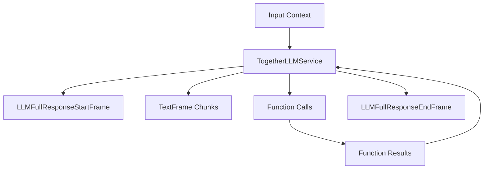

## Overview

`AzureLLMService` provides access to Azure OpenAI's language models through an OpenAI-compatible interface. It inherits from `OpenAILLMService` and supports streaming responses, function calling, and context management.

## Installation

To use `AzureLLMService`, install the required dependencies:

```bash
pip install pipecat-ai[azure]
```

You'll need to set up:

- Azure OpenAI API key
- Azure OpenAI endpoint URL
- Azure OpenAI deployment name (used as the model identifier)

## Configuration

### Constructor Parameters

<ParamField path="api_key" type="str" required>
  Azure OpenAI API key
</ParamField>

<ParamField path="endpoint" type="str" required>
  Azure OpenAI endpoint URL
</ParamField>

<ParamField path="model" type="str" required>
  Model deployment name
</ParamField>

<ParamField path="api_version" type="str" default="2024-09-01-preview">
  Azure OpenAI API version
</ParamField>

### Input Parameters

Inherits all input parameters from OpenAILLMService:

<ParamField path="extra" type="Optional[Dict[str, Any]]">
  Additional parameters to pass to the model
</ParamField>

<ParamField path="frequency_penalty" type="Optional[float]">
  Reduces likelihood of repeating tokens based on their frequency. Range: [-2.0,
  2.0]
</ParamField>

<ParamField path="max_completion_tokens" type="Optional[int]">
  Maximum number of tokens in the completion. Must be greater than or equal to 1
</ParamField>

<ParamField path="max_tokens" type="Optional[int]">
  Maximum number of tokens to generate. Must be greater than or equal to 1
</ParamField>

<ParamField path="presence_penalty" type="Optional[float]">
  Reduces likelihood of repeating any tokens that have appeared. Range: [-2.0,
  2.0]
</ParamField>

<ParamField path="seed" type="Optional[int]">
  Random seed for deterministic generation. Must be greater than or equal to 0
</ParamField>

<ParamField path="temperature" type="Optional[float]">
  Controls randomness in the output. Range: [0.0, 2.0]
</ParamField>

<ParamField path="top_p" type="Optional[float]">
  Controls diversity via nucleus sampling. Range: [0.0, 1.0]
</ParamField>

## Input Frames

<ParamField path="OpenAILLMContextFrame" type="Frame">
  Contains OpenAI-specific conversation context
</ParamField>

<ParamField path="LLMMessagesFrame" type="Frame">
  Contains conversation messages
</ParamField>

<ParamField path="VisionImageRawFrame" type="Frame">
  Contains image for vision model processing
</ParamField>

<ParamField path="LLMUpdateSettingsFrame" type="Frame">
  Updates model settings
</ParamField>

## Output Frames

<ParamField path="TextFrame" type="Frame">
  Contains generated text chunks
</ParamField>

<ParamField path="FunctionCallInProgressFrame" type="Frame">
  Indicates start of function call
</ParamField>

<ParamField path="FunctionCallResultFrame" type="Frame">
  Contains function call results
</ParamField>

## Methods

See the [LLM base class methods](/server/base-classes/llm#methods) for additional functionality.

## Usage Example

```python
from pipecat.services.azure import AzureLLMService
from pipecat.processors.aggregators.openai_llm_context import OpenAILLMContext
from openai.types.chat import ChatCompletionToolParam
from pipecat.pipeline.pipeline import Pipeline
from pipecat.pipeline.task import PipelineParams, PipelineTask

# Configure service
llm = AzureLLMService(
    api_key="your-azure-api-key",
    endpoint="https://your-resource.openai.azure.com",
    model="your-deployment-name"  # e.g., "gpt-4o"
)

# Define tools for function calling
tools = [
    ChatCompletionToolParam(
        type="function",
        function={
            "name": "get_current_weather",
            "description": "Get the current weather",
            "parameters": {
                "type": "object",
                "properties": {
                    "location": {
                        "type": "string",
                        "description": "The city and state, e.g. San Francisco, CA"
                    },
                    "format": {
                        "type": "string",
                        "enum": ["celsius", "fahrenheit"],
                        "description": "The temperature unit to use"
                    }
                },
                "required": ["location", "format"]
            }
        }
    )
]

# Create context with system message and tools
context = OpenAILLMContext(
    messages=[
        {
            "role": "system",
            "content": "You are a helpful assistant in a voice conversation. Keep responses concise."
        }
    ],
    tools=tools
)

# Register function handlers
async def fetch_weather(function_name, tool_call_id, args, llm, context, result_callback):
    await result_callback({"conditions": "nice", "temperature": "75"})

llm.register_function(None, fetch_weather)

# Create context aggregator for message handling
context_aggregator = llm.create_context_aggregator(context)

# Set up pipeline
pipeline = Pipeline([
    transport.input(),
    context_aggregator.user(),
    llm,
    tts,
    transport.output(),
    context_aggregator.assistant()
])

# Create and configure task
task = PipelineTask(
    pipeline,
    PipelineParams(
        allow_interruptions=True,
        enable_metrics=True,
        enable_usage_metrics=True,
    ),
)
```

## Function Calling

Supports OpenAI-compatible function calling:

```python
# Define tools
tools = [{
    "type": "function",
    "function": {
        "name": "get_weather",
        "description": "Get weather information",
        "parameters": {
            "type": "object",
            "properties": {
                "location": {"type": "string"}
            }
        }
    }
}]

# Configure context with tools
context = OpenAILLMContext(
    messages=[],
    tools=tools
)

# Register function handler
@service.function("get_weather")
async def handle_weather(location: str):
    return {"temperature": 72, "condition": "sunny"}
```

## Available Models

Azure OpenAI supports deploying various OpenAI models:

| Model Type | Description           |
| ---------- | --------------------- |
| GPT-4o     | GPT-4o models         |
| GPT-4      | GPT-4 models          |
| GPT-3.5    | GPT-3.5 Turbo models  |
| Embeddings | Text embedding models |

The actual model used is determined by your Azure OpenAI deployment configuration.

<Note>
  See [Azure's OpenAI
  docs](https://learn.microsoft.com/en-us/azure/ai-services/openai/concepts/models)
  for a complete list of supported models.
</Note>

## Frame Flow



## Metrics Support

The service collects the same metrics as OpenAILLMService:

- Token usage (prompt and completion)
- Processing duration
- Time to First Byte (TTFB)
- Function call metrics

## Notes

- OpenAI-compatible interface
- Supports streaming responses
- Handles function calling
- Manages conversation context
- Includes token usage tracking
- Thread-safe processing
- Automatic error handling
- Inherits OpenAI service features
