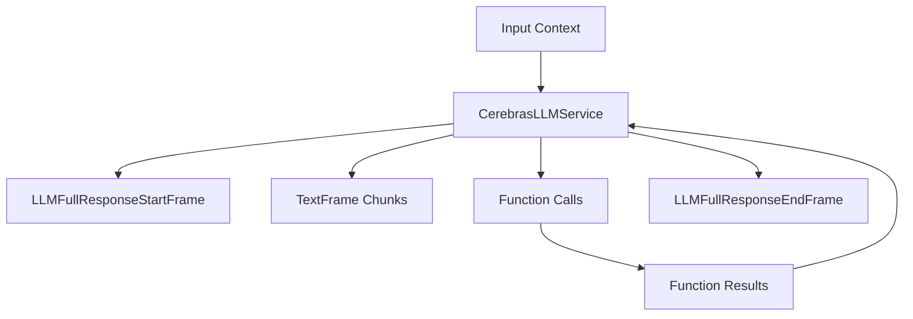

## Overview

`CerebrasLLMService` provides access to Cerebras's language models through an OpenAI-compatible interface. It inherits from `OpenAILLMService` and supports streaming responses, function calling, and context management.

## Installation

To use `CerebrasLLMService`, install the required dependencies:

```bash
pip install "pipecat-ai[cerebras]"
```

You'll need to set up your Cerebras API key as an environment variable: `CEREBRAS_API_KEY`

## Configuration

### Constructor Parameters

<ParamField path="api_key" type="str" required>
  Your Cerebras API key
</ParamField>

<ParamField path="model" type="str" default="llama-3.3-70b">
  Model identifier
</ParamField>

<ParamField path="base_url" type="str" default="https://api.cerebras.ai/v1">
  Cerebras API endpoint
</ParamField>

### Input Parameters

Inherits OpenAI-compatible parameters:

<ParamField path="max-completion-tokens" type="Optional[int]">
  Maximum number of tokens to generate. Must be greater than or equal to 1
</ParamField>

<ParamField path="seed" type="Optional[int]">
  Random seed for deterministic generation. Must be greater than or equal to 0
</ParamField>

<ParamField path="temperature" type="Optional[float]">
  Controls randomness in the output. Range: [0.0, 1.5]
</ParamField>

<ParamField path="top_p" type="Optional[float]">
  Controls diversity via nucleus sampling. Range: [0.0, 1.0]
</ParamField>

## Usage Example

```python
from pipecat.services.cerebras.llm import CerebrasLLMService
from pipecat.processors.aggregators.openai_llm_context import OpenAILLMContext
from pipecat.adapters.schemas.function_schema import FunctionSchema
from pipecat.adapters.schemas.tools_schema import ToolsSchema
from pipecat.pipeline.pipeline import Pipeline
from pipecat.pipeline.task import PipelineParams, PipelineTask

# Configure service
llm = CerebrasLLMService(
    api_key="your-cerebras-api-key",
    model="llama-3.3-70b"
)

# Define weather function using standardized schema
weather_function = FunctionSchema(
    name="get_current_weather",
    description="Get the current weather",
    properties={
        "location": {
            "type": "string",
            "description": "The city and state, e.g. San Francisco, CA"
        },
        "format": {
            "type": "string",
            "enum": ["celsius", "fahrenheit"],
            "description": "The temperature unit to use"
        }
    },
    required=["location", "format"]
)

# Create tools schema
tools = ToolsSchema(standard_tools=[weather_function])

# Create context with system message and tools
context = OpenAILLMContext(
    messages=[
        {
            "role": "system",
            "content": """You are a helpful LLM in a WebRTC call. Your goal is to demonstrate your capabilities in a succinct way.

You have one function available:

1. get_current_weather is used to get current weather information.

Infer whether to use Fahrenheit or Celsius automatically based on the location, unless the user specifies a preference. Start by asking me for my location. Then, use 'get_current_weather' to give me a forecast. Respond to what the user said in a creative and helpful way.""",
        },
    ],
    tools=tools
)

# Register function handlers
async def fetch_weather(function_name, tool_call_id, args, llm, context, result_callback):
    await result_callback({"conditions": "nice", "temperature": "75"})

llm.register_function("get_current_weather", fetch_weather)

# Create context aggregator for message handling
context_aggregator = llm.create_context_aggregator(context)

# Set up pipeline
pipeline = Pipeline([
    transport.input(),
    context_aggregator.user(),
    llm,
    tts,
    transport.output(),
    context_aggregator.assistant()
])

# Create and configure task
task = PipelineTask(
    pipeline,
    params=PipelineParams(
        allow_interruptions=True,
        enable_metrics=True,
        enable_usage_metrics=True,
    ),
)
```

## Methods

See the [LLM base class methods](/server/base-classes/llm#methods) for additional functionality.

## Function Calling

This service supports function calling (also known as tool calling) which allows the LLM to request information from external services and APIs. For example, you can enable your bot to:

- Check current weather conditions
- Query databases
- Access external APIs
- Perform custom actions

<Card
  title="Function Calling Guide"
  icon="function"
  href="/guides/features/function-calling"
>
  Learn how to implement function calling with standardized schemas, register
  handlers, manage context properly, and control execution flow in your
  conversational AI applications.
</Card>

## Available Models

Cerebras provides access to these models:

| Model Name      | Description         |
| --------------- | ------------------- |
| `llama3.1-8b`   | Llama 3.1 8B model  |
| `llama3.1-70b`  | Llama 3.1 70B model |
| `llama-3.3-70b` | Llama 3.3 70B model |

## Frame Flow

Inherits the OpenAI LLM Service frame flow:



## Metrics Support

The service collects standard LLM metrics:

- Token usage (prompt and completion)
- Processing duration
- Time to First Byte (TTFB)
- Function call metrics

## Notes

- OpenAI-compatible interface
- Supports streaming responses
- Handles function calling
- Manages conversation context
- Thread-safe processing
- Automatic error handling
