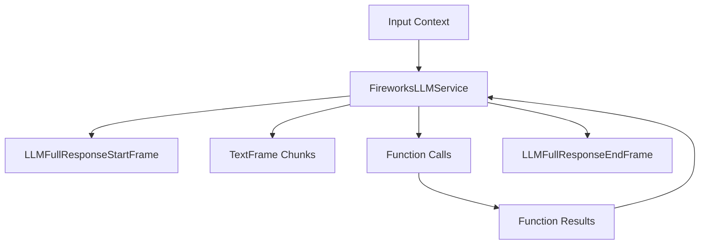

## Overview

`FireworksLLMService` provides access to Fireworks AI's language models through an OpenAI-compatible interface. It inherits from `OpenAILLMService` and supports streaming responses, function calling, and context management.

## Installation

To use `FireworksLLMService`, install the required dependencies:

```bash
pip install pipecat-ai[fireworks]
```

You'll also need to set up your Fireworks API key as an environment variable: `FIREWORKS_API_KEY`

## Configuration

### Constructor Parameters

<ParamField path="api_key" type="str" required>
  Your Fireworks AI API key
</ParamField>

<ParamField
  path="model"
  type="str"
  default="accounts/fireworks/models/firefunction-v2">
  Model identifier
</ParamField>

<ParamField
  path="base_url"
  type="str"
  default="https://api.fireworks.ai/inference/v1">
  Fireworks AI API endpoint
</ParamField>

### Input Parameters

Inherits all input parameters from BaseOpenAILLMService:

<ParamField path="extra" type="Optional[Dict[str, Any]]">
  Additional parameters to pass to the model
</ParamField>

<ParamField path="frequency_penalty" type="Optional[float]">
  Reduces likelihood of repeating tokens based on their frequency. Range: [-2.0,
  2.0]
</ParamField>

<ParamField path="max_tokens" type="Optional[int]">
  Maximum number of tokens to generate. Must be greater than or equal to 1
</ParamField>

<ParamField path="presence_penalty" type="Optional[float]">
  Reduces likelihood of repeating any tokens that have appeared. Range: [-2.0,
  2.0]
</ParamField>

<ParamField path="temperature" type="Optional[float]">
  Controls randomness in the output. Range: [0.0, 2.0]
</ParamField>

<ParamField path="top_p" type="Optional[float]">
  Controls diversity via nucleus sampling. Range: [0.0, 1.0]
</ParamField>

## Input Frames

<ParamField path="OpenAILLMContextFrame" type="Frame">
  Contains OpenAI-specific conversation context
</ParamField>

<ParamField path="LLMMessagesFrame" type="Frame">
  Contains conversation messages
</ParamField>

<ParamField path="VisionImageRawFrame" type="Frame">
  Contains image for vision model processing
</ParamField>

<ParamField path="LLMUpdateSettingsFrame" type="Frame">
  Updates model settings
</ParamField>

## Output Frames

<ParamField path="TextFrame" type="Frame">
  Contains generated text chunks
</ParamField>

<ParamField path="FunctionCallInProgressFrame" type="Frame">
  Indicates start of function call
</ParamField>

<ParamField path="FunctionCallResultFrame" type="Frame">
  Contains function call results
</ParamField>

## Methods

See the [LLM base class methods](/server/base-classes/llm#methods) for additional functionality.

## Usage Example

```python
from pipecat.services.fireworks import FireworksLLMService
from pipecat.processors.aggregators.openai_llm_context import OpenAILLMContext

# Configure service
service = FireworksLLMService(
    api_key="your-fireworks-api-key",
    model="accounts/fireworks/models/firefunction-v2",
    params=FireworksLLMService.InputParams(
        temperature=0.7,
        max_tokens=1000
    )
)

# Create context
context = OpenAILLMContext(
    messages=[
        {"role": "system", "content": "You are a helpful assistant"},
        {"role": "user", "content": "What is machine learning?"}
    ], tools=[]
)

# Use in pipeline
pipeline = Pipeline(
    [
        transport.input(),
        context_aggregator.user(),
        llm,
        tts,
        transport.output(),
        context_aggregator.assistant(),
    ]
)
```

## Function Calling

Supports OpenAI-compatible function calling with the `firefunction-v2` model:

```python
# Define tools
tools = [{
    "type": "function",
    "function": {
        "name": "get_weather",
        "description": "Get weather information",
        "parameters": {
            "type": "object",
            "properties": {
                "location": {"type": "string"}
            }
        }
    }
}]

# Configure context with tools
context = OpenAILLMContext(
    messages=[],
    tools=tools
)

# Register function handler
@service.function("get_weather")
async def handle_weather(location: str):
    return {"temperature": 72, "condition": "sunny"}
```

## Available Models

Fireworks AI provides access to various models, notably:

| Model Name                                           | Description                    |
| ---------------------------------------------------- | ------------------------------ |
| `accounts/fireworks/models/firefunction-v2`          | Optimized for function calling |
| `accounts/fireworks/models/firefunction-v1`          | Optimized for function calling |
| `accounts/fireworks/models/llama-v3p1-8b-instruct`   | Llama 3.1 8B Instruct          |
| `accounts/fireworks/models/llama-v3p1-70b-instruct`  | Llama 3.1 70B Instruct         |
| `accounts/fireworks/models/llama-v3p1-405b-instruct` | Llama 3.1 405B Instruct        |
| `accounts/fireworks/models/mixtral-8x22b-instruct`   | Mixtral MoE 8x22B Instruct     |

<Note>
  See [Fireworks's console](https://fireworks.ai/models) for a complete list of
  supported models.
</Note>

## Frame Flow

Inherits the BaseOpenAI LLM Service frame flow:



## Metrics Support

The service collects standard LLM metrics:

- Token usage (prompt and completion)
- Processing duration
- Time to First Byte (TTFB)
- Function call metrics

## Notes

- OpenAI-compatible interface
- Supports streaming responses
- Handles function calling
- Manages conversation context
- Includes token usage tracking
- Thread-safe processing
- Automatic error handling
