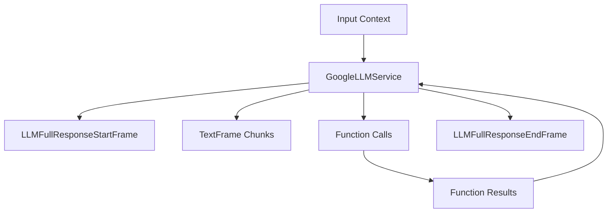

## Overview

`GoogleLLMService` provides integration with Google's Gemini models, supporting streaming responses, function calling, and multimodal inputs. It includes specialized context handling for Google's message format while maintaining compatibility with OpenAI-style contexts.

## Installation

To use `GoogleLLMService`, install the required dependencies:

```bash
pip install pipecat-ai[google]
```

You'll also need to set up your Google API key as an environment variable: `GOOGLE_API_KEY`

## Configuration

### Constructor Parameters

<ParamField path="api_key" type="str" required>
  Google API key
</ParamField>

<ParamField path="model" type="str" default="gemini-2.0-flash-001">
  Model identifier
</ParamField>

<ParamField path="system_instruction" type="Optional[str]" default="None">
System instructions for the model.

<Note>
Unlike OpenAI, Google Gemini handles system messages differently. System messages are:

- Set during client initialization as `system_instruction`
- Can be updated during a conversation, which will recreate the client
- Not directly included in the message context like in OpenAI

</Note>

</ParamField>

<ParamField path="tools" type="Optional[List[Dict[str, Any]]]" default="None">
  List of function definitions for the model to use
</ParamField>

<ParamField path="tool_config" type="Optional[Dict[str, Any]]" default="None">
  Configuration for tool usage
</ParamField>

<ParamField path="params" type="InputParams" optional>
  Model configuration parameters
</ParamField>

### Input Parameters

<ParamField path="extra" type="Optional[Dict[str, Any]]" default="{}">
  Additional parameters to pass to the model
</ParamField>

<ParamField path="max_tokens" type="Optional[int]" default="4096">
  Maximum number of tokens to generate. Must be greater than or equal to 1
</ParamField>

<ParamField path="temperature" type="Optional[float]" default="None">
  Controls randomness in the output. Range: [0.0, 2.0]
</ParamField>

<ParamField path="top_k" type="Optional[int]" default="None">
  Controls diversity via nucleus sampling. Must be greater than or equal to 0
</ParamField>

<ParamField path="top_p" type="Optional[float]" default="None">
  Controls diversity via nucleus sampling. Range: [0.0, 1.0]
</ParamField>

## Input Frames

<ParamField path="OpenAILLMContextFrame" type="Frame">
  Contains conversation context
</ParamField>

<ParamField path="LLMMessagesFrame" type="Frame">
  Contains conversation messages
</ParamField>

<ParamField path="VisionImageRawFrame" type="Frame">
  Contains image for vision processing
</ParamField>

<ParamField path="LLMUpdateSettingsFrame" type="Frame">
  Updates model settings
</ParamField>

## Output Frames

<ParamField path="TextFrame" type="Frame">
  Contains generated text
</ParamField>

<ParamField path="LLMFullResponseStartFrame" type="Frame">
  Signals start of response
</ParamField>

<ParamField path="LLMFullResponseEndFrame" type="Frame">
  Signals end of response
</ParamField>

<ParamField path="LLMSearchResponseFrame" type="Frame">
  Contains search results and origins when grounding is used
</ParamField>

## Context Management

The Google service uses specialized context management to handle conversations and message formatting. This includes managing the conversation history, system prompts, function calls, and converting between OpenAI and Google message formats.

### GoogleLLMContext

The base context manager for Google conversations:

```python
context = GoogleLLMContext(
    messages=[],    # Conversation history
    tools=[],       # Available function calling tools
    tool_choice={}  # How the model should use the provided tools
)
```

### Context Aggregators

Context aggregators handle message format conversion and management. The service provides a method to create paired aggregators:

<ResponseField name="create_context_aggregator" type="static method">
Creates user and assistant aggregators for handling message formatting.

```python
@staticmethod
def create_context_aggregator(
    context: OpenAILLMContext,
    *,
    assistant_expect_stripped_words: bool = True
) -> GoogleContextAggregatorPair
```

### Parameters

<ParamField path="context" type="OpenAILLMContext" required>
  The context object containing conversation history and settings
</ParamField>

<ParamField path="assistant_expect_stripped_words" type="bool" default="True">
  Controls text preprocessing for assistant responses
</ParamField>

</ResponseField>

### Usage Example

```python

# 1. Create the context
context = GoogleLLMContext(
    messages=[],
    system="You are a helpful assistant"
)

# 2. Create aggregators for message handling
aggregators = GoogleLLMService.create_context_aggregator(context)

# 3. Access individual aggregators
user_aggregator = aggregators.user()      # Handles user message formatting
assistant_aggregator = aggregators.assistant()  # Handles assistant responses

# 4. Use in a pipeline
pipeline = Pipeline([
    user_aggregator,
    llm,
    assistant_aggregator
])
```

The context management system ensures proper message formatting and history tracking throughout the conversation while handling the conversion between OpenAI and Google message formats automatically.

## Methods

See the [LLM base class methods](/server/base-classes/llm#methods) for additional functionality.

## Function Calling

This service supports function calling (also known as tool calling) which allows the LLM to request information from external services and APIs. For example, you can enable your bot to:

- Check current weather conditions
- Query databases
- Access external APIs
- Perform custom actions

<Card
  title="Function Calling Guide"
  icon="function"
  href="/guides/features/function-calling"
>
  Learn how to implement function calling with standardized schemas, register
  handlers, manage context properly, and control execution flow in your
  conversational AI applications.
</Card>

## Search Grounding

`GoogleLLMService` supports Google's Search Grounding feature, which enables the model to retrieve and reference information from the web when generating responses. This feature enhances the model's ability to provide up-to-date information and cite sources.

### Enabling Search Grounding

To enable Search Grounding, configure the `tools` parameter with a Google search retrieval configuration:

```python
# Configure search grounding
search_tool = {
    "google_search_retrieval": {
        "dynamic_retrieval_config": {
            "mode": "MODE_DYNAMIC",
            "dynamic_threshold": 0,  # 0 = always ground with search
        }
    }
}

# Initialize LLM with search tool
llm = GoogleLLMService(
    api_key=os.getenv("GOOGLE_API_KEY"),
    model="gemini-1.5-flash-002",  # Use a model that supports grounding
    system_instruction="Your system instruction here",
    tools=[search_tool],
)
```

### Dynamic Retrieval Configuration

The `dynamic_retrieval_config` controls when Search Grounding is applied:

<ParamField path="mode" type="string" default="MODE_UNSPECIFIED">
  Retrieval mode: "MODE_UNSPECIFIED" (always on), "MODE_DYNAMIC" (model decides)
</ParamField>

<ParamField path="dynamic_threshold" type="float" default="0.3">
  Controls frequency of search retrieval when using MODE_DYNAMIC. Range: 0.0
  (always retrieve) to 1.0 (never retrieve)
</ParamField>

### Receiving Search Results

When Search Grounding is used, the service generates a `LLMSearchResponseFrame` containing the search results and source information:

<ParamField path="search_result" type="str">
  The full text response generated with search grounding
</ParamField>

<ParamField path="origins" type="List[Dict]">

Information about source websites and referenced content:

- `site_uri`: Source URL
- `site_title`: Source title
- `results`: Text segments from the source with confidence scores

</ParamField>

<ParamField path="rendered_content" type="Optional[str]">
  Additional content rendered by the grounding system
</ParamField>

### Pipeline Example

Here's how to integrate Search Grounding in a pipeline:

```python
# Configure the service
llm = GoogleLLMService(
    api_key=os.getenv("GOOGLE_API_KEY"),
    model="gemini-1.5-flash-002",
    system_instruction=system_instruction,
    tools=[search_tool],
)


# Create pipeline
pipeline = Pipeline([
    transport.input(),
    stt,
    context_aggregator.user(),
    llm,
    tts,
    transport.output(),
    context_aggregator.assistant(),
])
```

## Usage Examples

### Basic Usage

```python
# Configure service
llm = GoogleLLMService(
    api_key="your-api-key",
    model="gemini-1.5-flash-latest",
    params=GoogleLLMService.InputParams(
        temperature=0.7,
        max_tokens=1000
    )
)

# Create context and aggregators
context = GoogleLLMContext()
context_aggregator = llm.create_context_aggregator(context)

# Create pipeline
pipeline = Pipeline([
    transport.input(),
    context_aggregator.user(),
    llm,
    tts,
    transport.output(),
    context_aggregator.assistant()
])
```

### With Function Calling

```python
# Configure function calling
context = GoogleLLMContext()
context.add_tool({
    "function_declarations": [{
        "name": "get_weather",
        "description": "Get weather information",
        "parameters": {
            "type": "object",
            "properties": {
                "location": {"type": "string"}
            }
        }
    }]
})
```

## Frame Flow



## Metrics Support

The service collects various metrics:

- Token usage (prompt and completion)
- Processing time
- Time to first byte (TTFB)

## Notes

- Supports streaming responses
- Handles function calling
- Provides OpenAI compatibility
- Manages conversation context
- Supports vision inputs
- Includes metrics collection
- Thread-safe processing
