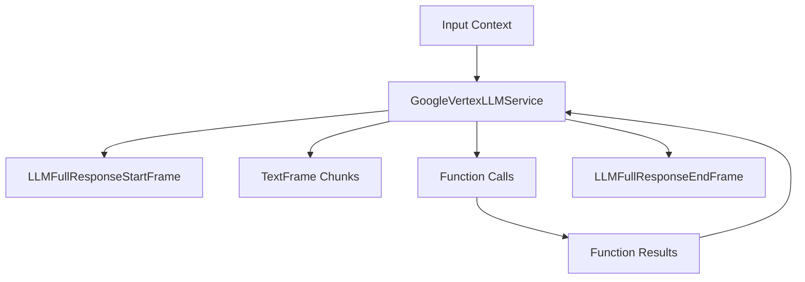

## Overview

`GoogleVertexLLMService` provides access to Google's language models through Vertex AI while maintaining an OpenAI-compatible interface. It inherits from `OpenAILLMService` and supports all the features of the OpenAI interface while connecting to Google's AI services.

## Installation

To use `GoogleVertexLLMService`, install the required dependencies:

```bash
pip install "pipecat-ai[google]"
```

You'll also need to set up Google Cloud credentials. You can either:

- Set the `GOOGLE_APPLICATION_CREDENTIALS` environment variable pointing to your service account JSON file
- Provide credentials directly to the service constructor

## Configuration

### Constructor Parameters

<ParamField path="credentials" type="Optional[str]">
  JSON string of Google service account credentials
</ParamField>

<ParamField path="credentials_path" type="Optional[str]">
  Path to the Google service account JSON file
</ParamField>

<ParamField path="model" type="str" default="google/gemini-2.0-flash-001">
  Model identifier
</ParamField>

<ParamField path="params" type="InputParams">
  Vertex AI specific parameters
</ParamField>

### Input Parameters

Extends the OpenAI input parameters with Vertex AI specific options:

<ParamField path="location" type="str" default="us-east4">
  Google Cloud region where the model is deployed
</ParamField>

<ParamField path="project_id" type="str" required>
  Google Cloud project ID
</ParamField>

Also inherits all OpenAI-compatible parameters:

<ParamField path="frequency_penalty" type="Optional[float]">
  Reduces likelihood of repeating tokens based on their frequency. Range: [-2.0,
  2.0]
</ParamField>

<ParamField path="max_tokens" type="Optional[int]">
  Maximum number of tokens to generate. Must be greater than or equal to 1
</ParamField>

<ParamField path="presence_penalty" type="Optional[float]">
  Reduces likelihood of repeating any tokens that have appeared. Range: [-2.0,
  2.0]
</ParamField>

<ParamField path="temperature" type="Optional[float]">
  Controls randomness in the output. Range: [0.0, 2.0]
</ParamField>

<ParamField path="top_p" type="Optional[float]">
  Controls diversity via nucleus sampling. Range: [0.0, 1.0]
</ParamField>

## Usage Example

```python
from pipecat.services.google.llm_vertex import GoogleVertexLLMService
from pipecat.processors.aggregators.openai_llm_context import OpenAILLMContext
from pipecat.pipeline.pipeline import Pipeline
from pipecat.pipeline.task import PipelineParams, PipelineTask

# Configure service
llm = GoogleVertexLLMService(
    credentials_path="/path/to/service-account.json",
    model="google/gemini-2.0-flash-001",
    params=GoogleVertexLLMService.InputParams(
        project_id="your-google-cloud-project-id",
        location="us-east4"
    )
)

# Create context with system message
context = OpenAILLMContext(
    messages=[
        {
            "role": "system",
            "content": "You are a helpful assistant in a voice conversation. Keep responses concise."
        }
    ]
)

# Create context aggregator for message handling
context_aggregator = llm.create_context_aggregator(context)

# Set up pipeline
pipeline = Pipeline([
    transport.input(),
    context_aggregator.user(),
    llm,
    tts,
    transport.output(),
    context_aggregator.assistant()
])

# Create and configure task
task = PipelineTask(
    pipeline,
    params=PipelineParams(
        allow_interruptions=True,
        enable_metrics=True,
        enable_usage_metrics=True,
    ),
)
```

## Authentication

The service supports multiple authentication methods:

1. **Direct credentials string** - Pass the JSON credentials as a string to the constructor
2. **Credentials file path** - Provide a path to the service account JSON file
3. **Environment variable** - Set `GOOGLE_APPLICATION_CREDENTIALS` to the path of your service account file

The service automatically handles token refresh, with tokens having a 1-hour lifetime.

## Methods

See the [LLM base class methods](https://reference-server.pipecat.ai/en/latest/api/pipecat.services.llm_service.html#llm-service) for additional functionality.

## Function Calling

This service supports function calling (also known as tool calling) through the OpenAI-compatible interface, which allows the LLM to request information from external services and APIs.

<Card
  title="Function Calling Guide"
  icon="function"
  href="/guides/fundamentals/function-calling"
>
  Learn how to implement function calling with standardized schemas, register
  handlers, manage context properly, and control execution flow in your
  conversational AI applications.
</Card>

## Available Models

| Model Name                    | Description                           |
| ----------------------------- | ------------------------------------- |
| `google/gemini-2.0-flash-001` | Fast, efficient text generation model |
| `google/gemini-2.0-pro-001`   | Comprehensive, high-quality model     |
| `google/gemini-1.5-pro-001`   | Versatile multimodal model            |
| `google/gemini-1.5-flash-001` | Fast, efficient multimodal model      |

<Note>
  See [Google Vertex AI
  documentation](https://cloud.google.com/vertex-ai/generative-ai/docs/model-reference/overview)
  for a complete list of supported models and their capabilities.
</Note>

## Frame Flow

Inherits the OpenAI LLM Service frame flow:



## Metrics Support

The service collects standard LLM metrics:

- **Time to First Byte (TTFB)** - Response latency measurement
- **Processing Duration** - Total request processing time
- **Token Usage** - Prompt tokens, completion tokens, and totals

<Info>
  [Learn how to enable Metrics](/guides/features/metrics) in your Pipeline.
</Info>

## Notes

- Uses Google Cloud's Vertex AI API
- Maintains OpenAI-compatible interface
- Supports streaming responses
- Handles function calling
- Manages conversation context
- Includes token usage tracking
- Thread-safe processing
- Automatic token refresh
- Requires Google Cloud project setup
