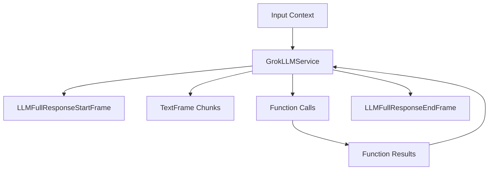

## Overview

`GrokLLMService` provides access to Grok's language models through an OpenAI-compatible interface. It inherits from `OpenAILLMService` and supports streaming responses, function calling, and context management.

## Installation

To use `GrokLLMService`, install the required dependencies:

```bash
pip install "pipecat-ai[grok]"
```

You'll also need to set up your Grok API key as an environment variable: `GROK_API_KEY`

## Configuration

### Constructor Parameters

<ParamField path="api_key" type="str" required>
  Your Grok API key
</ParamField>

<ParamField path="model" type="str" default="grok-beta">
  Model identifier
</ParamField>

<ParamField path="base_url" type="str" default="https://api.x.ai/v1">
  Grok API endpoint
</ParamField>

### Input Parameters

Inherits OpenAI-compatible parameters:

<ParamField path="frequency_penalty" type="Optional[float]">
  Reduces likelihood of repeating tokens based on their frequency. Range: [-2.0,
  2.0]
</ParamField>

<ParamField path="max_tokens" type="Optional[int]">
  Maximum number of tokens to generate. Must be greater than or equal to 1
</ParamField>

<ParamField path="presence_penalty" type="Optional[float]">
  Reduces likelihood of repeating any tokens that have appeared. Range: [-2.0,
  2.0]
</ParamField>

<ParamField path="temperature" type="Optional[float]">
  Controls randomness in the output. Range: [0.0, 2.0]
</ParamField>

<ParamField path="top_p" type="Optional[float]">
  Controls diversity via nucleus sampling. Range: [0.0, 1.0]
</ParamField>

## Usage Example

```python
from pipecat.services.grok import GrokLLMService
from pipecat.processors.aggregators.openai_llm_context import OpenAILLMContext
from openai.types.chat import ChatCompletionToolParam
from pipecat.pipeline.pipeline import Pipeline
from pipecat.pipeline.task import PipelineParams, PipelineTask

# Configure service
llm = GrokLLMService(
    api_key="your-grok-api-key",
    model="grok-beta"
)

# Define tools for function calling
tools = [
    ChatCompletionToolParam(
        type="function",
        function={
            "name": "get_current_weather",
            "description": "Get the current weather",
            "parameters": {
                "type": "object",
                "properties": {
                    "location": {
                        "type": "string",
                        "description": "The city and state, e.g. San Francisco, CA"
                    },
                    "format": {
                        "type": "string",
                        "enum": ["celsius", "fahrenheit"],
                        "description": "The temperature unit to use"
                    }
                },
                "required": ["location", "format"]
            }
        }
    )
]

# Create context with system message and tools
context = OpenAILLMContext(
    messages=[
        {
            "role": "system",
            "content": "You are a helpful assistant in a voice conversation. Keep responses concise."
        }
    ],
    tools=tools
)

# Register function handlers
async def fetch_weather(function_name, tool_call_id, args, llm, context, result_callback):
    await result_callback({"conditions": "nice", "temperature": "75"})

llm.register_function(None, fetch_weather)

# Create context aggregator for message handling
context_aggregator = llm.create_context_aggregator(context)

# Set up pipeline
pipeline = Pipeline([
    transport.input(),
    context_aggregator.user(),
    llm,
    tts,
    transport.output(),
    context_aggregator.assistant()
])

# Create and configure task
task = PipelineTask(
    pipeline,
    PipelineParams(
        allow_interruptions=True,
        enable_metrics=True,
        enable_usage_metrics=True,
    ),
)
```

## Available Models

| Model Name  | Description       |
| ----------- | ----------------- |
| `grok-beta` | Grok's beta model |

<Note>
  See [Grok's docs](https://docs.x.ai/docs#models) for a complete list of
  supported models.
</Note>

## Frame Flow

Inherits the OpenAI LLM Service frame flow:



## Metrics Support

The service collects standard LLM metrics:

- Token usage (prompt and completion)
- Processing duration
- Time to First Byte (TTFB)
- Function call metrics

## Notes

- OpenAI-compatible interface
- Supports streaming responses
- Handles function calling
- Manages conversation context
- Includes token usage tracking
- Thread-safe processing
- Automatic error handling
