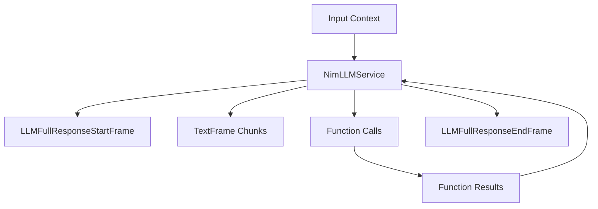

## Overview

`NimLLMService` provides access to NVIDIA's NIM language models through an OpenAI-compatible interface. It inherits from `OpenAILLMService` and supports streaming responses, function calling, and context management, with special handling for NVIDIA's incremental token reporting.

## Installation

To use `NimLLMService`, install the required dependencies:

```bash
pip install "pipecat-ai[nim]"
```

You'll need to set up your NVIDIA NIM API key as an environment variable: `NIM_API_KEY`

## Configuration

### Constructor Parameters

<ParamField path="api_key" type="str" required>
  Your NVIDIA NIM API key
</ParamField>

<ParamField
  path="model"
  type="str"
  default="nvidia/llama-3.1-nemotron-70b-instruct"
>
  Model identifier
</ParamField>

<ParamField
  path="base_url"
  type="str"
  default="https://integrate.api.nvidia.com/v1"
>
  NVIDIA NIM API endpoint
</ParamField>

### Input Parameters

Inherits OpenAI-compatible parameters:

<ParamField path="frequency_penalty" type="Optional[float]">
  Reduces likelihood of repeating tokens based on their frequency. Range: [-2.0,
  2.0]
</ParamField>

<ParamField path="max_tokens" type="Optional[int]">
  Maximum number of tokens to generate. Must be greater than or equal to 1
</ParamField>

<ParamField path="presence_penalty" type="Optional[float]">
  Reduces likelihood of repeating any tokens that have appeared. Range: [-2.0,
  2.0]
</ParamField>

<ParamField path="temperature" type="Optional[float]">
  Controls randomness in the output. Range: [0.0, 2.0]
</ParamField>

<ParamField path="top_p" type="Optional[float]">
  Controls diversity via nucleus sampling. Range: [0.0, 1.0]
</ParamField>

## Usage Example

```python
from pipecat.services.nim.llm import NimLLMService
from pipecat.processors.aggregators.openai_llm_context import OpenAILLMContext
from pipecat.adapters.schemas.function_schema import FunctionSchema
from pipecat.adapters.schemas.tools_schema import ToolsSchema
from pipecat.pipeline.pipeline import Pipeline
from pipecat.pipeline.task import PipelineParams, PipelineTask
from pipecat.services.llm_service import FunctionCallParams

# Configure service
llm = NimLLMService(
    api_key="your-nim-api-key",
    model="nvidia/llama-3.1-nemotron-70b-instruct"
)

# Define weather function using standardized schema
weather_function = FunctionSchema(
    name="get_current_weather",
    description="Get the current weather",
    properties={
        "location": {
            "type": "string",
            "description": "The city and state, e.g. San Francisco, CA"
        },
        "format": {
            "type": "string",
            "enum": ["celsius", "fahrenheit"],
            "description": "The temperature unit to use"
        }
    },
    required=["location", "format"]
)

# Create tools schema
tools = ToolsSchema(standard_tools=[weather_function])

# Create context with system message and tools
context = OpenAILLMContext(
    messages=[
        {
            "role": "system",
            "content": "You are a helpful assistant in a voice conversation. Keep responses concise."
        }
    ],
    tools=tools
)

# Register function handlers
async def fetch_weather(params: FunctionCallParams):
    await params.result_callback({"conditions": "nice", "temperature": "75"})

llm.register_function("get_current_weather", fetch_weather)

# Create context aggregator for message handling
context_aggregator = llm.create_context_aggregator(context)

# Set up pipeline
pipeline = Pipeline([
    transport.input(),
    context_aggregator.user(),
    llm,
    tts,
    transport.output(),
    context_aggregator.assistant()
])

# Create and configure task
task = PipelineTask(
    pipeline,
    params=PipelineParams(
        allow_interruptions=True,
        enable_metrics=True,
        enable_usage_metrics=True,
    ),
)
```

## Methods

See the [LLM base class methods](/server/base-classes/llm#methods) for additional functionality.

## Function Calling

This service supports function calling (also known as tool calling) which allows the LLM to request information from external services and APIs. For example, you can enable your bot to:

- Check current weather conditions
- Query databases
- Access external APIs
- Perform custom actions

<Card
  title="Function Calling Guide"
  icon="function"
  href="/guides/features/function-calling"
>
  Learn how to implement function calling with standardized schemas, register
  handlers, manage context properly, and control execution flow in your
  conversational AI applications.
</Card>

## Available Models

NVIDIA NIM provides access to various models:

| Model Name                               | Description                     |
| ---------------------------------------- | ------------------------------- |
| `nvidia/llama-3.1-nemotron-70b-instruct` | Llama 3.1 70B Nemotron instruct |
| `nvidia/llama-3.1-nemotron-13b-instruct` | Llama 3.1 13B Nemotron instruct |
| `nvidia/llama-3.1-nemotron-8b-instruct`  | Llama 3.1 8B Nemotron instruct  |

<Note>
  See [NVIDIA's NIM console](https://build.nvidia.com/explore/discover) for a
  complete list of supported models.
</Note>

## Token Usage Handling

NimLLMService includes special handling for token usage metrics:

1. Accumulates incremental token updates from NIM
2. Records prompt tokens on first appearance
3. Tracks completion tokens as they increase
4. Reports final totals at the end of processing

This ensures compatibility with OpenAI's token reporting format while maintaining accurate metrics.

## Frame Flow

Inherits the OpenAI LLM Service frame flow:



## Metrics Support

The service collects standard LLM metrics:

- Token usage (prompt and completion)
- Processing duration
- Time to First Byte (TTFB)
- Function call metrics

## Notes

- OpenAI-compatible interface
- Supports streaming responses
- Handles function calling
- Manages conversation context
- Custom token usage tracking for NIM's incremental reporting
- Thread-safe processing
- Automatic error handling
