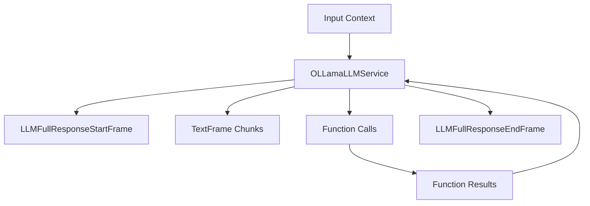

## Overview

`OLLamaLLMService` provides access to locally-run Ollama models through an OpenAI-compatible interface. It inherits from `BaseOpenAILLMService` and allows you to run various open-source models locally while maintaining compatibility with OpenAI's API format.

## Installation

To use `OLLamaLLMService`, you need:

1. Install Ollama on your system ([Ollama installation guide](https://ollama.ai/download))
2. Install Pipecat dependencies:

```bash
pip install "pipecat-ai[ollama]"
```

## Configuration

### Constructor Parameters

<ParamField path="model" type="str" default="llama2">
  Ollama model identifier
</ParamField>

<ParamField path="base_url" type="str" default="http://localhost:11434/v1">
  Local Ollama API endpoint
</ParamField>

### Input Parameters

Inherits all input parameters from BaseOpenAILLMService:

<ParamField path="extra" type="Optional[Dict[str, Any]]">
  Additional parameters to pass to the model
</ParamField>

<ParamField path="frequency_penalty" type="Optional[float]">
  Reduces likelihood of repeating tokens based on their frequency. Range: [-2.0,
  2.0]
</ParamField>

<ParamField path="max_completion_tokens" type="Optional[int]">
  Maximum number of tokens in the completion. Must be greater than or equal to 1
</ParamField>

<ParamField path="max_tokens" type="Optional[int]">
  Maximum number of tokens to generate. Must be greater than or equal to 1
</ParamField>

<ParamField path="presence_penalty" type="Optional[float]">
  Reduces likelihood of repeating any tokens that have appeared. Range: [-2.0,
  2.0]
</ParamField>

<ParamField path="seed" type="Optional[int]">
  Random seed for deterministic generation. Must be greater than or equal to 0
</ParamField>

<ParamField path="temperature" type="Optional[float]">
  Controls randomness in the output. Range: [0.0, 2.0]
</ParamField>

<ParamField path="top_p" type="Optional[float]">
  Controls diversity via nucleus sampling. Range: [0.0, 1.0]
</ParamField>

## Input Frames

<ParamField path="OpenAILLMContextFrame" type="Frame">
  Contains OpenAI-specific conversation context
</ParamField>

<ParamField path="LLMMessagesFrame" type="Frame">
  Contains conversation messages
</ParamField>

<ParamField path="VisionImageRawFrame" type="Frame">
  Contains image for vision model processing
</ParamField>

<ParamField path="LLMUpdateSettingsFrame" type="Frame">
  Updates model settings
</ParamField>

## Output Frames

<ParamField path="TextFrame" type="Frame">
  Contains generated text chunks
</ParamField>

<ParamField path="FunctionCallInProgressFrame" type="Frame">
  Indicates start of function call
</ParamField>

<ParamField path="FunctionCallResultFrame" type="Frame">
  Contains function call results
</ParamField>

## Context Management

The Ollama service uses specialized context management to handle conversations and message formatting. It relies on the OpenAI base class for context management, which includes managing the conversation history, system prompts, tool calls, and converting between OpenAI and Ollama message formats.

### OpenAILLMContext

The base context manager for OpenAI conversations:

```python
context = OpenAILLMContext(
    messages=[],  # Conversation history
    tools=[],     # Available function calling tools
    system="You are a helpful assistant"  # System prompt
)
```

### Context Aggregators

Context aggregators handle message format conversion and management. The service provides a method to create paired aggregators:

<ResponseField name="create_context_aggregator" type="static method">
Creates user and assistant aggregators for handling message formatting.

```python
@staticmethod
def create_context_aggregator(
    context: OpenAILLMContext,
    *,
    assistant_expect_stripped_words: bool = True
) -> OpenAIContextAggregatorPair
```

### Parameters

<ParamField path="context" type="OpenAILLMContext" required>
  The context object containing conversation history and settings
</ParamField>

<ParamField path="assistant_expect_stripped_words" type="bool" default="True">
  Controls text preprocessing for assistant responses
</ParamField>

</ResponseField>

### Usage Example

```python

# 1. Create the context
context = OpenAILLMContext(
    messages=[],
    system="You are a helpful assistant"
)

# 2. Create aggregators for message handling
aggregators = OpenAILLMService.create_context_aggregator(context)

# 3. Access individual aggregators
user_aggregator = aggregators.user()      # Handles user message formatting
assistant_aggregator = aggregators.assistant()  # Handles assistant responses

# 4. Use in a pipeline
pipeline = Pipeline([
    user_aggregator,
    llm,
    assistant_aggregator
])
```

The context management system ensures proper message formatting and history tracking throughout the conversation.

## Methods

See the [LLM base class methods](/server/base-classes/llm#methods) for additional functionality.

## Function Calling

This service supports function calling (also known as tool calling) which allows the LLM to request information from external services and APIs. For example, you can enable your bot to:

- Check current weather conditions
- Query databases
- Access external APIs
- Perform custom actions

<Card
  title="Function Calling Guide"
  icon="function"
  href="/guides/features/function-calling"
>
  Learn how to implement function calling with standardized schemas, register
  handlers, manage context properly, and control execution flow in your
  conversational AI applications.
</Card>

## Usage Example

```python
from pipecat.services.ollama.llm import OLLamaLLMService
from pipecat.processors.aggregators.openai_llm_context import OpenAILLMContext

# Configure service
service = OLLamaLLMService(
    model="llama2",
    params=OLLamaLLMService.InputParams(
        temperature=0.7,
        max_tokens=1000
    )
)

# Create context
context = OpenAILLMContext(
    messages=[
        {"role": "system", "content": "You are a helpful assistant"},
        {"role": "user", "content": "Explain quantum computing"}
    ]
)

# Create pipeline
pipeline = Pipeline([
    transport.input(),
    context_aggregator.user(),
    llm,
    tts,
    transport.output(),
    context_aggregator.assistant()
])
```

## Available Models

Ollama supports various open-source models. Here are some popular options:

| Model Name    | Description                        |
| ------------- | ---------------------------------- |
| `llama2`      | Meta's Llama 2 base model          |
| `codellama`   | Specialized for code generation    |
| `mistral`     | Mistral AI's base model            |
| `mixtral`     | Mistral's mixture of experts model |
| `neural-chat` | Intel's neural chat model          |
| `phi`         | Microsoft's phi model series       |
| `vicuna`      | Berkeley's vicuna model            |

See [Ollama's documentation](https://ollama.com/library) for a full list of available models.

To use a specific model:

```python
service = OLLamaLLMService(model="mistral")
```

## Frame Flow

Inherits the BaseOpenAI LLM Service frame flow:



## Metrics Support

The service collects standard metrics:

- Token usage (prompt and completion)
- Processing duration
- Time to First Byte (TTFB)
- Function call metrics

## Key Features

1. **Local Execution**

   - No internet connection required after model download
   - Complete data privacy
   - Lower latency for many use cases

2. **Model Management**

   - Easy model switching
   - Local model customization
   - Version control through Ollama

3. **Resource Control**
   - CPU/GPU utilization management
   - Memory usage control
   - Concurrent request handling

## Common Use Cases

1. **Development and Testing**

   - Rapid prototyping
   - Offline development
   - Cost-effective testing

2. **Privacy-Sensitive Applications**

   - Healthcare applications
   - Financial services
   - Personal data processing

3. **Edge Computing**
   - IoT applications
   - Embedded systems
   - Low-latency requirements

## Notes

- Runs models locally through Ollama
- OpenAI-compatible interface
- Supports streaming responses
- Handles function calling
- Manages conversation context
- Includes token usage tracking
- Thread-safe processing
