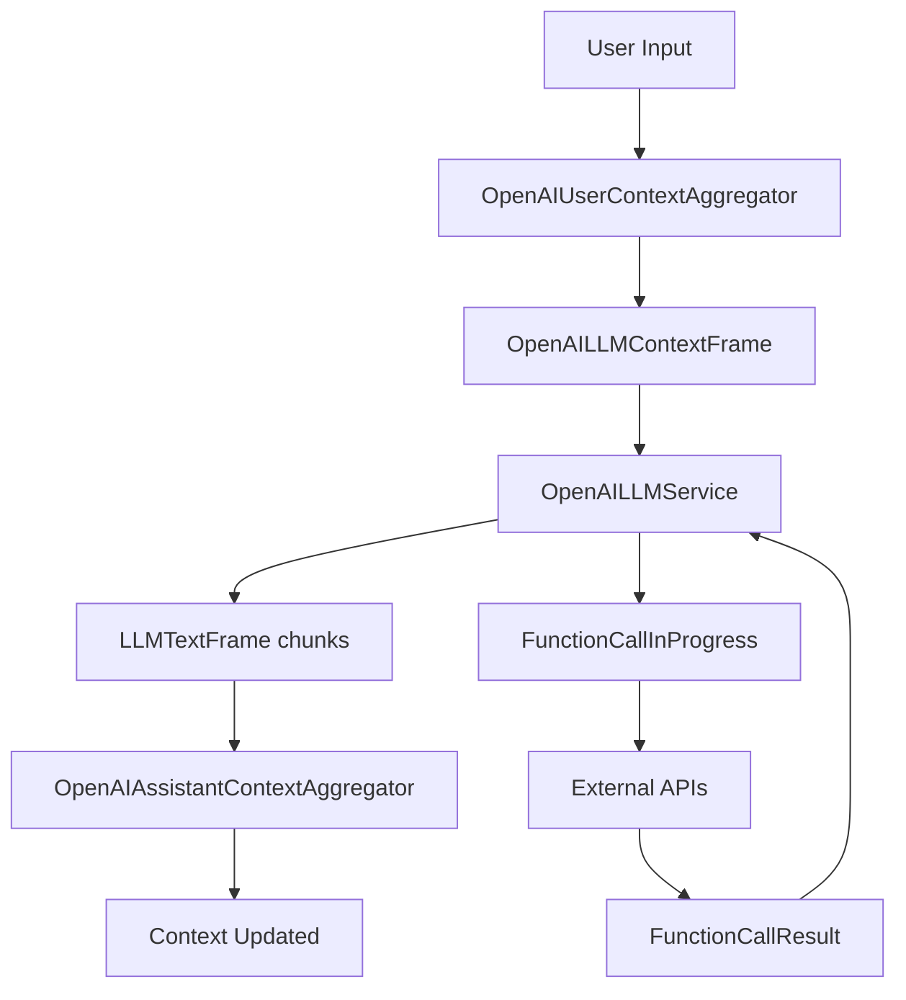

## Overview

`OpenAILLMService` provides chat completion capabilities using OpenAI's API, supporting features like streaming responses, function calling, vision input, and advanced context management.

## Installation

To use OpenAI services, install the required dependencies:

```bash
pip install pipecat-ai[openai]
```

You'll also need to set up your OpenAI API key as an environment variable: `OPENAI_API_KEY`

<Tip>
  You can obtain an OpenAI API key from the [OpenAI
  platform](https://platform.openai.com/api-keys).
</Tip>

## OpenAILLMService

### Constructor Parameters

<ParamField path="model" type="str" default="gpt-4o">
  OpenAI model identifier. See [OpenAI's
  docs](https://platform.openai.com/docs/models) for the latest supported
  models.
</ParamField>

<ParamField path="api_key" type="str" optional>
  OpenAI API key (defaults to environment variable)
</ParamField>

<ParamField path="base_url" type="str" optional>
  Custom API endpoint URL for alternative OpenAI-compatible services.
</ParamField>

<ParamField path="organization" type="str" optional>
  OpenAI organization identifier
</ParamField>

<ParamField path="project" type="str" optional>
  OpenAI project identifier
</ParamField>

<ParamField path="params" type="InputParams" optional>
  Model configuration parameters (see below)
</ParamField>

### Input Parameters

The `params` object accepts the following configuration settings:

<ParamField path="frequency_penalty" type="float" optional>
Reduces likelihood of repeating tokens based on their frequency in the output
  so far.

Range: [-2.0, 2.0] where higher values reduce repetition more.

</ParamField>

<ParamField path="presence_penalty" type="float" optional>
Reduces likelihood of repeating any tokens that have appeared in the output so
  far.

Range: [-2.0, 2.0] where higher values reduce repetition more.

</ParamField>

<ParamField path="temperature" type="float" optional>
Controls randomness/creativity in the output. Lower values are more
  deterministic, higher values more creative.
  
Range: [0.0, 2.0]

</ParamField>

<ParamField path="top_p" type="float" optional>
Controls diversity via nucleus sampling. Only tokens with top_p cumulative
  probability are considered.

Range: [0.0, 1.0]

</ParamField>

<ParamField path="max_tokens" type="int" optional>
  Maximum number of tokens to generate. Set to limit response length.
</ParamField>

<ParamField path="max_completion_tokens" type="int" optional>
  Alternative way to specify maximum completion length.
</ParamField>

<ParamField path="seed" type="int" optional>
  Seed for deterministic generation. Useful for reproducible outputs.
</ParamField>

<ParamField path="extra" type="Dict[str, Any]" optional>
  Additional parameters to pass to the OpenAI API.
</ParamField>

## Input Frames

The service processes the following input frames:

<ParamField path="OpenAILLMContextFrame" type="Frame">
  Contains OpenAI-specific conversation context
</ParamField>

<ParamField path="LLMMessagesFrame" type="Frame">
  Contains conversation messages
</ParamField>

<ParamField path="VisionImageRawFrame" type="Frame">
  Contains image for vision model processing
</ParamField>

<ParamField path="LLMUpdateSettingsFrame" type="Frame">
  Updates model settings
</ParamField>

<ParamField path="UserImageRequestFrame" type="Frame">
  Requests an image from a user
</ParamField>

<ParamField path="UserImageRawFrame" type="Frame">
  Contains user-provided image data
</ParamField>

## Output Frames

The service produces the following output frames:

<ParamField path="LLMFullResponseStartFrame" type="Frame">
  Indicates the start of a response
</ParamField>

<ParamField path="LLMFullResponseEndFrame" type="Frame">
  Indicates the end of a response
</ParamField>

<ParamField path="LLMTextFrame" type="Frame">
  Contains streamed completion chunks
</ParamField>

<ParamField path="FunctionCallInProgressFrame" type="Frame">
  Indicates start of function call
</ParamField>

<ParamField path="FunctionCallResultFrame" type="Frame">
  Contains function call results
</ParamField>

<ParamField path="ErrorFrame" type="Frame">
  Contains error information
</ParamField>

## Methods

See the [LLM base class methods](/server/base-classes/llm#methods) for additional functionality.

## Context Management

OpenAI's API requires a specific format for conversation history and tools. The `OpenAILLMContext` class manages this conversation state, including:

- Message history (user, assistant, system messages)
- Function/tool definitions
- Tool choice preferences
- Image and multimedia content

#### Constructor Parameters

<ParamField path="messages" type="List[ChatCompletionMessageParam]" optional>
Initial list of conversation messages. Each message should be an object with
  at least a "role" (user, assistant, or system) and "content" fields.
  
Defaults to an empty list.

</ParamField>

<ParamField
  path="tools"
  type="List[ChatCompletionToolParam] | NotGiven | ToolsSchema"
  optional
>
Function definitions the model can call. Use for integrating external data
sources or capabilities.

Defaults to NOT_GIVEN (no functions available).

</ParamField>

<ParamField
  path="tool_choice"
  type="ChatCompletionToolChoiceOptionParam | NotGiven"
  optional
>
Controls when the model can call functions. Options include "auto" (model
  decides), "required" (must call a function), or a specific function name.

Defaults to NOT_GIVEN (`auto`).

</ParamField>

### Creating a Context

The simplest way to create a context is:

```python
from pipecat.processors.aggregators.openai_llm_context import OpenAILLMContext

# Basic context with system prompt
context = OpenAILLMContext(
    messages=[{"role": "system", "content": "You are a helpful assistant."}]
)

# Context with function calling enabled
context = OpenAILLMContext(
    messages=[{"role": "system", "content": "You are a helpful assistant."}],
    tools=[{
        "type": "function",
        "function": {
            "name": "get_weather",
            "description": "Get current weather information",
            "parameters": {
                "type": "object",
                "properties": {
                    "location": {"type": "string", "description": "The city name"}
                },
                "required": ["location"]
            }
        }
    }]
)
```

### Context Aggregators

To integrate the context into a pipeline, you need paired aggregators that handle:

1. Adding user messages to the context before sending to the LLM
2. Capturing assistant responses and adding them to the context

```python
# Create context aggregators
context_aggregator = llm.create_context_aggregator(context)

# Access individual aggregators for the pipeline
user_aggregator = context_aggregator.user()
assistant_aggregator = context_aggregator.assistant()
```

<Tip>
  The context is shared between both aggregators, so all messages are captured
  in conversation history automatically.
</Tip>

### Using Context Aggregators in a Pipeline

```python
# Create pipeline with context aggregators
pipeline = Pipeline([
    transport.input(),          # Input from user
    stt,                        # Convert speech to text
    user_aggregator,            # Process user input and update context
    llm,                        # Generate response
    tts,                        # Convert response to speech
    transport.output(),         # Send output to user
    assistant_aggregator        # Store LLM responses in context
])
```

## Multimodal Capabilities

OpenAI's latest models (like GPT-4o) support multimodal inputs including images:

```python
# Vision support is handled automatically when you send a VisionImageRawFrame
if isinstance(frame, VisionImageRawFrame):
    context = OpenAILLMContext()
    context.add_image_frame_message(
        format=frame.format,
        size=frame.size,
        image=frame.image,
        text="Describe this image in detail"
    )
```

## Function Calling

This service supports function calling (also known as tool calling) which allows the LLM to request information from external services and APIs. For example, you can enable your bot to:

- Check current weather conditions
- Query databases
- Access external APIs
- Perform custom actions

See the [Function Calling guide](/guides/features/function-calling) for:

- Detailed implementation instructions
- Provider-specific function definitions
- Handler registration examples
- Control over function call behavior
- Complete usage examples

## Usage Examples

### Basic Usage

```python
from pipecat.pipeline import Pipeline
from pipecat.services.openai import OpenAILLMService
from pipecat.processors.aggregators.openai_llm_context import OpenAILLMContext

# Configure the service
llm = OpenAILLMService(
    model="gpt-4o",
    params=OpenAILLMService.InputParams(
        temperature=0.7,
        max_tokens=1000
    )
)

# Create context and aggregators
context = OpenAILLMContext(
    messages=[{"role": "system", "content": "You are a helpful assistant."}]
)
context_aggregator = llm.create_context_aggregator(context)

# Create pipeline
pipeline = Pipeline([
    transport.input(),
    stt,
    context_aggregator.user(),
    llm,
    tts,
    transport.output(),
    context_aggregator.assistant()
])
```

### With Function Calling

```python
from pipecat.services.openai import OpenAILLMService
from pipecat.processors.aggregators.openai_llm_context import OpenAILLMContext

# Configure the service
llm = OpenAILLMService(model="gpt-4o")

# Create context with tools
context = OpenAILLMContext(
    messages=[{"role": "system", "content": "You are a helpful assistant."}],
    tools=[{
        "type": "function",
        "function": {
            "name": "get_weather",
            "description": "Get current weather information",
            "parameters": {
                "type": "object",
                "properties": {
                    "location": {"type": "string"}
                },
                "required": ["location"]
            }
        }
    }]
)

# Register function handler
@llm.register_function("get_weather")
async def handle_weather(function_name, tool_call_id, arguments, llm, context, callback):
    location = arguments.get("location", "")
    weather_data = {"temperature": 72, "condition": "sunny", "location": location}
    await callback(weather_data)

# Create context aggregator
context_aggregator = llm.create_context_aggregator(context)

# Create pipeline
pipeline = Pipeline([
    transport.input(),
    stt,
    context_aggregator.user(),
    llm,
    tts,
    transport.output(),
    context_aggregator.assistant()
])
```

## Frame Flow



## Error Handling

The service handles common API errors including:

- Authentication errors
- Rate limiting
- Invalid requests
- Network connectivity issues
- API timeouts

For unexpected errors, the service emits an `ErrorFrame` with details.
