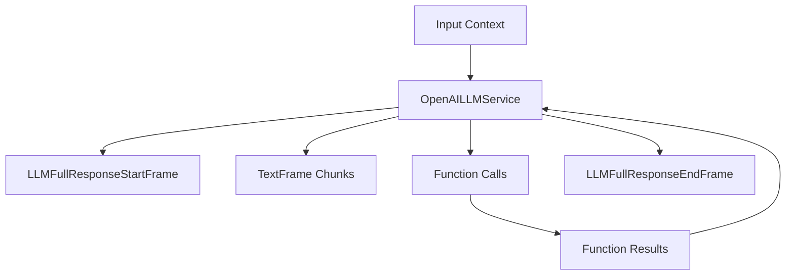

## Overview

OpenAI LLM services provide chat completion capabilities using OpenAI's API. The implementation includes two main classes:

- `BaseOpenAILLMService`: Base class providing core OpenAI chat completion functionality
- `OpenAILLMService`: Implementation with context aggregation support

## Installation

To use OpenAI services, install the required dependencies:

```bash
pip install pipecat-ai[openai]
```

You'll also need to set up your OpenAI API key as an environment variable: `OPENAI_API_KEY`

## BaseOpenAILLMService

### Constructor Parameters

<ParamField path="model" type="str" required>
  OpenAI model identifier (e.g., "gpt-4", "gpt-3.5-turbo")
</ParamField>

<ParamField path="api_key" type="str" optional>
  OpenAI API key (defaults to environment variable)
</ParamField>

<ParamField path="base_url" type="str" optional>
  Custom API endpoint URL
</ParamField>

<ParamField path="params" type="InputParams" optional>
  Model configuration parameters
</ParamField>

### Input Parameters

<ParamField path="extra" type="Optional[Dict[str, Any]]">
  Additional parameters to pass to the model
</ParamField>

<ParamField path="frequency_penalty" type="Optional[float]">
  Reduces likelihood of repeating tokens based on their frequency. Range: [-2.0,
  2.0]
</ParamField>

<ParamField path="max_completion_tokens" type="Optional[int]">
  Maximum number of tokens in the completion. Must be greater than or equal to 1
</ParamField>

<ParamField path="max_tokens" type="Optional[int]">
  Maximum number of tokens to generate. Must be greater than or equal to 1
</ParamField>

<ParamField path="presence_penalty" type="Optional[float]">
  Reduces likelihood of repeating any tokens that have appeared. Range: [-2.0,
  2.0]
</ParamField>

<ParamField path="seed" type="Optional[int]">
  Random seed for deterministic generation. Must be greater than or equal to 0
</ParamField>

<ParamField path="temperature" type="Optional[float]">
  Controls randomness in the output. Range: [0.0, 2.0]
</ParamField>

<ParamField path="top_p" type="Optional[float]">
  Controls diversity via nucleus sampling. Range: [0.0, 1.0]
</ParamField>
## Input Frames

<ParamField path="OpenAILLMContextFrame" type="Frame">
  Contains OpenAI-specific conversation context
</ParamField>

<ParamField path="LLMMessagesFrame" type="Frame">
  Contains conversation messages
</ParamField>

<ParamField path="VisionImageRawFrame" type="Frame">
  Contains image for vision model processing
</ParamField>

<ParamField path="LLMUpdateSettingsFrame" type="Frame">
  Updates model settings
</ParamField>

## Output Frames

<ParamField path="TextFrame" type="Frame">
  Contains generated text chunks
</ParamField>

<ParamField path="FunctionCallInProgressFrame" type="Frame">
  Indicates start of function call
</ParamField>

<ParamField path="FunctionCallResultFrame" type="Frame">
  Contains function call results
</ParamField>

## OpenAILLMService

Extended implementation with context aggregation support.

### Constructor Parameters

<ParamField path="model" type="str" default="gpt-4">
  OpenAI model identifier
</ParamField>

<ParamField path="params" type="BaseOpenAILLMService.InputParams">
  Model configuration parameters
</ParamField>

## Context Management

The OpenAI service uses specialized context management to handle conversations and message formatting. This includes managing the conversation history and system prompts, and tool calls.

### OpenAILLMContext

The base context manager for OpenAI conversations:

```python
context = OpenAILLMContext(
    messages=[],  # Conversation history
    tools=[],     # Available function calling tools
    system="You are a helpful assistant"  # System prompt
)
```

### Context Aggregators

Context aggregators handle message format conversion and management. The service provides a method to create paired aggregators:

<ResponseField name="create_context_aggregator" type="static method">
Creates user and assistant aggregators for handling message formatting.

```python
@staticmethod
def create_context_aggregator(
    context: OpenAILLMContext,
    *,
    assistant_expect_stripped_words: bool = True
) -> OpenAIContextAggregatorPair
```

### Parameters

<ParamField path="context" type="OpenAILLMContext" required>
  The context object containing conversation history and settings
</ParamField>

<ParamField path="assistant_expect_stripped_words" type="bool" default="True">
  Controls text preprocessing for assistant responses
</ParamField>

</ResponseField>

### Usage Example

```python

# 1. Create the context
context = OpenAILLMContext(
    messages=[],
    system="You are a helpful assistant"
)

# 2. Create aggregators for message handling
aggregators = OpenAILLMService.create_context_aggregator(context)

# 3. Access individual aggregators
user_aggregator = aggregators.user()      # Handles user message formatting
assistant_aggregator = aggregators.assistant()  # Handles assistant responses

# 4. Use in a pipeline
pipeline = Pipeline([
    user_aggregator,
    llm_service,
    assistant_aggregator
])
```

The context management system ensures proper message formatting and history tracking throughout the conversation.

## Methods

See the [LLM base class methods](/server/base-classes/llm#methods) for additional functionality.

## Function Calling

This service supports function calling (also known as tool calling) which allows the LLM to request information from external services and APIs. For example, you can enable your bot to:

- Check current weather conditions
- Query databases
- Access external APIs
- Perform custom actions

See the [Function Calling guide](/guides/features/function-calling) for:

- Detailed implementation instructions
- Provider-specific function definitions
- Handler registration examples
- Control over function call behavior
- Complete usage examples

## Usage Examples

### Basic Usage

```python
from pipecat.services.openai import OpenAILLMService

# Configure service
llm_service = OpenAILLMService(
    model="gpt-4",
    params=OpenAILLMService.InputParams(
        temperature=0.7,
        max_tokens=1000
    )
)

# Create pipeline
pipeline = Pipeline([
    context_manager,
    llm_service,
    response_handler
])
```

### With Function Calling

```python
# Configure function calling
context = OpenAILLMContext(
    system_prompt="You are a helpful assistant.",
    tools=[{
        "type": "function",
        "function": {
            "name": "get_weather",
            "description": "Get weather information",
            "parameters": {
                "type": "object",
                "properties": {
                    "location": {"type": "string"}
                }
            }
        }
    }]
)

# Create context aggregators
aggregators = OpenAILLMService.create_context_aggregator(context)
```

## Frame Flow



## Notes

- Supports streaming responses
- Handles function calling
- Provides metrics collection
- Supports vision models
- Manages conversation context
- Thread-safe processing
