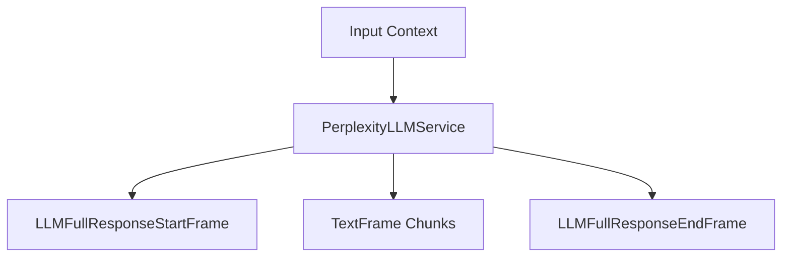

## Overview

`PerplexityLLMService` provides access to Perplexity's language models through an OpenAI-compatible interface. It inherits from `OpenAILLMService` and supports streaming responses and context management, with special handling for Perplexity's incremental token reporting.

<Note>
  Unlike other LLM services, Perplexity does not support function calling.
  Instead, they offer native internet search built in without requiring special
  function calls.
</Note>

## Installation

To use `PerplexityLLMService`, install the required dependencies:

```bash
pip install "pipecat-ai[perplexity]"
```

You'll need to set up your Perplexity API key as an environment variable: `PERPLEXITY_API_KEY`.

## Configuration

### Constructor Parameters

<ParamField path="api_key" type="str" required>
  Your Perplexity API key
</ParamField>

<ParamField path="model" type="str" default="sonar">
  Model identifier
</ParamField>

<ParamField path="base_url" type="str" default="https://api.perplexity.ai">
  Perplexity API endpoint
</ParamField>

### Input Parameters

Inherits OpenAI-compatible parameters:

<ParamField path="frequency_penalty" type="Optional[float]">
  Reduces likelihood of repeating tokens based on their frequency. Must be
  greater than 0
</ParamField>

<ParamField path="max_tokens" type="Optional[int]">
  Maximum number of tokens to generate
</ParamField>

<ParamField path="presence_penalty" type="Optional[float]">
  Reduces likelihood of repeating any tokens that have appeared. Range: [-2.0,
  2.0]
</ParamField>

<ParamField path="temperature" type="Optional[float]">
  Controls randomness in the output. Range: [0.0, 2.0]
</ParamField>

<ParamField path="top_p" type="Optional[float]">
  Controls diversity via nucleus sampling. Range: [0.0, 1.0]
</ParamField>

## Usage Example

```python
from pipecat.services.perplexity import PerplexityLLMService
from pipecat.processors.aggregators.openai_llm_context import OpenAILLMContext
from pipecat.pipeline.pipeline import Pipeline
from pipecat.pipeline.task import PipelineParams, PipelineTask

# Configure service
llm = PerplexityLLMService(
    api_key=os.getenv("PERPLEXITY_API_KEY"),
    model="sonar"
)

# Create context with system message
context = OpenAILLMContext(
    messages=[
        {
            "role": "user",
            "content": "You are a helpful LLM in a WebRTC call. Your goal is to demonstrate your capabilities in a succinct way. Your output will be converted to audio so don't include special characters in your answers."
        }
    ]
)

# Create context aggregator for message handling
context_aggregator = llm.create_context_aggregator(context)

# Set up pipeline
pipeline = Pipeline([
    transport.input(),
    context_aggregator.user(),
    llm,
    tts,
    transport.output(),
    context_aggregator.assistant()
])

# Create and configure task
task = PipelineTask(
    pipeline,
    PipelineParams(
        allow_interruptions=True,
        enable_metrics=True,
        enable_usage_metrics=True,
        report_only_initial_ttfb=True,
    ),
)
```

## Methods

See the [LLM base class methods](/server/base-classes/llm#methods) for additional functionality.

## Available Models

Perplexity provides access to various models:

| Model Name  | Description                              |
| ----------- | ---------------------------------------- |
| `sonar`     | Default model optimized for general chat |
| `sonar-pro` | Pro version of the sonar model           |

<Note>
  See [Perplexity's
  documentation](https://docs.perplexity.ai/guides/model-cards) for the most
  up-to-date list of supported models.
</Note>

## Token Usage Handling

PerplexityLLMService includes special handling for token usage metrics:

1. Accumulates incremental token updates from Perplexity
2. Records prompt tokens on first appearance
3. Tracks completion tokens as they increase
4. Reports final totals at the end of processing

This ensures compatibility with OpenAI's token reporting format while maintaining accurate metrics.

## Frame Flow

Inherits the OpenAI LLM Service frame flow:



## Metrics Support

The service collects standard LLM metrics:

- Token usage (prompt and completion)
- Processing duration
- Time to First Byte (TTFB)

## Notes

- OpenAI-compatible interface
- Supports streaming responses
- Manages conversation context
- Custom token usage tracking for Perplexity's incremental reporting
- Thread-safe processing
- Automatic error handling
