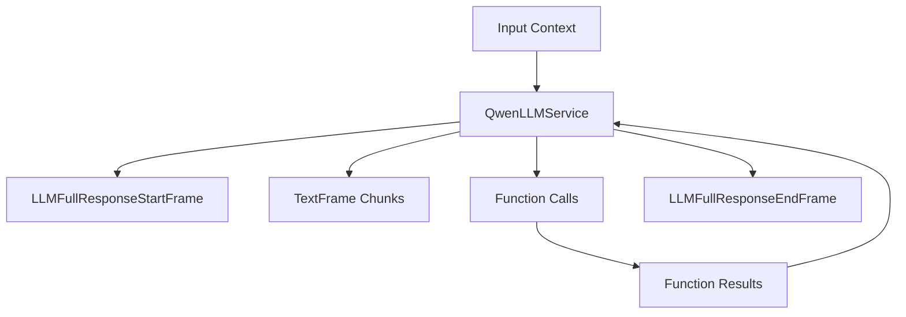

## Overview

`QwenLLMService` provides access to Alibaba Cloud's Qwen language models through an OpenAI-compatible interface. It inherits from `OpenAILLMService` and supports streaming responses, function calling, and context management, with particularly strong capabilities for Chinese language processing.

## Installation

To use `QwenLLMService`, install the required dependencies:

```bash
pip install "pipecat-ai[qwen]"
```

You'll also need to set up your Qwen API key as an environment variable: `QWEN_API_KEY`

## Configuration

### Constructor Parameters

<ParamField path="api_key" type="str" required>
  Your DashScope API key for accessing Qwen models
</ParamField>

<ParamField path="model" type="str" default="qwen-plus">
  Model identifier (see Available Models section)
</ParamField>

<ParamField
  path="base_url"
  type="str"
  default="https://dashscope-intl.aliyuncs.com/compatible-mode/v1"
>
  Qwen API endpoint (OpenAI-compatible mode)
</ParamField>

### Input Parameters

Inherits OpenAI-compatible parameters:

<ParamField path="frequency_penalty" type="Optional[float]">
  Reduces likelihood of repeating tokens based on their frequency. Range: [-2.0,
  2.0]
</ParamField>

<ParamField path="max_tokens" type="Optional[int]">
  Maximum number of tokens to generate. Must be greater than or equal to 1
</ParamField>

<ParamField path="presence_penalty" type="Optional[float]">
  Reduces likelihood of repeating any tokens that have appeared. Range: [-2.0,
  2.0]
</ParamField>

<ParamField path="temperature" type="Optional[float]">
  Controls randomness in the output. Range: [0.0, 2.0]
</ParamField>

<ParamField path="top_p" type="Optional[float]">
  Controls diversity via nucleus sampling. Range: [0.0, 1.0]
</ParamField>

## Usage Example

```python
from pipecat.services.qwen.llm import QwenLLMService
from pipecat.processors.aggregators.openai_llm_context import OpenAILLMContext
from pipecat.adapters.schemas.function_schema import FunctionSchema
from pipecat.adapters.schemas.tools_schema import ToolsSchema
from pipecat.pipeline.pipeline import Pipeline
from pipecat.pipeline.task import PipelineParams, PipelineTask
from pipecat.services.llm_service import FunctionCallParams

# Configure service
llm = QwenLLMService(
    api_key="your-dashscope-api-key",
    model="qwen2.5-72b-instruct"  # Use a model with strong Chinese capabilities
)

# Define weather function using standardized schema
weather_function = FunctionSchema(
    name="get_current_weather",
    description="Get the current weather",
    properties={
        "location": {
            "type": "string",
            "description": "The city and state, e.g. Beijing, China"
        },
        "format": {
            "type": "string",
            "enum": ["celsius", "fahrenheit"],
            "description": "The temperature unit to use"
        }
    },
    required=["location", "format"]
)

# Create tools schema
tools = ToolsSchema(standard_tools=[weather_function])

# Create context with system message and tools
# Note the bilingual prompt for better Chinese support
context = OpenAILLMContext(
    messages=[
        {
            "role": "system",
            "content": "You are a helpful assistant in a voice conversation. "
                       "Keep responses concise. You can respond in Chinese when "
                       "the user speaks Chinese. 你是一个语音对话中的助手，保持简洁的回答。"
                       "当用户用中文交流时，你可以用中文回答。"
        }
    ],
    tools=tools
)

# Register function handlers
async def fetch_weather(params: FunctionCallParams):
    await params.result_callback({"conditions": "sunny", "temperature": "22°C"})

llm.register_function("get_current_weather", fetch_weather)

# Create context aggregator for message handling
context_aggregator = llm.create_context_aggregator(context)

# Set up pipeline
pipeline = Pipeline([
    transport.input(),
    context_aggregator.user(),
    llm,
    tts,
    transport.output(),
    context_aggregator.assistant()
])

# Create and configure task
task = PipelineTask(
    pipeline,
    params=PipelineParams(
        allow_interruptions=True,
        enable_metrics=True,
        enable_usage_metrics=True,
    ),
)
```

## Methods

See the [LLM base class methods](/server/base-classes/llm#methods) for additional functionality.

## Function Calling

This service supports function calling (also known as tool calling) which allows the LLM to request information from external services and APIs. For example, you can enable your bot to:

- Check current weather conditions
- Query databases
- Access external APIs
- Perform custom actions

<Card
  title="Function Calling Guide"
  icon="function"
  href="/guides/features/function-calling"
>
  Learn how to implement function calling with standardized schemas, register
  handlers, manage context properly, and control execution flow in your
  conversational AI applications.
</Card>

## Available Models

### Commercial Models

| Model Name   | Description          | Context Size | Strengths                                |
| ------------ | -------------------- | ------------ | ---------------------------------------- |
| `qwen-max`   | Best performance     | 32K tokens   | Complex reasoning, multi-step tasks      |
| `qwen-plus`  | Balanced performance | 131K tokens  | Good balance of quality, speed, and cost |
| `qwen-turbo` | Fast and affordable  | 1M tokens    | Simple tasks, high throughput            |

### Open Source Models

| Model Name                | Description               | Context Size |
| ------------------------- | ------------------------- | ------------ |
| `qwen2.5-72b-instruct`    | Largest open source model | 131K tokens  |
| `qwen2.5-32b-instruct`    | Medium-sized model        | 131K tokens  |
| `qwen2.5-14b-instruct`    | Smaller model             | 131K tokens  |
| `qwen2.5-7b-instruct`     | Smallest model            | 131K tokens  |
| `qwen2.5-14b-instruct-1m` | Long context model        | 1M tokens    |
| `qwen2.5-7b-instruct-1m`  | Long context model        | 1M tokens    |

<Note>
  See [Alibaba Cloud's Model Studio
  documentation](https://www.alibabacloud.com/help/en/model-studio/getting-started/models)
  for a complete and up-to-date list of supported models.
</Note>

## Chinese Language Support

Qwen models have excellent support for Chinese language processing:

- Native Chinese language capabilities in all models
- Support for both Simplified and Traditional Chinese
- Strong performance on Chinese linguistic tasks
- Culturally appropriate responses for Chinese contexts

For optimal Chinese language support:

1. Use a system prompt in both English and Chinese
2. Consider using specialized Chinese models when available
3. Pair with `QwenTTSService` for high-quality Chinese speech synthesis

## Frame Flow

Inherits the OpenAI LLM Service frame flow:



## Metrics Support

The service collects standard LLM metrics:

- Token usage (prompt and completion)
- Processing duration
- Time to First Byte (TTFB)
- Function call metrics

## Notes

- OpenAI-compatible interface
- Superior Chinese language capabilities
- Supports long contexts (up to 1M tokens in some models)
- Handles function calling
- Manages conversation context
- Includes token usage tracking
- Thread-safe processing
- Automatic error handling
