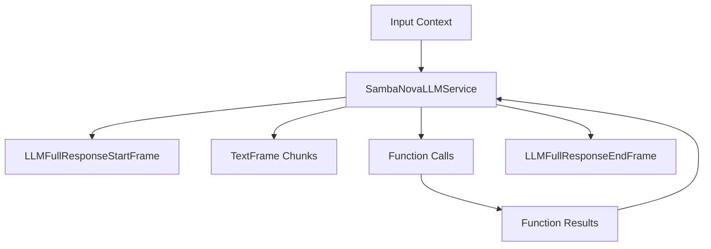

## Overview

`SambaNovaLLMService` provides access to SambaNova's language models through an OpenAI-compatible interface.
It inherits from `OpenAILLMService` and supports streaming responses, function calling, and context management.

## Installation

To use `SambaNovaLLMService`, install the required dependencies:

```bash
pip install "pipecat-ai[sambanova]"
```

You also need to set up your SambaNova API key as an environment variable: `SAMBANOVA_API_KEY`.

<Tip>
  Get your SambaNova API key
  [here](https://cloud.sambanova.ai/?utm_source=pipecat&utm_medium=external&utm_campaign=cloud_signup).
</Tip>

## Configuration

### Constructor Parameters

<ParamField path="api_key" type="str" required>
  Your SambaNova API key
</ParamField>

<ParamField
  path="model"
  type="str"
  default="Llama-4-Maverick-17B-128E-Instruct"
>
  Model identifier
</ParamField>

<ParamField path="base_url" type="str" default="https://api.sambanova.ai/v1">
  SambaNova API endpoint
</ParamField>

### Input Parameters

Inherits OpenAI-compatible parameters:

<ParamField path="max_tokens" type="Optional[int]">
  Maximum number of tokens to generate. Must be greater than or equal to 1.
</ParamField>

<ParamField path="temperature" type="Optional[float]">
  Controls randomness in the output. Range: [0.0, 1.0].
</ParamField>

<ParamField path="top_p" type="Optional[float]">
  Controls diversity via nucleus sampling. Range: [0.0, 1.0]
</ParamField>

## Usage Example

```python
from pipecat.adapters.schemas.function_schema import FunctionSchema
from pipecat.adapters.schemas.tools_schema import ToolsSchema
from pipecat.services.sambanova.llm import SambaNovaLLMService
from pipecat.processors.aggregators.openai_llm_context import OpenAILLMContext
from openai.types.chat import ChatCompletionToolParam
from pipecat.pipeline.pipeline import Pipeline
from pipecat.pipeline.task import PipelineParams, PipelineTask
from pipecat.services.llm_service import FunctionCallParams

# Configure service
llm = SambaNovaLLMService(
    api_key'your-sambanova-api-key',
    model='Llama-4-Maverick-17B-128E-Instruct',
    params=SambaNovaLLMService.InputParams(temperature=0.7, max_tokens=1024),
)

# Define function to call
async def fetch_weather(params: FunctionCallParams) -> Any:
    """Mock function that fetches the weather forcast from an API."""

    await params.result_callback({'conditions': 'nice', 'temperature': '20 Degrees Celsius'})

# Register function handlers
llm.register_function('get_current_weather', fetch_weather)

# Define weather function using standardized schema
weather_function = FunctionSchema(
    name='get_current_weather',
    description='Get the current weather',
    properties={
        'location': {
            'type': 'string',
            'description': 'The city and state.',
        },
        'format': {
            'type': 'string',
            'enum': ['celsius', 'fahrenheit'],
            'description': "The temperature unit to use. Infer this from the user's location.",
        },
    },
    required=['location', 'format'],
)

# Create tools schema
tools = ToolsSchema(standard_tools=[weather_function])

# Define system message
messages = [
    {
        'role': 'system',
        'content': 'You are a helpful LLM in a WebRTC call. '
        'Your goal is to demonstrate your capabilities of weather forecasting in a succinct way. '
        'Introduce yourself to the user and then wait for their question. '
        'Elaborate your response into a conversational answer in a creative and helpful way. '
        'Your output will be converted to audio so do not include special characters in your answer. '
        'Once the final answer has been provided, please stop, unless the user asks another question. ',
    },
]

# Create context with system message and tools
context = OpenAILLMContext(messages, tools)

# Context aggregator
context_aggregator = llm.create_context_aggregator(context)

# Create context aggregator for message handling
context_aggregator = llm.create_context_aggregator(context)

# Set up pipeline
pipeline = Pipeline(
    [
        transport.input(),
        stt,
        context_aggregator.user(),
        llm,
        tts,
        transport.output(),
        context_aggregator.assistant(),
    ]
)

# Create and configure task
task = PipelineTask(
    pipeline,
    params=PipelineParams(
        allow_interruptions=True,
        enable_metrics=True,
        enable_usage_metrics=True,
    ),
)
```

## Methods

See the [LLM base class methods](https://pipecat-docs.readthedocs.io/en/latest/api/pipecat.services.llm_service.html#llm-service) for additional functionality.

## Function Calling

This service supports function calling (also known as tool calling) which allows the LLM to request information from external services and APIs. For example, you can enable your bot to:

- Check current weather conditions.
- Query databases.
- Access external APIs.
- Perform custom actions.

<Card
  title="Function Calling Guide"
  icon="function"
  href="/guides/fundamentals/function-calling"
>
  Learn how to implement function calling with standardized schemas, register
  handlers, manage context properly, and control execution flow in your
  conversational AI applications.
</Card>

## Available Models

| Model Name                            | Description                                       |
| ------------------------------------- | ------------------------------------------------- |
| `DeepSeek-R1`                         | deepseek-ai/DeepSeek-R1                           |
| `DeepSeek-R1-Distill-Llama-70B`       | deepseek-ai/DeepSeek-R1-Distill-Llama-70B         |
| `DeepSeek-V3-0324`                    | deepseek-ai/DeepSeek-V3-0324                      |
| `Llama-4-Maverick-17B-128E-Instruct`  | meta-llama/Llama-4-Maverick-17B-128E-Instruct     |
| `Llama-4-Scout-17B-16E-Instruct`      | meta-llama/Llama-4-Scout-17B-16E-Instruct         |
| `Meta-Llama-3.3-70B-Instruct`         | meta-llama/Llama-3.3-70B-Instruct                 |
| `Meta-Llama-3.2-3B-Instruct`          | meta-llama/Llama-3.2-3B-Instruct                  |
| `Meta-Llama-3.2-1B-Instruct`          | meta-llama/Llama-3.2-1B-Instruct                  |
| `Meta-Llama-3.1-405B-Instruct`        | meta-llama/Llama-3.1-405B-Instruct                |
| `Meta-Llama-3.1-8B-Instruct`          | meta-llama/Llama-3.1-8B-Instruct                  |
| `Meta-Llama-Guard-3-8B`               | meta-llama/Llama-Guard-3-8B                       |
| `QwQ-32B`                             | Qwen/QwQ-32B                                      |
| `Qwen3-32B`                           | Qwen/Qwen3-32B                                    |
| `Llama-3.3-Swallow-70B-Instruct-v0.4` | Tokyotech-llm/Llama-3.3-Swallow-70B-Instruct-v0.4 |

<Note>
  See [SambaNova's
  docs](https://docs.sambanova.ai/cloud/docs/get-started/supported-models) for a
  complete list of supported models.
</Note>

## Frame Flow

Inherits the OpenAI LLM Service frame flow:



## Metrics Support

The service collects standard LLM metrics:

- Token usage (prompt and completion).
- Processing duration.
- Time to First Byte (TTFB).
- Function call metrics.

## Notes

- OpenAI-compatible interface.
- Supports streaming responses.
- Handles function calling.
- Manages conversation context.
- Includes token usage tracking.
- Thread-safe processing.
- Automatic error handling.
