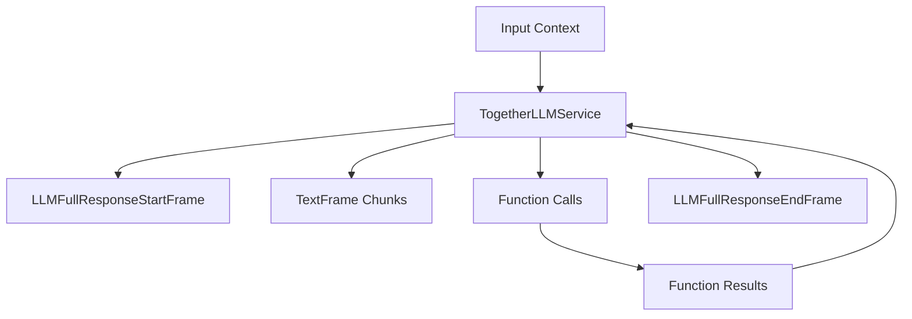

## Overview

`TogetherLLMService` provides access to Together AI's language models, including Meta's Llama 3.1 and 3.2 models, through an OpenAI-compatible interface. It inherits from `OpenAILLMService` and supports streaming responses, function calling, and context management.

## Installation

To use `TogetherLLMService`, install the required dependencies:

```bash
pip install "pipecat-ai[together]"
```

You'll also need to set up your Together API key as an environment variable: `TOGETHER_API_KEY`

## Configuration

### Constructor Parameters

<ParamField path="api_key" type="str" required>
  Your Together AI API key
</ParamField>

<ParamField path="base_url" type="str" default="https://api.together.xyz/v1">
  Together AI API endpoint
</ParamField>

<ParamField
  path="model"
  type="str"
  default="meta-llama/Meta-Llama-3.1-8B-Instruct-Turbo"
>
  Model identifier
</ParamField>

### Input Parameters

Inherits all input parameters from OpenAILLMService:

<ParamField path="extra" type="Optional[Dict[str, Any]]">
  Additional parameters to pass to the model
</ParamField>

<ParamField path="frequency_penalty" type="Optional[float]">
  Reduces likelihood of repeating tokens based on their frequency. Range: [-2.0,
  2.0]
</ParamField>

<ParamField path="max_completion_tokens" type="Optional[int]">
  Maximum number of tokens in the completion. Must be greater than or equal to 1
</ParamField>

<ParamField path="max_tokens" type="Optional[int]">
  Maximum number of tokens to generate. Must be greater than or equal to 1
</ParamField>

<ParamField path="presence_penalty" type="Optional[float]">
  Reduces likelihood of repeating any tokens that have appeared. Range: [-2.0,
  2.0]
</ParamField>

<ParamField path="seed" type="Optional[int]">
  Random seed for deterministic generation. Must be greater than or equal to 0
</ParamField>

<ParamField path="temperature" type="Optional[float]">
  Controls randomness in the output. Range: [0.0, 2.0]
</ParamField>

<ParamField path="top_p" type="Optional[float]">
  Controls diversity via nucleus sampling. Range: [0.0, 1.0]
</ParamField>

## Input Frames

<ParamField path="OpenAILLMContextFrame" type="Frame">
  Contains OpenAI-specific conversation context
</ParamField>

<ParamField path="LLMMessagesFrame" type="Frame">
  Contains conversation messages
</ParamField>

<ParamField path="VisionImageRawFrame" type="Frame">
  Contains image for vision model processing
</ParamField>

<ParamField path="LLMUpdateSettingsFrame" type="Frame">
  Updates model settings
</ParamField>

## Output Frames

<ParamField path="TextFrame" type="Frame">
  Contains generated text chunks
</ParamField>

<ParamField path="FunctionCallInProgressFrame" type="Frame">
  Indicates start of function call
</ParamField>

<ParamField path="FunctionCallResultFrame" type="Frame">
  Contains function call results
</ParamField>

## Usage Example

```python
from pipecat.services.together.llm import TogetherLLMService
from pipecat.processors.aggregators.openai_llm_context import OpenAILLMContext
from pipecat.adapters.schemas.function_schema import FunctionSchema
from pipecat.adapters.schemas.tools_schema import ToolsSchema
from pipecat.pipeline.pipeline import Pipeline
from pipecat.pipeline.task import PipelineParams, PipelineTask

# Configure service
llm = TogetherLLMService(
    api_key="your-together-api-key",
    model="meta-llama/Meta-Llama-3.1-8B-Instruct-Turbo"
)

# Define weather function using standardized schema
weather_function = FunctionSchema(
    name="get_current_weather",
    description="Get the current weather",
    properties={
        "location": {
            "type": "string",
            "description": "The city and state, e.g. San Francisco, CA"
        },
        "format": {
            "type": "string",
            "enum": ["celsius", "fahrenheit"],
            "description": "The temperature unit to use"
        }
    },
    required=["location", "format"]
)

# Create tools schema
tools = ToolsSchema(standard_tools=[weather_function])

# Create context with system message and tools
context = OpenAILLMContext(
    messages=[
        {
            "role": "system",
            "content": "You are a helpful assistant in a voice conversation. Keep responses concise."
        }
    ],
    tools=tools
)

# Register function handlers
async def fetch_weather(function_name, tool_call_id, args, llm, context, result_callback):
    await result_callback({"conditions": "nice", "temperature": "75"})

llm.register_function("get_current_weather", fetch_weather)

# Create context aggregator for message handling
context_aggregator = llm.create_context_aggregator(context)

# Set up pipeline
pipeline = Pipeline([
    transport.input(),
    context_aggregator.user(),
    llm,
    tts,
    transport.output(),
    context_aggregator.assistant()
])

# Create and configure task
task = PipelineTask(
    pipeline,
    params=PipelineParams(
        allow_interruptions=True,
        enable_metrics=True,
        enable_usage_metrics=True,
    ),
)
```

## Methods

See the [LLM base class methods](/server/base-classes/llm#methods) for additional functionality.

## Function Calling

This service supports function calling (also known as tool calling) which allows the LLM to request information from external services and APIs. For example, you can enable your bot to:

- Check current weather conditions
- Query databases
- Access external APIs
- Perform custom actions

<Card
  title="Function Calling Guide"
  icon="function"
  href="/guides/features/function-calling"
>
  Learn how to implement function calling with standardized schemas, register
  handlers, manage context properly, and control execution flow in your
  conversational AI applications.
</Card>

## Available Models

Together AI provides access to various models, including:

| Model Name                                       | Description                                     |
| ------------------------------------------------ | ----------------------------------------------- |
| `meta-llama/Meta-Llama-3.1-8B-Instruct-Turbo`    | Llama 3.1 8B instruct model optimized for speed |
| `meta-llama/Meta-Llama-3.1-34B-Instruct`         | Llama 3.1 34B instruct model                    |
| `meta-llama/Meta-Llama-3.1-70B-Instruct`         | Llama 3.1 70B instruct model                    |
| `meta-llama/Meta-Llama-3.1-405B-Instruct`        | Llama 3.1 405B instruct model                   |
| `meta-llama/Llama-3.2-3B-Instruct-Turbo`         | Llama 3.2 3B instruct model optimized for speed |
| `meta-llama/Llama-3.2-11B-Vision-Instruct-Turbo` | Llama 3.2 11B vision & instruct model           |
| `meta-llama/Llama-3.2-90B-Vision-Instruct-Turbo` | Llama 3.2 90B vision & instruct model           |

<Note>
  See [Together's docs](https://docs.together.ai/docs/serverless-models) for a
  complete list of supported models.
</Note>

## Frame Flow

Inherits the OpenAI LLM Service frame flow:



## Metrics Support

The service collects the same metrics as OpenAILLMService:

- Token usage (prompt and completion)
- Processing duration
- Time to First Byte (TTFB)
- Function call metrics

## Notes

- OpenAI-compatible interface
- Supports streaming responses
- Handles function calling
- Manages conversation context
- Includes token usage tracking
- Thread-safe processing
- Automatic error handling
- Inherits OpenAI service features
