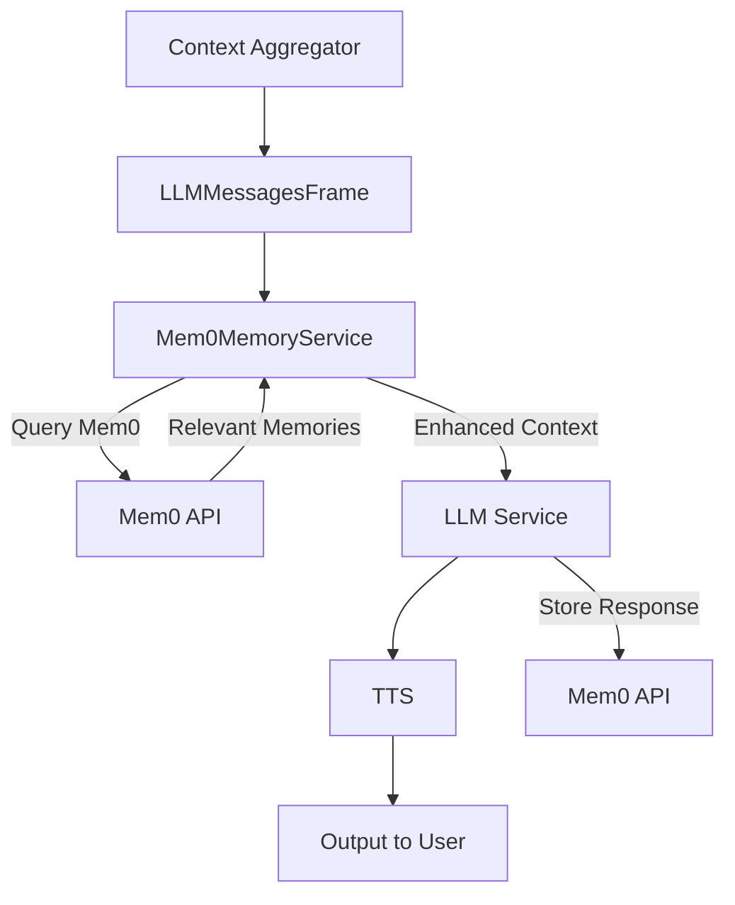

## Overview

`Mem0MemoryService` provides long-term memory capabilities for conversational agents by integrating with Mem0's API. It automatically stores conversation history and retrieves relevant past context based on the current conversation, enhancing LLM responses with persistent memory across sessions.

## Installation

To use the Mem0 memory service, install the required dependencies:

```bash
pip install "pipecat-ai[mem0]"
```

You'll also need to set up your Mem0 API key as an environment variable: `MEM0_API_KEY`.

<Tip>
  You can obtain a Mem0 API key by signing up at [mem0.ai](https://mem0.ai).
</Tip>

## Mem0MemoryService

### Constructor Parameters

<ParamField path="api_key" type="str" required>
  Mem0 API key for accessing the service
</ParamField>

<ParamField path="user_id" type="str" optional>
  Unique identifier for the end user to associate with memories
</ParamField>

<ParamField path="agent_id" type="str" optional>
  Identifier for the agent using the memory service
</ParamField>

<ParamField path="run_id" type="str" optional>
  Identifier for the specific conversation session
</ParamField>

<ParamField path="params" type="InputParams" optional>
  Configuration parameters for memory retrieval (see below)
</ParamField>

<Tip>
  At least one of `user_id`, `agent_id`, or `run_id` must be provided to
  organize memories.
</Tip>

### Input Parameters

The `params` object accepts the following configuration settings:

<ParamField path="search_limit" type="int" default="10">
  Maximum number of relevant memories to retrieve per query
</ParamField>

<ParamField path="search_threshold" type="float" default="0.1">
  Relevance threshold for memory retrieval (0.0 to 1.0)
</ParamField>

<ParamField path="api_version" type="str" default="v2">
  Mem0 API version to use
</ParamField>

<ParamField
  path="system_prompt"
  type="str"
  default="Based on previous conversations, I recall: \n\n"
>
  Prefix text to add before retrieved memories
</ParamField>

<ParamField path="add_as_system_message" type="bool" default="True">
  Whether to add memories as a system message (True) or user message (False)
</ParamField>

<ParamField path="position" type="int" default="1">
  Position in the context where memories should be inserted
</ParamField>

## Input Frames

The service processes the following input frames:

<ParamField path="OpenAILLMContextFrame" type="Frame">
  Contains OpenAI-specific conversation context
</ParamField>

<ParamField path="LLMMessagesFrame" type="Frame">
  Contains conversation messages in standard format
</ParamField>

## Output Frames

The service may produce the following output frames:

<ParamField path="LLMMessagesFrame" type="Frame">
  Enhanced messages with relevant memories included
</ParamField>

<ParamField path="OpenAILLMContextFrame" type="Frame">
  Enhanced OpenAI context with memories included
</ParamField>

<ParamField path="ErrorFrame" type="Frame">
  Contains error information if memory operations fail
</ParamField>

## Memory Operations

The service performs two main operations automatically:

### Message Storage

All conversation messages are stored in Mem0 for future reference. The service:

- Captures full message history from context frames
- Associates messages with the specified user/agent/run IDs
- Stores metadata to enable efficient retrieval

### Memory Retrieval

When a new user message is detected, the service:

1. Uses the message as a search query
2. Retrieves relevant past memories from Mem0
3. Formats memories with the configured system prompt
4. Adds the formatted memories to the conversation context
5. Passes the enhanced context downstream in the pipeline

## Pipeline Positioning

The memory service should be positioned **after** the user context aggregator but **before** the LLM service:

```
context_aggregator.user() → memory_service → llm
```

This ensures that:

1. The user's latest message is included in the context
2. The memory service can enhance the context before the LLM processes it
3. The LLM receives the enhanced context with relevant memories

## Usage Examples

### Basic Integration

```python
from pipecat.services.mem0.memory import Mem0MemoryService
from pipecat.pipeline.pipeline import Pipeline

# Create the memory service
memory = Mem0MemoryService(
    api_key=os.getenv("MEM0_API_KEY"),
    user_id="user123",  # Unique user identifier
)

# Position the memory service between context aggregator and LLM
pipeline = Pipeline([
    transport.input(),
    context_aggregator.user(),
    memory,           # <-- Memory service enhances context here
    llm,
    tts,
    transport.output(),
    context_aggregator.assistant()
])
```

## Frame Flow



## Error Handling

The service includes basic error handling to ensure conversation flow continues even when memory operations fail:

- Exceptions during memory storage and retrieval are caught and logged
- If an error occurs during frame processing, an `ErrorFrame` is emitted with error details
- The original frame is still passed downstream to prevent the pipeline from stalling
- Connection and authentication errors from the Mem0 API will be logged but won't interrupt the conversation

<Warning>
  While the service attempts to handle errors gracefully, memory operations that
  fail may result in missing context in conversations. Monitor your application
  logs for memory-related errors.
</Warning>
