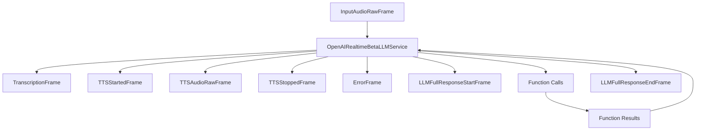

## Overview

`OpenAIRealtimeBetaLLMService` provides real-time, multimodal conversation capabilities using OpenAI's Realtime Beta API. It supports speech-to-speech interactions with integrated LLM processing, function calling, and advanced conversation management.

## Installation

To use `OpenAIRealtimeBetaLLMService`, install the required dependencies:

```bash
pip install pipecat-ai[openai]
```

You'll also need to set up your OpenAI API key as an environment variable: `OPENAI_API_KEY`.

## Configuration

### Constructor Parameters

<ParamField path="api_key" type="str" required>
  Your OpenAI API key
</ParamField>

<ParamField
  path="model"
  type="str"
  default="gpt-4o-realtime-preview-2024-12-17"
>
  The speech-to-speech model used for processing
</ParamField>

<ParamField
  path="base_url"
  type="str"
  default="wss://api.openai.com/v1/realtime?model=gpt-4o-realtime-preview-2024-10-01"
>
  WebSocket endpoint URL
</ParamField>

<ParamField path="session_properties" type="SessionProperties">
  Configuration for the realtime session
</ParamField>

<ParamField path="start_audio_paused" type="bool" default="False">
  Whether to start with audio input paused
</ParamField>

<ParamField path="send_transcription_frames" type="bool" default="True">
  Whether to emit transcription frames
</ParamField>

### Session Properties

```python
class SessionProperties(BaseModel):
    modalities: Optional[List[Literal["text", "audio"]]]
    instructions: Optional[str]
    voice: Optional[str]
    input_audio_format: Optional[Literal["pcm16", "g711_ulaw", "g711_alaw"]]
    output_audio_format: Optional[Literal["pcm16", "g711_ulaw", "g711_alaw"]]
    input_audio_transcription: Optional[InputAudioTranscription]
    turn_detection: Optional[Union[TurnDetection, bool]]
    tools: Optional[List[Dict]]
    tool_choice: Optional[Literal["auto", "none", "required"]]
    temperature: Optional[float]
    max_response_output_tokens: Optional[Union[int, Literal["inf"]]]
```

## Input Frames

### Audio Input

<ParamField path="InputAudioRawFrame" type="Frame">
  Raw audio data for speech input
</ParamField>

### Control Input

<ParamField path="StartInterruptionFrame" type="Frame">
  Signals start of user interruption
</ParamField>

<ParamField path="UserStartedSpeakingFrame" type="Frame">
  Signals user started speaking
</ParamField>

<ParamField path="UserStoppedSpeakingFrame" type="Frame">
  Signals user stopped speaking
</ParamField>

### Context Input

<ParamField path="OpenAILLMContextFrame" type="Frame">
  Contains conversation context
</ParamField>

<ParamField path="LLMMessagesAppendFrame" type="Frame">
  Appends messages to conversation
</ParamField>

## Output Frames

### Audio Output

<ParamField path="TTSAudioRawFrame" type="Frame">
  Generated speech audio
</ParamField>

### Control Output

<ParamField path="TTSStartedFrame" type="Frame">
  Signals start of speech synthesis
</ParamField>

<ParamField path="TTSStoppedFrame" type="Frame">
  Signals end of speech synthesis
</ParamField>

### Text Output

<ParamField path="TextFrame" type="Frame">
  Generated text responses
</ParamField>

<ParamField path="TranscriptionFrame" type="Frame">
  Speech transcriptions
</ParamField>

## Usage Example

```python
from pipecat.services.openai import OpenAIRealtimeBetaLLMService
from pipecat.services.openai.events import SessionProperties, TurnDetection

# Configure service
service = OpenAIRealtimeBetaLLMService(
    api_key="your-api-key",
    session_properties=SessionProperties(
        modalities=["audio", "text"],
        voice="alloy",
        turn_detection=TurnDetection(
            threshold=0.5,
            silence_duration_ms=800
        ),
        temperature=0.7
    )
)

# Use in pipeline
pipeline = Pipeline([
    audio_input,       # Produces InputAudioRawFrame
    service,           # Processes speech/generates responses
    audio_output       # Handles TTSAudioRawFrame
])
```

## Function Calling

The service supports function calling with automatic response handling:

```python
# Define tools
tools = [{
    "type": "function",
    "function": {
        "name": "get_weather",
        "description": "Get weather information",
        "parameters": {
            "type": "object",
            "properties": {
                "location": {"type": "string"}
            }
        }
    }
}]

# Configure service with tools
service = OpenAIRealtimeBetaLLMService(
    api_key="your-api-key",
    session_properties=SessionProperties(
        tools=tools,
        tool_choice="auto"
    )
)

# Register function handler
@service.function("get_weather")
async def handle_weather(location: str):
    # Implementation
    return {"temperature": 72, "condition": "sunny"}
```

See the [Function Calling guide](/guides/features/function-calling) for:

- Detailed implementation instructions
- Provider-specific function definitions
- Handler registration examples
- Control over function call behavior
- Complete usage examples

## Frame Flow



## Metrics Support

The service collects comprehensive metrics:

- Token usage (prompt and completion)
- Processing duration
- Time to First Byte (TTFB)
- Audio processing metrics
- Function call metrics

## Advanced Features

### Turn Detection

```python
# Server-side VAD
turn_detection = TurnDetection(
    type="server_vad",
    threshold=0.5,
    prefix_padding_ms=300,
    silence_duration_ms=800
)

# Disable turn detection
turn_detection = False
```

### Context Management

```python
# Create context
context = OpenAIRealtimeLLMContext(
    messages=[],
    tools=[],
    system="You are a helpful assistant"
)

# Create aggregators
aggregators = service.create_context_aggregator(context)
```

## Notes

- Supports real-time speech-to-speech conversation
- Handles interruptions and turn-taking
- Manages WebSocket connection lifecycle
- Provides function calling capabilities
- Supports conversation context management
- Includes comprehensive error handling
- Manages audio streaming and processing
- Handles both text and audio modalities
