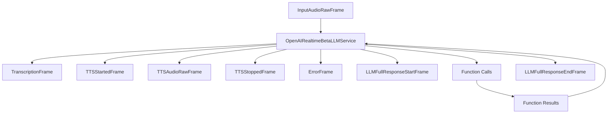

`OpenAIRealtimeBetaLLMService` provides real-time, multimodal conversation capabilities using OpenAI's Realtime Beta API. It supports speech-to-speech interactions with integrated LLM processing, function calling, and advanced conversation management.

<CardGroup cols={2}>
  <Card title="Real-time Interaction" icon="bolt">
    Stream audio in real-time with minimal latency response times
  </Card>
  <Card title="Speech Processing" icon="waveform-lines">
    Built-in speech-to-text and text-to-speech capabilities with voice options
  </Card>
  <Card title="Advanced Turn Detection" icon="microphone">
    Multiple voice activity detection options including semantic turn detection
  </Card>
  <Card title="Powerful Function Calling" icon="code">
    Seamless support for calling external functions and APIs
  </Card>
</CardGroup>

## Installation

To use `OpenAIRealtimeBetaLLMService`, install the required dependencies:

```bash
pip install pipecat-ai[openai]
```

You'll also need to set up your OpenAI API key as an environment variable: `OPENAI_API_KEY`.

## Configuration

### Constructor Parameters

<ParamField path="api_key" type="str" required>
  Your OpenAI API key
</ParamField>

<ParamField path="model" type="str" default="gpt-4o-realtime-preview-latest">
  The speech-to-speech model used for processing
</ParamField>

<ParamField
  path="base_url"
  type="str"
  default="wss://api.openai.com/v1/realtime"
>
  WebSocket endpoint URL
</ParamField>

<ParamField path="session_properties" type="SessionProperties">
  Configuration for the realtime session
</ParamField>

<ParamField path="start_audio_paused" type="bool" default="False">
  Whether to start with audio input paused
</ParamField>

<ParamField path="send_transcription_frames" type="bool" default="True">
  Whether to emit transcription frames
</ParamField>

### Session Properties

The `SessionProperties` object configures the behavior of the realtime session:

<ParamField path="modalities" type="List[Literal['text', 'audio']]" optional>
  The modalities to enable (default includes both text and audio)
</ParamField>

<ParamField path="instructions" type="str" optional>
  System instructions that guide the model's behavior
</ParamField>

```python
service = OpenAIRealtimeBetaLLMService(
    api_key=os.getenv("OPENAI_API_KEY"),
    session_properties=SessionProperties(
        instructions="You are a helpful assistant. Be concise and friendly."
    )
)
```

<ParamField path="voice" type="str" optional>
  Voice ID for text-to-speech (options: alloy, echo, fable, onyx, nova, shimmer)
</ParamField>

<ParamField
  path="input_audio_format"
  type="Literal['pcm16', 'g711_ulaw', 'g711_alaw']"
  optional
>
  Format of the input audio
</ParamField>

<ParamField
  path="output_audio_format"
  type="Literal['pcm16', 'g711_ulaw', 'g711_alaw']"
  optional
>
  Format of the output audio
</ParamField>

<ParamField
  path="input_audio_transcription"
  type="InputAudioTranscription"
  optional
>
  Configuration for audio transcription
</ParamField>

```python
from pipecat.services.openai.events import InputAudioTranscription

service = OpenAIRealtimeBetaLLMService(
    api_key=os.getenv("OPENAI_API_KEY"),
    session_properties=SessionProperties(
        input_audio_transcription=InputAudioTranscription(
            model="gpt-4o-transcribe-latest",
            language="en",
            prompt="This is a technical conversation about programming"
        )
    )
)
```

<ParamField
  path="input_audio_noise_reduction"
  type="InputAudioNoiseReduction"
  optional
>
  Configuration for audio noise reduction
</ParamField>

<ParamField
  path="turn_detection"
  type="Union[TurnDetection, SemanticTurnDetection, bool]"
  optional
>
  Configuration for turn detection (set to False to disable)
</ParamField>

<ParamField path="tools" type="List[Dict]" optional>
  List of function definitions for tool/function calling
</ParamField>

<ParamField
  path="tool_choice"
  type="Literal['auto', 'none', 'required']"
  optional
>
  Controls when the model calls functions
</ParamField>

<ParamField path="temperature" type="float" optional>
  Controls randomness in responses (0.0 to 2.0)
</ParamField>

<ParamField
  path="max_response_output_tokens"
  type="Union[int, Literal['inf']]"
  optional
>
  Maximum number of tokens to generate
</ParamField>

## Input Frames

### Audio Input

<ParamField path="InputAudioRawFrame" type="Frame">
  Raw audio data for speech input
</ParamField>

### Control Input

<ParamField path="StartInterruptionFrame" type="Frame">
  Signals start of user interruption
</ParamField>

<ParamField path="UserStartedSpeakingFrame" type="Frame">
  Signals user started speaking
</ParamField>

<ParamField path="UserStoppedSpeakingFrame" type="Frame">
  Signals user stopped speaking
</ParamField>

### Context Input

<ParamField path="OpenAILLMContextFrame" type="Frame">
  Contains conversation context
</ParamField>

<ParamField path="LLMMessagesAppendFrame" type="Frame">
  Appends messages to conversation
</ParamField>

## Output Frames

### Audio Output

<ParamField path="TTSAudioRawFrame" type="Frame">
  Generated speech audio
</ParamField>

### Control Output

<ParamField path="TTSStartedFrame" type="Frame">
  Signals start of speech synthesis
</ParamField>

<ParamField path="TTSStoppedFrame" type="Frame">
  Signals end of speech synthesis
</ParamField>

### Text Output

<ParamField path="TextFrame" type="Frame">
  Generated text responses
</ParamField>

<ParamField path="TranscriptionFrame" type="Frame">
  Speech transcriptions
</ParamField>

## Events

<ParamField path="on_conversation_item_created" type="event">
  Emitted when a conversation item on the server is created. Handler receives: -
  `item_id: str` - `item: ConversationItem`
</ParamField>

<ParamField path="on_conversation_item_updated" type="event">
  Emitted when a conversation item on the server is updated. Handler receives: -
  `item_id: str` - `item: Optional[ConversationItem]` (may not exist for some
  updates)
</ParamField>

## Methods

<ResponseField name="retrieve_conversation_item" type="method">
  Retrieves a converation item's details from the server.

```python
async def retrieve_conversation_item(self, item_id: str) -> ConversationItem
```

</ResponseField>

## Usage Example

```python
from pipecat.services.openai import OpenAIRealtimeBetaLLMService
from pipecat.services.openai.events import SessionProperties, TurnDetection

# Configure service
service = OpenAIRealtimeBetaLLMService(
    api_key="your-api-key",
    session_properties=SessionProperties(
        modalities=["audio", "text"],
        voice="alloy",
        turn_detection=TurnDetection(
            threshold=0.5,
            silence_duration_ms=800
        ),
        temperature=0.7
    )
)

# Use in pipeline
pipeline = Pipeline([
    audio_input,       # Produces InputAudioRawFrame
    service,           # Processes speech/generates responses
    audio_output       # Handles TTSAudioRawFrame
])
```

## Function Calling

The service supports function calling with automatic response handling:

```python
# Define tools
tools = [{
    "type": "function",
    "function": {
        "name": "get_weather",
        "description": "Get weather information",
        "parameters": {
            "type": "object",
            "properties": {
                "location": {"type": "string"}
            }
        }
    }
}]

# Configure service with tools
service = OpenAIRealtimeBetaLLMService(
    api_key="your-api-key",
    session_properties=SessionProperties(
        tools=tools,
        tool_choice="auto"
    )
)

# Register function handler
@service.function("get_weather")
async def handle_weather(location: str):
    # Implementation
    return {"temperature": 72, "condition": "sunny"}
```

See the [Function Calling guide](/guides/features/function-calling) for:

- Detailed implementation instructions
- Provider-specific function definitions
- Handler registration examples
- Control over function call behavior
- Complete usage examples

## Frame Flow



## Metrics Support

The service collects comprehensive metrics:

- Token usage (prompt and completion)
- Processing duration
- Time to First Byte (TTFB)
- Audio processing metrics
- Function call metrics

## Advanced Features

### Turn Detection

```python
# Server-side basic VAD
turn_detection = TurnDetection(
    type="server_vad",
    threshold=0.5,
    prefix_padding_ms=300,
    silence_duration_ms=800
)

# Server-side semantic VAD
turn_detection = SemanticTurnDetection(
  type="semantic_vad",
  eagerness="auto", # default. could also be "low" | "medium" | "high"
  create_response=True # default
  interrupt_response=Tue # default
)

# Disable turn detection
turn_detection = False
```

### Context Management

```python
# Create context
context = OpenAIRealtimeLLMContext(
    messages=[],
    tools=[],
    system="You are a helpful assistant"
)

# Create aggregators
aggregators = service.create_context_aggregator(context)
```

## Foundational Examples

Check out these examples to see the service in action:

- [OpenAI Realtime Beta Example](https://github.com/pipecat-ai/pipecat/blob/main/examples/foundational/19-openai-realtime-beta.py)
  Basic implementation showing core features

## Notes

- Supports real-time speech-to-speech conversation
- Handles interruptions and turn-taking
- Manages WebSocket connection lifecycle
- Provides function calling capabilities
- Supports conversation context management
- Includes comprehensive error handling
- Manages audio streaming and processing
- Handles both text and audio modalities
