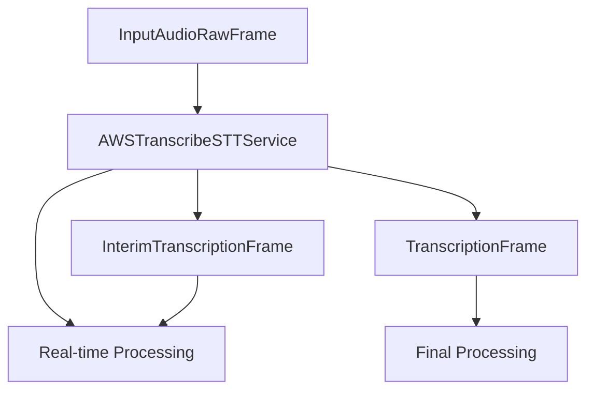

## Overview

`AWSTranscribeSTTService` provides real-time speech-to-text capabilities using Amazon Transcribe's WebSocket API. It supports interim results, adjustable quality levels, and can handle continuous audio streams.

## Installation

To use `AWSTranscribeSTTService`, install the required dependencies:

```bash
pip install "pipecat-ai[aws]"
```

You'll also need to set up your AWS credentials as environment variables:

- `AWS_ACCESS_KEY_ID`
- `AWS_SECRET_ACCESS_KEY`
- `AWS_SESSION_TOKEN` (if using temporary credentials)
- `AWS_REGION` (defaults to "us-east-1")

<Tip>
  You can obtain AWS credentials by setting up an IAM user with access to Amazon
  Transcribe in your AWS account.
</Tip>

## Configuration

### Constructor Parameters

<ParamField path="api_key" type="str" optional>
  Your AWS secret access key (can also use environment variable)
</ParamField>

<ParamField path="aws_access_key_id" type="str" optional>
  Your AWS access key ID (can also use environment variable)
</ParamField>

<ParamField path="aws_session_token" type="str" optional>
  Your AWS session token for temporary credentials (can also use environment
  variable)
</ParamField>

<ParamField path="region" type="str" default="us-east-1">
  AWS region to use for Transcribe service
</ParamField>

<ParamField path="sample_rate" type="int" default="16000">
  Audio sample rate in Hz (only 8000 Hz or 16000 Hz are supported)
</ParamField>

<ParamField path="language" type="Language" default="Language.EN">
  Language for transcription
</ParamField>

### Default Settings

```python
{
    "sample_rate": 16000,
    "language": Language.EN,
    "media_encoding": "linear16",  # AWS expects raw PCM
    "number_of_channels": 1,
    "show_speaker_label": False,
    "enable_channel_identification": False
}
```

## Input

The service processes `InputAudioRawFrame` instances containing:

- Raw PCM audio data
- 16-bit depth
- 8kHz or 16kHz sample rate (will convert to 16kHz if another rate is provided)
- Single channel (mono)

## Output Frames

The service produces two types of frames during transcription:

### TranscriptionFrame

Generated for final transcriptions, containing:

<ParamField path="text" type="string">
  Transcribed text
</ParamField>

<ParamField path="user_id" type="string">
  User identifier
</ParamField>

<ParamField path="timestamp" type="string">
  ISO 8601 formatted timestamp
</ParamField>

<ParamField path="language" type="Language">
  Language used for transcription
</ParamField>

### InterimTranscriptionFrame

Generated during ongoing speech, containing same fields as TranscriptionFrame but with preliminary results.

## Methods

See the [STT base class methods](/server/base-classes/speech#methods) for additional functionality.

### Language Setting

```python
await service.set_language(Language.FR)
```

## Usage Example

```python
from pipecat.services.aws.stt import AWSTranscribeSTTService

# Configure service using environment variables for credentials
stt = AWSTranscribeSTTService(
    region="us-west-2",
    sample_rate=16000,
    language=Language.EN
)

# Or provide credentials directly
stt = AWSTranscribeSTTService(
    aws_access_key_id="YOUR_ACCESS_KEY_ID",
    api_key="YOUR_SECRET_ACCESS_KEY",
    region="us-west-2",
    sample_rate=16000,
    language=Language.EN
)

# Use in pipeline
pipeline = Pipeline([
    transport.input(),
    stt,
    llm,
    ...
])
```

## Language Support

AWS Transcribe STT supports the following languages:

| Language Code | Description         | Service Codes |
| ------------- | ------------------- | ------------- |
| `Language.EN` | English (US)        | `en-US`       |
| `Language.ES` | Spanish             | `es-US`       |
| `Language.FR` | French              | `fr-FR`       |
| `Language.DE` | German              | `de-DE`       |
| `Language.IT` | Italian             | `it-IT`       |
| `Language.PT` | Portuguese (Brazil) | `pt-BR`       |
| `Language.JA` | Japanese            | `ja-JP`       |
| `Language.KO` | Korean              | `ko-KR`       |
| `Language.ZH` | Chinese (Mandarin)  | `zh-CN`       |

<Note>
  AWS Transcribe supports additional languages and regional variants. See the
  [AWS Transcribe
  documentation](https://docs.aws.amazon.com/transcribe/latest/dg/supported-languages.html)
  for a complete list.
</Note>

## Frame Flow



## Metrics Support

The service supports the following metrics:

- Time to First Byte (TTFB)
- Processing duration

## Notes

- Requires valid AWS credentials with access to Amazon Transcribe
- Supports real-time transcription with interim results
- Handles WebSocket connection management and reconnection
- Only supports mono audio (single channel)
- Automatically handles audio format conversion to PCM
- Manages connection lifecycle (start, stop, cancel)
