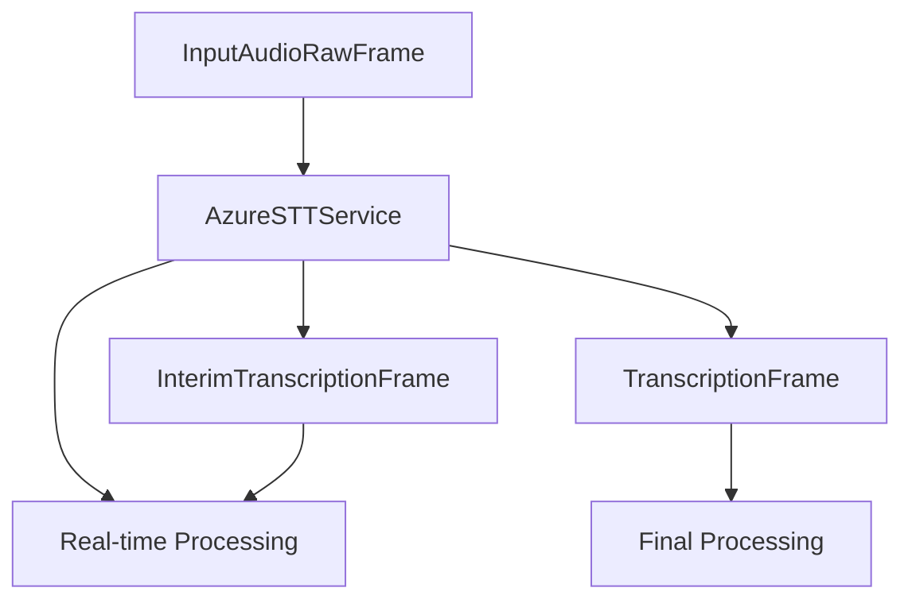

## Overview

`AzureSTTService` provides real-time speech recognition using Azure's Cognitive Services Speech SDK. It supports continuous recognition and multiple languages.

## Installation

To use `AzureSTTService`, install the required dependencies:

```bash
pip install pipecat-ai[azure]
```

You'll also need to set up the following environment variables:

- `AZURE_API_KEY`
- `AZURE_REGION`

## Configuration

### Constructor Parameters

<ParamField path="api_key" type="str" required>
  Azure Speech Service API key
</ParamField>

<ParamField path="region" type="str" required>
  Azure region identifier
</ParamField>

<ParamField path="language" type="Language" default="Language.EN_US">
  Recognition language
</ParamField>

<ParamField path="sample_rate" type="int" default="24000">
  Input audio sample rate in Hz
</ParamField>

<ParamField path="channels" type="int" default="1">
  Number of audio channels
</ParamField>

## Input

The service processes audio data through a `PushAudioInputStream`:

- PCM format
- Configurable sample rate
- Mono or stereo input

## Output Frames

<ParamField path="TranscriptionFrame" type="Frame">
  Contains: - Recognized text - Empty user ID - ISO 8601 formatted timestamp
</ParamField>

## Methods

See the [STT base class methods](/api-reference/services/base-service-classes#methods) for additional functionality.

### Language Setting

```python
await service.set_language(Language.FR)
```

## Language Support

Azure STT supports the following languages and regional variants:

| Language Code    | Description         | Service Codes    |
| ---------------- | ------------------- | ---------------- |
| `Language.ZH`    | Chinese             | `zh-CN`          |
| `Language.EN_US` | English (US)        | `en-US`          |
| `Language.EN_IN` | English (India)     | `en-IN`          |
| `Language.FR`    | French              | `fr-FR`          |
| `Language.DE`    | German              | `de-DE`          |
| `Language.HI`    | Hindi               | `hi-IN`          |
| `Language.IT`    | Italian             | `it-IT`          |
| `Language.JA`    | Japanese            | `ja-JP`          |
| `Language.KO`    | Korean              | `ko-KR`          |
| `Language.PT_BR` | Portuguese (Brazil) | `pt-BR`          |
| `Language.ES`    | Spanish             | `es-ES`, `es-MX` |

## Usage Example

```python
# Configure service
stt_service = AzureSTTService(
    api_key="your-api-key",
    region="eastus",
    language=Language.EN_US,
    sample_rate=16000,
    channels=1
)

# Use in pipeline
pipeline = Pipeline([
    audio_input,
    stt_service,
    text_handler
])
```

## Frame Flow



## Notes

- Supports continuous recognition
- Handles automatic reconnection
- Provides real-time transcription
- Thread-safe processing
- Automatic resource cleanup
