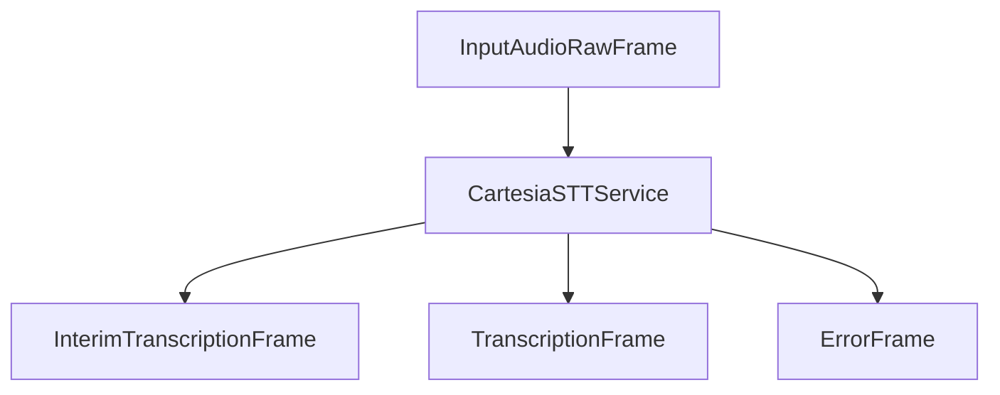

## Overview

`CartesiaSTTService` provides real-time speech-to-text capabilities using Cartesia's WebSocket API. It supports streaming transcription with both interim and final results using the `ink-whisper` model.

## Installation

To use `CartesiaSTTService`, install the required dependencies:

```bash
pip install "pipecat-ai[cartesia]"
```

You'll also need to set up your Cartesia API key as an environment variable: `CARTESIA_API_KEY`.

<Tip>
  You can obtain a Cartesia API key by signing up at
  [Cartesia](https://cartesia.ai/).
</Tip>

## Configuration

### Constructor Parameters

<ParamField path="api_key" type="str" required>
  Your Cartesia API key
</ParamField>

<ParamField path="base_url" type="str" default="api.cartesia.ai">
  Custom Cartesia API endpoint URL
</ParamField>

<ParamField path="sample_rate" type="int" default="16000">
  Audio sample rate in Hz
</ParamField>

<ParamField path="live_options" type="CartesiaLiveOptions" optional>
  Custom transcription options
</ParamField>

### CartesiaLiveOptions

<ParamField path="model" type="str" default="ink-whisper">
  The Cartesia transcription model to use
</ParamField>

<ParamField path="language" type="str" default="en">
  Language code for transcription
</ParamField>

<ParamField path="encoding" type="str" default="pcm_s16le">
  Audio encoding format
</ParamField>

<ParamField path="sample_rate" type="int" default="16000">
  Audio sample rate in Hz
</ParamField>

### Default Options

```python
CartesiaLiveOptions(
    model="ink-whisper",
    language="en",
    encoding="pcm_s16le",
    sample_rate=16000
)
```

## Input

The service processes raw audio data with the following requirements:

- PCM audio format (`pcm_s16le`)
- 16-bit depth
- 16kHz sample rate (default)
- Single channel (mono)

## Output Frames

The service produces two types of frames during transcription:

### TranscriptionFrame

Generated for final transcriptions, containing:

<ParamField path="text" type="string">
  Final transcribed text
</ParamField>

<ParamField path="user_id" type="string">
  User identifier
</ParamField>

<ParamField path="timestamp" type="string">
  ISO 8601 formatted timestamp
</ParamField>

<ParamField path="language" type="Language">
  Detected or configured language
</ParamField>

### InterimTranscriptionFrame

Generated during ongoing speech, containing the same fields as TranscriptionFrame but with preliminary results.

## Methods

See the [STT base class methods](/server/base-classes/speech#methods) for additional functionality.

### Language Setting

The service supports language configuration through the `CartesiaLiveOptions`:

```python
live_options = CartesiaLiveOptions(language="es")
```

### Model Selection

```python
live_options = CartesiaLiveOptions(model="ink-whisper")
```

## Usage Example

```python
from pipecat.services.cartesia.stt import CartesiaSTTService, CartesiaLiveOptions
from pipecat.transcriptions.language import Language

# Basic configuration
stt = CartesiaSTTService(
    api_key=os.getenv("CARTESIA_API_KEY")
)

# Advanced configuration
live_options = CartesiaLiveOptions(
    model="ink-whisper",
    language=Language.ES.value,
    sample_rate=16000,
    encoding="pcm_s16le"
)

stt = CartesiaSTTService(
    api_key=os.getenv("CARTESIA_API_KEY"),
    live_options=live_options
)

# Use in pipeline
pipeline = Pipeline([
    transport.input(),
    stt,
    llm,
    ...
])
```

## Frame Flow



## Connection Management

The service automatically manages WebSocket connections:

- **Auto-reconnect**: Reconnects automatically when the connection is closed due to timeout
- **Finalization**: Sends a "finalize" command when user stops speaking to flush the transcription session
- **Error handling**: Gracefully handles connection errors and WebSocket exceptions

## Metrics Support

The service supports comprehensive metrics collection:

- Time to First Byte (TTFB)
- Processing duration
- Speech detection events
- Connection status

## Notes

- Requires valid Cartesia API key
- Supports real-time streaming transcription
- Handles automatic WebSocket connection management
- Includes comprehensive error handling
- Manages connection lifecycle automatically
