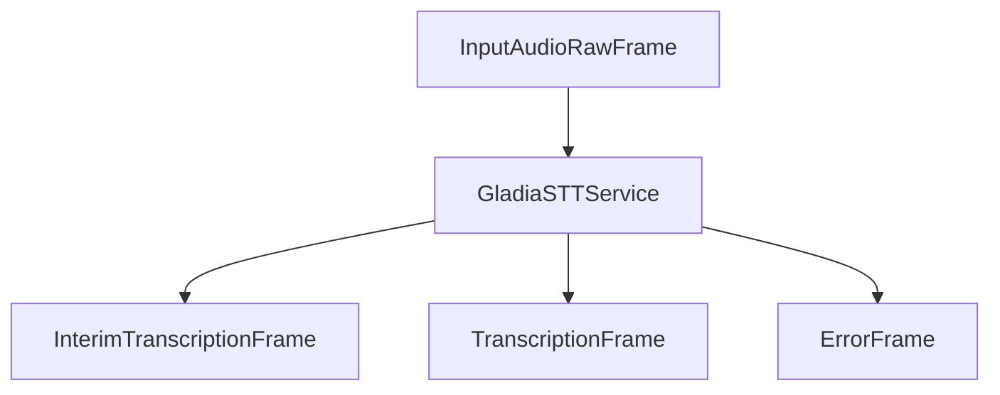

## Overview

`GladiaSTTService` is a speech-to-text (STT) service that integrates with Gladia's API to provide real-time transcription capabilities. It processes audio input and produces transcription frames in real-time with support for multiple languages, custom vocabulary, and various processing options.

## Installation

To use `GladiaSTTService`, you need to install the Gladia dependencies:

```bash
pip install "pipecat-ai[gladia]"
```

You'll also need to set up your Gladia API key as an environment variable: `GLADIA_API_KEY`.

## Configuration

### Service Parameters

<ParamField path="api_key" type="string" required>
  Your Gladia API key for authentication
</ParamField>

<ParamField path="url" type="string" default="https://api.gladia.io/v2/live">
  Gladia API endpoint URL
</ParamField>

<ParamField path="confidence" type="float" default="0.5">
  Minimum confidence threshold to create interim and final transcriptions.
  Values range from 0 to 1.
</ParamField>

<ParamField path="sample_rate" type="integer" default="None">
  Audio sample rate in Hz
</ParamField>

<ParamField path="model" type="string" default="solaria-1">
  Model to use for transcription. Options include
  
  - `solaria-1`
  - `solaria-mini-1`
  - `fast`
  - `accurate`

See [Gladia's docs](https://docs.gladia.io/api-reference/v2/live/init#body-model) for the latest supported models.

</ParamField>

<ParamField
  path="params"
  type="GladiaInputParams"
  default="GladiaInputParams()"
>
  Additional configuration parameters for the service
</ParamField>

### GladiaInputParams

<ParamField path="encoding" type="string" default="wav/pcm">
  Audio encoding format
</ParamField>

<ParamField path="bit_depth" type="integer" default="16">
  Audio bit depth
</ParamField>

<ParamField path="channels" type="integer" default="1">
  Number of audio channels
</ParamField>

<ParamField path="custom_metadata" type="Dict[str, Any]" optional>
  Additional metadata to include with requests
</ParamField>

<ParamField path="endpointing" type="float" optional>
  Silence duration in seconds to mark end of speech
</ParamField>

<ParamField
  path="maximum_duration_without_endpointing"
  type="integer"
  default="10"
>
  Maximum utterance duration without silence
</ParamField>

<ParamField path="language" type="Language" deprecated>
  Primary language for transcription. Deprecated: use `language_config` instead.
</ParamField>

<ParamField path="language_config" type="LanguageConfig" optional>
  Detailed language configuration
</ParamField>

<ParamField path="pre_processing" type="PreProcessingConfig" optional>
  Audio pre-processing options
</ParamField>

<ParamField path="realtime_processing" type="RealtimeProcessingConfig" optional>
  Real-time processing features
</ParamField>

<ParamField path="messages_config" type="MessagesConfig" optional>
  WebSocket message filtering options
</ParamField>

### LanguageConfig

<ParamField path="languages" type="List[str]" optional>
  Specify language(s) for transcription. If one language is set, it will be used
  for all transcription. If multiple languages are provided or none, language
  will be auto-detected by the model.
</ParamField>

<ParamField path="code_switching" type="boolean" default="false">
  If true, language will be auto-detected on each utterance. Otherwise, language
  will be auto-detected on first utterance and then used for the rest of the
  transcription. If one language is set, this option will be ignored.
</ParamField>

### PreProcessingConfig

<ParamField path="speech_threshold" type="float" default="0.8">
  Sensitivity configuration for Speech Threshold. A value close to 1 will apply
  stricter thresholds, making it less likely to detect background sounds as
  speech. Must be between 0 and 1.
</ParamField>

### CustomVocabularyConfig

<ParamField
  path="vocabulary"
  type="List[Union[str, CustomVocabularyItem]]"
  required
>
  Specific vocabulary list to feed the transcription model with. Can be a list
  of strings or CustomVocabularyItem objects.
</ParamField>

<ParamField path="default_intensity" type="float" optional>
  Default intensity for the custom vocabulary. Must be between 0 and 1.
</ParamField>

### CustomSpellingConfig

<ParamField path="spelling_dictionary" type="Dict[str, List[str]]" required>
  The list of spelling rules applied on the audio transcription. Keys are the
  correct spellings and values are lists of phonetic variations.
</ParamField>

### TranslationConfig

<ParamField path="target_languages" type="List[str]" required>
  The target language(s) in ISO639-1 format (e.g., "en", "fr", "es")
</ParamField>

<ParamField path="model" type="string" default="base">
  Translation model to use. Options: "base" or "enhanced"
</ParamField>

<ParamField path="match_original_utterances" type="boolean" default="true">
  Align translated utterances with the original ones
</ParamField>

### RealtimeProcessingConfig

<ParamField path="words_accurate_timestamps" type="boolean" optional>
  Whether to provide per-word timestamps
</ParamField>

<ParamField path="custom_vocabulary" type="boolean" optional>
  Whether to enable custom vocabulary
</ParamField>

<ParamField
  path="custom_vocabulary_config"
  type="CustomVocabularyConfig"
  optional
>
  Custom vocabulary configuration
</ParamField>

<ParamField path="custom_spelling" type="boolean" optional>
  Whether to enable custom spelling
</ParamField>

<ParamField path="custom_spelling_config" type="CustomSpellingConfig" optional>
  Custom spelling configuration
</ParamField>

<ParamField path="translation" type="boolean" optional>
  Whether to enable translation
</ParamField>

<ParamField path="translation_config" type="TranslationConfig" optional>
  Translation configuration
</ParamField>

<ParamField path="named_entity_recognition" type="boolean" optional>
  Whether to enable named entity recognition
</ParamField>

<ParamField path="sentiment_analysis" type="boolean" optional>
  Whether to enable sentiment analysis
</ParamField>

### MessagesConfig

<ParamField path="receive_partial_transcripts" type="boolean" default="true">
  If true, partial utterances will be sent via WebSocket
</ParamField>

<ParamField path="receive_final_transcripts" type="boolean" default="true">
  If true, final utterances will be sent via WebSocket
</ParamField>

<ParamField path="receive_speech_events" type="boolean" default="true">
  If true, begin and end speech events will be sent via WebSocket
</ParamField>

<ParamField path="receive_pre_processing_events" type="boolean" default="true">
  If true, pre-processing events will be sent via WebSocket
</ParamField>

<ParamField
  path="receive_realtime_processing_events"
  type="boolean"
  default="true"
>
  If true, realtime processing events will be sent via WebSocket
</ParamField>

<ParamField path="receive_post_processing_events" type="boolean" default="true">
  If true, post-processing events will be sent via WebSocket
</ParamField>

<ParamField path="receive_acknowledgments" type="boolean" default="true">
  If true, acknowledgments will be sent via WebSocket
</ParamField>

<ParamField path="receive_errors" type="boolean" default="true">
  If true, errors will be sent via WebSocket
</ParamField>

<ParamField path="receive_lifecycle_events" type="boolean" default="false">
  If true, lifecycle events will be sent via WebSocket
</ParamField>

## Input

The service processes raw audio data with the following requirements:

- PCM audio format
- 16-bit depth
- 16kHz sample rate (default)
- Single channel (mono)

## Output

The service produces two types of frames during transcription:

### TranscriptionFrame

Generated for final transcriptions, containing:

<ParamField path="text" type="string">
  Transcribed text
</ParamField>

<ParamField path="user_id" type="string">
  User identifier
</ParamField>

<ParamField path="timestamp" type="string">
  ISO 8601 formatted timestamp
</ParamField>

<ParamField path="language" type="Language">
  Transcription language
</ParamField>

### InterimTranscriptionFrame

Generated during ongoing speech, containing the same fields as TranscriptionFrame but with preliminary results.

### ErrorFrame

Generated when transcription errors occur, containing error details.

## Methods

See the [STT base class methods](/server/base-classes/speech#methods) for additional functionality.

### Language Setting

```python
await service.set_language(Language.FR)
```

## Language Support

Gladia STT supports a wide range of languages. Here's a partial list:

| Language Code    | Description         | Service Code |
| ---------------- | ------------------- | ------------ |
| `Language.AF`    | Afrikaans           | `af`         |
| `Language.AM`    | Amharic             | `am`         |
| `Language.AR`    | Arabic              | `ar`         |
| `Language.AS`    | Assamese            | `as`         |
| `Language.AZ`    | Azerbaijani         | `az`         |
| `Language.BA`    | Bashkir             | `ba`         |
| `Language.BE`    | Belarusian          | `be`         |
| `Language.BG`    | Bulgarian           | `bg`         |
| `Language.BN`    | Bengali             | `bn`         |
| `Language.BO`    | Tibetan             | `bo`         |
| `Language.BR`    | Breton              | `br`         |
| `Language.BS`    | Bosnian             | `bs`         |
| `Language.CA`    | Catalan             | `ca`         |
| `Language.CS`    | Czech               | `cs`         |
| `Language.CY`    | Welsh               | `cy`         |
| `Language.DA`    | Danish              | `da`         |
| `Language.DE`    | German              | `de`         |
| `Language.EL`    | Greek               | `el`         |
| `Language.EN`    | English             | `en`         |
| `Language.ES`    | Spanish             | `es`         |
| `Language.ET`    | Estonian            | `et`         |
| `Language.EU`    | Basque              | `eu`         |
| `Language.FA`    | Persian             | `fa`         |
| `Language.FI`    | Finnish             | `fi`         |
| `Language.FO`    | Faroese             | `fo`         |
| `Language.FR`    | French              | `fr`         |
| `Language.GL`    | Galician            | `gl`         |
| `Language.GU`    | Gujarati            | `gu`         |
| `Language.HA`    | Hausa               | `ha`         |
| `Language.HAW`   | Hawaiian            | `haw`        |
| `Language.HE`    | Hebrew              | `he`         |
| `Language.HI`    | Hindi               | `hi`         |
| `Language.HR`    | Croatian            | `hr`         |
| `Language.HT`    | Haitian Creole      | `ht`         |
| `Language.HU`    | Hungarian           | `hu`         |
| `Language.HY`    | Armenian            | `hy`         |
| `Language.ID`    | Indonesian          | `id`         |
| `Language.IS`    | Icelandic           | `is`         |
| `Language.IT`    | Italian             | `it`         |
| `Language.JA`    | Japanese            | `ja`         |
| `Language.JV`    | Javanese            | `jv`         |
| `Language.KA`    | Georgian            | `ka`         |
| `Language.KK`    | Kazakh              | `kk`         |
| `Language.KM`    | Khmer               | `km`         |
| `Language.KN`    | Kannada             | `kn`         |
| `Language.KO`    | Korean              | `ko`         |
| `Language.LA`    | Latin               | `la`         |
| `Language.LB`    | Luxembourgish       | `lb`         |
| `Language.LN`    | Lingala             | `ln`         |
| `Language.LO`    | Lao                 | `lo`         |
| `Language.LT`    | Lithuanian          | `lt`         |
| `Language.LV`    | Latvian             | `lv`         |
| `Language.MG`    | Malagasy            | `mg`         |
| `Language.MI`    | Maori               | `mi`         |
| `Language.MK`    | Macedonian          | `mk`         |
| `Language.ML`    | Malayalam           | `ml`         |
| `Language.MN`    | Mongolian           | `mn`         |
| `Language.MR`    | Marathi             | `mr`         |
| `Language.MS`    | Malay               | `ms`         |
| `Language.MT`    | Maltese             | `mt`         |
| `Language.MY_MR` | Burmese             | `mymr`       |
| `Language.NE`    | Nepali              | `ne`         |
| `Language.NL`    | Dutch               | `nl`         |
| `Language.NN`    | Norwegian (Nynorsk) | `nn`         |
| `Language.NO`    | Norwegian           | `no`         |
| `Language.OC`    | Occitan             | `oc`         |
| `Language.PA`    | Punjabi             | `pa`         |
| `Language.PL`    | Polish              | `pl`         |
| `Language.PS`    | Pashto              | `ps`         |
| `Language.PT`    | Portuguese          | `pt`         |
| `Language.RO`    | Romanian            | `ro`         |
| `Language.RU`    | Russian             | `ru`         |
| `Language.SA`    | Sanskrit            | `sa`         |
| `Language.SD`    | Sindhi              | `sd`         |
| `Language.SI`    | Sinhala             | `si`         |
| `Language.SK`    | Slovak              | `sk`         |
| `Language.SL`    | Slovenian           | `sl`         |
| `Language.SN`    | Shona               | `sn`         |
| `Language.SO`    | Somali              | `so`         |
| `Language.SQ`    | Albanian            | `sq`         |
| `Language.SR`    | Serbian             | `sr`         |
| `Language.SU`    | Sundanese           | `su`         |
| `Language.SV`    | Swedish             | `sv`         |
| `Language.SW`    | Swahili             | `sw`         |
| `Language.TA`    | Tamil               | `ta`         |
| `Language.TE`    | Telugu              | `te`         |
| `Language.TG`    | Tajik               | `tg`         |
| `Language.TH`    | Thai                | `th`         |
| `Language.TK`    | Turkmen             | `tk`         |
| `Language.TL`    | Tagalog             | `tl`         |
| `Language.TR`    | Turkish             | `tr`         |
| `Language.TT`    | Tatar               | `tt`         |
| `Language.UK`    | Ukrainian           | `uk`         |
| `Language.UR`    | Urdu                | `ur`         |
| `Language.UZ`    | Uzbek               | `uz`         |
| `Language.VI`    | Vietnamese          | `vi`         |
| `Language.YI`    | Yiddish             | `yi`         |
| `Language.YO`    | Yoruba              | `yo`         |
| `Language.ZH`    | Chinese             | `zh`         |

For a complete list of supported languages, refer to [Gladia's documentation](https://docs.gladia.io/api-reference/v2/live/init#body-language-config-languages).

## Advanced Features

### Custom Vocabulary

You can provide custom vocabulary items with bias intensity:

```python
from pipecat.services.gladia.config import CustomVocabularyItem, CustomVocabularyConfig, RealtimeProcessingConfig

custom_vocab = CustomVocabularyConfig(
    vocabulary=[
        CustomVocabularyItem(value="Pipecat", intensity=0.8),
        CustomVocabularyItem(value="Daily", intensity=0.7),
    ],
    default_intensity=0.5
)

realtime_config = RealtimeProcessingConfig(
    custom_vocabulary=True,
    custom_vocabulary_config=custom_vocab
)
```

### Translation

Enable real-time translation:

```python
from pipecat.services.gladia.config import TranslationConfig, RealtimeProcessingConfig

translation_config = TranslationConfig(
    target_languages=["fr", "es", "de"],
    model="enhanced",
    match_original_utterances=True
)

realtime_config = RealtimeProcessingConfig(
    translation=True,
    translation_config=translation_config
)
```

### Multi-language Support

Configure multiple languages with automatic language switching:

```python
from pipecat.services.gladia.config import LanguageConfig, GladiaInputParams

language_config = LanguageConfig(
    languages=["en", "fr", "es"],
    code_switching=True
)

params = GladiaInputParams(
    language_config=language_config
)
```

## Usage Example

```python
from pipecat.pipeline.pipeline import Pipeline
from pipecat.services.gladia.stt import GladiaSTTService
from pipecat.services.gladia.config import (
    GladiaInputParams,
    LanguageConfig,
    RealtimeProcessingConfig
)
from pipecat.transcriptions.language import Language

# Configure the service
stt = GladiaSTTService(
    api_key="your-api-key",
    model="solaria-1",
    params=GladiaInputParams(
        language_config=LanguageConfig(
            languages=[Language.EN, Language.FR],
            code_switching=True
        ),
    )
)

# Use in pipeline
pipeline = Pipeline([
    transport.input(),
    stt,
    llm,
    ...
])
```

## Frame Flow



## Metrics Support

The service collects processing metrics:

- Time to First Byte (TTFB)
- Processing duration
- Connection status

## Notes

- Audio input must be in PCM format
- Transcription frames are only generated when confidence threshold is met
- Service automatically handles websocket connections and cleanup
- Real-time processing occurs in parallel for natural conversation flow
