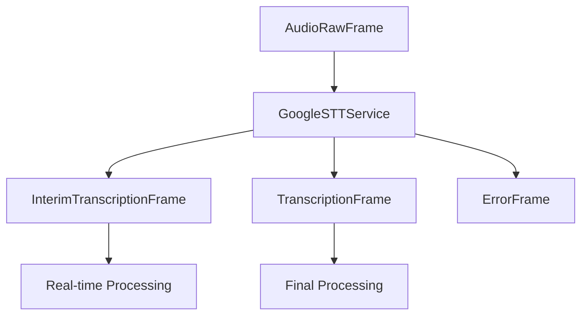

## Overview

`GoogleSTTService` provides real-time speech-to-text capabilities using Google Cloud's Speech-to-Text V2 API. It supports interim results, multiple languages, and voice activity detection (VAD).

## Installation

To use `GoogleSTTService`, install the required dependencies:

```bash
pip install pipecat-ai[google]
```

You'll need Google Cloud credentials either as a JSON string or file.

<Tip>
  You can obtain Google Cloud credentials by creating a service account in the
  [Google Cloud
  Console](https://console.cloud.google.com/iam-admin/serviceaccounts).
</Tip>

## Configuration

### Constructor Parameters

<ParamField path="credentials" type="str" optional>
  Google Cloud service account credentials as JSON string
</ParamField>

<ParamField path="credentials_path" type="str" optional>
  Path to service account credentials JSON file
</ParamField>

<ParamField path="location" type="str" default="global">
  Google Cloud location for the service
</ParamField>

<ParamField path="sample_rate" type="int" optional>
  Audio sample rate in Hertz
</ParamField>

<ParamField path="params" type="InputParams" optional>
  Configuration parameters for the service
</ParamField>

### InputParams

The `InputParams` class provides configuration options for the Google STT service.

<ParamField path="language" type="Language" default="Language.EN_US">
  Recognition language. See Language Support table for available options.
</ParamField>

<ParamField path="model" type="str" default="latest_long">
  Speech recognition model to use.
</ParamField>

<ParamField
  path="use_separate_recognition_per_channel"
  type="bool"
  default="False"
>
  Process each audio channel separately for multi-channel audio.
</ParamField>

<ParamField path="enable_automatic_punctuation" type="bool" default="True">
  Automatically add punctuation marks to transcriptions.
</ParamField>

<ParamField path="enable_spoken_punctuation" type="bool" default="False">
  Include spoken punctuation (e.g., "period", "comma") in transcript.
</ParamField>

<ParamField path="enable_spoken_emojis" type="bool" default="False">
  Include spoken emojis (e.g., "smiley face") in transcript.
</ParamField>

<ParamField path="profanity_filter" type="bool" default="False">
  Filter profanity from transcriptions.
</ParamField>

<ParamField path="enable_word_time_offsets" type="bool" default="False">
  Include timing information for each word.
</ParamField>

<ParamField path="enable_word_confidence" type="bool" default="False">
  Include confidence scores for each word.
</ParamField>

<ParamField path="enable_interim_results" type="bool" default="True">
  Stream partial recognition results as they become available.
</ParamField>

<ParamField path="enable_voice_activity_events" type="bool" default="False">
  Enable voice activity detection events.
</ParamField>

<Note>
- Not all features are available for all models or languages
- Some combinations of options may affect latency or accuracy
- Model selection should match your use case for best results

</Note>

## Input

The service processes raw audio data with:

- Linear16 PCM encoding
- 16-bit depth
- Configurable sample rate
- Single channel (mono)

## Output Frames

The service produces two types of frames:

### TranscriptionFrame

Generated for final transcriptions, containing:

<ParamField path="text" type="string">
  Transcribed text
</ParamField>

<ParamField path="user_id" type="string">
  User identifier
</ParamField>

<ParamField path="timestamp" type="string">
  ISO 8601 formatted timestamp
</ParamField>

<ParamField path="language" type="Language">
  Recognition language
</ParamField>

### InterimTranscriptionFrame

Generated during ongoing speech, containing same fields as TranscriptionFrame but with preliminary results.

## Methods

<ResponseField name="set_language" type="method">
Updates the service's recognition language.

```python
async def set_language(language: Language) -> None
```

Example:

```python
await service.set_language(Language.FR_FR)
```

</ResponseField>

<ResponseField name="set_model" type="method">
Updates the service's recognition model.

```python
async def set_model(model: str) -> None
```

Example:

```python
await service.set_model("medical_dictation")
```

</ResponseField>

<ResponseField name="update_options" type="method">
Updates multiple service options dynamically.

```python
async def update_options(
    *,
    language: Optional[Language] = None,
    model: Optional[str] = None,
    enable_automatic_punctuation: Optional[bool] = None,
    enable_spoken_punctuation: Optional[bool] = None,
    enable_spoken_emojis: Optional[bool] = None,
    profanity_filter: Optional[bool] = None,
    enable_word_time_offsets: Optional[bool] = None,
    enable_word_confidence: Optional[bool] = None,
    enable_interim_results: Optional[bool] = None,
    enable_voice_activity_events: Optional[bool] = None,
    location: Optional[str] = None,
) -> None
```

Example:

```python
await service.update_options(
    language=Language.ES_ES,
    enable_interim_results=True,
    profanity_filter=True
)
```

</ResponseField>

See the [STT base class methods](/server/base-classes/speech#methods) for additional functionality.

## Usage Example

```python
from pipecat.services.google import GoogleSTTService
from pipecat.transcriptions.language import Language

# Configure service
stt_service = GoogleSTTService(
    credentials_path="path/to/credentials.json",
    params=GoogleSTTService.InputParams(
        language=Language.EN_US,
        model="latest_long",
        enable_automatic_punctuation=True,
        enable_interim_results=True
    )
)

# Use in pipeline
pipeline = Pipeline([
    transport.input(),
    stt,
    context_aggregator.user(),
    llm,
    ...
])
```

## Regional Support

Google Cloud Speech-to-Text V2 supports different regional endpoints for improved latency and data residency requirements.

### Available Regions

See supported languages, models, and features for each region in Google's Speech-to-Text [documentation](https://cloud.google.com/speech-to-text/v2/docs/speech-to-text-supported-languages).

### Configuration

Specify the region during service initialization:

```python
stt_service = GoogleSTTService(
    credentials=credentials,
    location="us-central1",  # Use us-central1 endpoint
    params=GoogleSTTService.InputParams(
        model="chirp_2"
    )
)
```

### Dynamic Region Updates

The region can be updated during runtime:

```python
await stt_service.update_options(
    location="asia"
)
```

### Notes

- The `global` endpoint is used by default
- Regional endpoints may provide lower latency for users in those regions
- Some features or models might only be available in specific regions
- Regional selection may affect pricing
- Data residency requirements may dictate region selection

## Models

| Model Name             | Description                                  | Best For                |
| ---------------------- | -------------------------------------------- | ----------------------- |
| `chirp_2`              | Google's latest ASR model                    | General use cases       |
| `latest_long`          | Latest model optimized for long-form speech  | Conversations, meetings |
| `latest_short`         | Latest model optimized for short-form speech | Short messages, notes   |
| `telephony`            | Optimized for phone calls                    | Call centers            |
| `medical_dictation`    | Optimized for medical terminology            | Healthcare dictation    |
| `medical_conversation` | Optimized for doctor-patient interactions    | Medical consultations   |

See Google Cloud's [Speech-to-Text documentation](https://cloud.google.com/speech-to-text/docs/transcription-model) for more details.

## Language Support

| Language Code    | Description                    | Service Codes |
| ---------------- | ------------------------------ | ------------- |
| `Language.AF`    | Afrikaans                      | `af-ZA`       |
| `Language.SQ`    | Albanian                       | `sq-AL`       |
| `Language.AM`    | Amharic                        | `am-ET`       |
| `Language.AR`    | Arabic (Default: Egypt)        | `ar-EG`       |
| `Language.AR_AE` | Arabic (UAE)                   | `ar-AE`       |
| `Language.AR_BH` | Arabic (Bahrain)               | `ar-BH`       |
| `Language.AR_DZ` | Arabic (Algeria)               | `ar-DZ`       |
| `Language.AR_EG` | Arabic (Egypt)                 | `ar-EG`       |
| `Language.AR_IQ` | Arabic (Iraq)                  | `ar-IQ`       |
| `Language.AR_JO` | Arabic (Jordan)                | `ar-JO`       |
| `Language.AR_KW` | Arabic (Kuwait)                | `ar-KW`       |
| `Language.AR_LB` | Arabic (Lebanon)               | `ar-LB`       |
| `Language.AR_MA` | Arabic (Morocco)               | `ar-MA`       |
| `Language.AR_OM` | Arabic (Oman)                  | `ar-OM`       |
| `Language.AR_QA` | Arabic (Qatar)                 | `ar-QA`       |
| `Language.AR_SA` | Arabic (Saudi Arabia)          | `ar-SA`       |
| `Language.AR_SY` | Arabic (Syria)                 | `ar-SY`       |
| `Language.AR_TN` | Arabic (Tunisia)               | `ar-TN`       |
| `Language.AR_YE` | Arabic (Yemen)                 | `ar-YE`       |
| `Language.HY`    | Armenian                       | `hy-AM`       |
| `Language.AZ`    | Azerbaijani                    | `az-AZ`       |
| `Language.EU`    | Basque                         | `eu-ES`       |
| `Language.BN`    | Bengali (Default: India)       | `bn-IN`       |
| `Language.BN_BD` | Bengali (Bangladesh)           | `bn-BD`       |
| `Language.BN_IN` | Bengali (India)                | `bn-IN`       |
| `Language.BS`    | Bosnian                        | `bs-BA`       |
| `Language.BG`    | Bulgarian                      | `bg-BG`       |
| `Language.MY`    | Burmese                        | `my-MM`       |
| `Language.CA`    | Catalan                        | `ca-ES`       |
| `Language.ZH`    | Chinese (Default: Simplified)  | `cmn-Hans-CN` |
| `Language.ZH_CN` | Chinese (Simplified)           | `cmn-Hans-CN` |
| `Language.ZH_HK` | Chinese (Hong Kong)            | `cmn-Hans-HK` |
| `Language.ZH_TW` | Chinese (Traditional)          | `cmn-Hant-TW` |
| `Language.YUE`   | Chinese (Cantonese)            | `yue-Hant-HK` |
| `Language.HR`    | Croatian                       | `hr-HR`       |
| `Language.CS`    | Czech                          | `cs-CZ`       |
| `Language.DA`    | Danish                         | `da-DK`       |
| `Language.NL`    | Dutch (Default: Netherlands)   | `nl-NL`       |
| `Language.NL_BE` | Dutch (Belgium)                | `nl-BE`       |
| `Language.NL_NL` | Dutch (Netherlands)            | `nl-NL`       |
| `Language.EN`    | English (Default: US)          | `en-US`       |
| `Language.EN_AU` | English (Australia)            | `en-AU`       |
| `Language.EN_CA` | English (Canada)               | `en-CA`       |
| `Language.EN_GB` | English (UK)                   | `en-GB`       |
| `Language.EN_GH` | English (Ghana)                | `en-GH`       |
| `Language.EN_HK` | English (Hong Kong)            | `en-HK`       |
| `Language.EN_IN` | English (India)                | `en-IN`       |
| `Language.EN_IE` | English (Ireland)              | `en-IE`       |
| `Language.EN_KE` | English (Kenya)                | `en-KE`       |
| `Language.EN_NG` | English (Nigeria)              | `en-NG`       |
| `Language.EN_NZ` | English (New Zealand)          | `en-NZ`       |
| `Language.EN_PH` | English (Philippines)          | `en-PH`       |
| `Language.EN_SG` | English (Singapore)            | `en-SG`       |
| `Language.EN_TZ` | English (Tanzania)             | `en-TZ`       |
| `Language.EN_US` | English (US)                   | `en-US`       |
| `Language.EN_ZA` | English (South Africa)         | `en-ZA`       |
| `Language.ET`    | Estonian                       | `et-EE`       |
| `Language.FIL`   | Filipino                       | `fil-PH`      |
| `Language.FI`    | Finnish                        | `fi-FI`       |
| `Language.FR`    | French (Default: France)       | `fr-FR`       |
| `Language.FR_BE` | French (Belgium)               | `fr-BE`       |
| `Language.FR_CA` | French (Canada)                | `fr-CA`       |
| `Language.FR_CH` | French (Switzerland)           | `fr-CH`       |
| `Language.GL`    | Galician                       | `gl-ES`       |
| `Language.KA`    | Georgian                       | `ka-GE`       |
| `Language.DE`    | German (Default: Germany)      | `de-DE`       |
| `Language.DE_AT` | German (Austria)               | `de-AT`       |
| `Language.DE_CH` | German (Switzerland)           | `de-CH`       |
| `Language.EL`    | Greek                          | `el-GR`       |
| `Language.GU`    | Gujarati                       | `gu-IN`       |
| `Language.HE`    | Hebrew                         | `iw-IL`       |
| `Language.HI`    | Hindi                          | `hi-IN`       |
| `Language.HU`    | Hungarian                      | `hu-HU`       |
| `Language.IS`    | Icelandic                      | `is-IS`       |
| `Language.ID`    | Indonesian                     | `id-ID`       |
| `Language.IT`    | Italian                        | `it-IT`       |
| `Language.IT_CH` | Italian (Switzerland)          | `it-CH`       |
| `Language.JA`    | Japanese                       | `ja-JP`       |
| `Language.JV`    | Javanese                       | `jv-ID`       |
| `Language.KN`    | Kannada                        | `kn-IN`       |
| `Language.KK`    | Kazakh                         | `kk-KZ`       |
| `Language.KM`    | Khmer                          | `km-KH`       |
| `Language.KO`    | Korean                         | `ko-KR`       |
| `Language.LO`    | Lao                            | `lo-LA`       |
| `Language.LV`    | Latvian                        | `lv-LV`       |
| `Language.LT`    | Lithuanian                     | `lt-LT`       |
| `Language.MK`    | Macedonian                     | `mk-MK`       |
| `Language.MS`    | Malay                          | `ms-MY`       |
| `Language.ML`    | Malayalam                      | `ml-IN`       |
| `Language.MR`    | Marathi                        | `mr-IN`       |
| `Language.MN`    | Mongolian                      | `mn-MN`       |
| `Language.NE`    | Nepali                         | `ne-NP`       |
| `Language.NO`    | Norwegian                      | `no-NO`       |
| `Language.FA`    | Persian                        | `fa-IR`       |
| `Language.PL`    | Polish                         | `pl-PL`       |
| `Language.PT`    | Portuguese (Default: Portugal) | `pt-PT`       |
| `Language.PT_BR` | Portuguese (Brazil)            | `pt-BR`       |
| `Language.PT_PT` | Portuguese (Portugal)          | `pt-PT`       |
| `Language.PA`    | Punjabi                        | `pa-Guru-IN`  |
| `Language.RO`    | Romanian                       | `ro-RO`       |
| `Language.RU`    | Russian                        | `ru-RU`       |
| `Language.SR`    | Serbian                        | `sr-RS`       |
| `Language.SI`    | Sinhala                        | `si-LK`       |
| `Language.SK`    | Slovak                         | `sk-SK`       |
| `Language.SL`    | Slovenian                      | `sl-SI`       |
| `Language.ES`    | Spanish (Default: Spain)       | `es-ES`       |
| `Language.ES_AR` | Spanish (Argentina)            | `es-AR`       |
| `Language.ES_BO` | Spanish (Bolivia)              | `es-BO`       |
| `Language.ES_CL` | Spanish (Chile)                | `es-CL`       |
| `Language.ES_CO` | Spanish (Colombia)             | `es-CO`       |
| `Language.ES_CR` | Spanish (Costa Rica)           | `es-CR`       |
| `Language.ES_DO` | Spanish (Dominican Republic)   | `es-DO`       |
| `Language.ES_EC` | Spanish (Ecuador)              | `es-EC`       |
| `Language.ES_GT` | Spanish (Guatemala)            | `es-GT`       |
| `Language.ES_HN` | Spanish (Honduras)             | `es-HN`       |
| `Language.ES_MX` | Spanish (Mexico)               | `es-MX`       |
| `Language.ES_NI` | Spanish (Nicaragua)            | `es-NI`       |
| `Language.ES_PA` | Spanish (Panama)               | `es-PA`       |
| `Language.ES_PE` | Spanish (Peru)                 | `es-PE`       |
| `Language.ES_PR` | Spanish (Puerto Rico)          | `es-PR`       |
| `Language.ES_PY` | Spanish (Paraguay)             | `es-PY`       |
| `Language.ES_SV` | Spanish (El Salvador)          | `es-SV`       |
| `Language.ES_US` | Spanish (US)                   | `es-US`       |
| `Language.ES_UY` | Spanish (Uruguay)              | `es-UY`       |
| `Language.ES_VE` | Spanish (Venezuela)            | `es-VE`       |
| `Language.SU`    | Sundanese                      | `su-ID`       |
| `Language.SW`    | Swahili (Default: Tanzania)    | `sw-TZ`       |
| `Language.SW_KE` | Swahili (Kenya)                | `sw-KE`       |
| `Language.SW_TZ` | Swahili (Tanzania)             | `sw-TZ`       |
| `Language.SV`    | Swedish                        | `sv-SE`       |
| `Language.TA`    | Tamil (Default: India)         | `ta-IN`       |
| `Language.TA_IN` | Tamil (India)                  | `ta-IN`       |
| `Language.TA_MY` | Tamil (Malaysia)               | `ta-MY`       |
| `Language.TA_SG` | Tamil (Singapore)              | `ta-SG`       |
| `Language.TA_LK` | Tamil (Sri Lanka)              | `ta-LK`       |
| `Language.TE`    | Telugu                         | `te-IN`       |
| `Language.TH`    | Thai                           | `th-TH`       |
| `Language.TR`    | Turkish                        | `tr-TR`       |
| `Language.UK`    | Ukrainian                      | `uk-UA`       |
| `Language.UR`    | Urdu (Default: India)          | `ur-IN`       |
| `Language.UR_IN` | Urdu (India)                   | `ur-IN`       |
| `Language.UR_PK` | Urdu (Pakistan)                | `ur-PK`       |
| `Language.UZ`    | Uzbek                          | `uz-UZ`       |
| `Language.VI`    | Vietnamese                     | `vi-VN`       |
| `Language.XH`    | Xhosa                          | `xh-ZA`       |
| `Language.ZU`    | Zulu                           | `zu-ZA`       |

### Special Features

- Supports multiple languages simultaneously
- Provides regional variants for many languages
- Handles different Chinese scripts (simplified/traditional)
- Supports medical-specific models

## Frame Flow



## Notes

- Requires Google Cloud credentials
- Supports real-time transcription
- Handles streaming connection management
- Provides dynamic configuration updates
- Supports model switching
- Includes VAD capabilities
- Manages connection lifecycle
