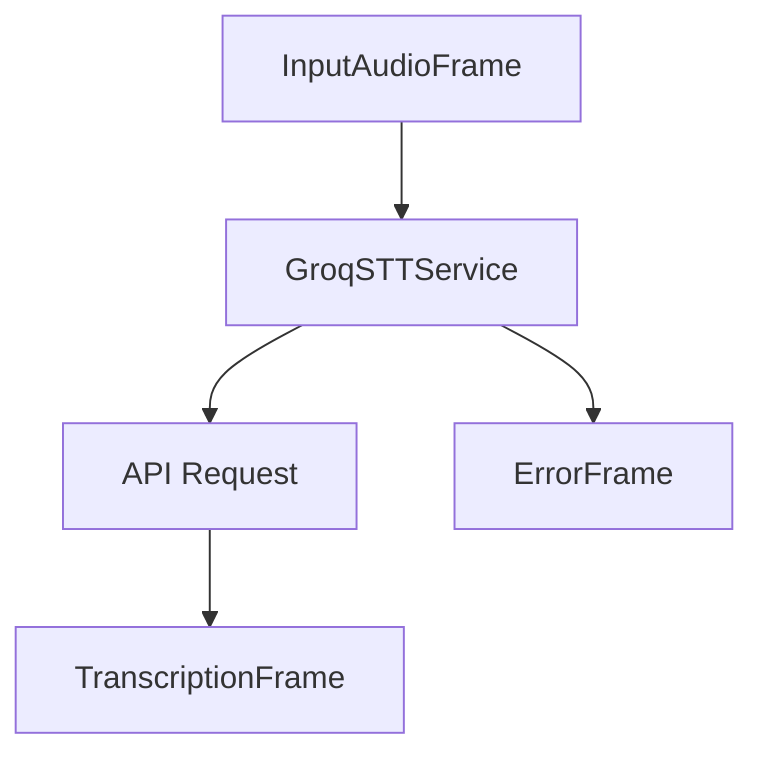

## Overview

`GroqSTTService` provides speech-to-text capabilities using Groq's hosted Whisper API. It offers high-accuracy transcription with minimal setup requirements.

## Installation

To use `GroqSTTService`, install the required dependencies:

```bash
pip install pipecat-ai[groq]
```

You'll need to set up your Groq API key as an environment variable: `GROQ_API_KEY`.

<Tip>
  You can obtain a Groq API key from the [Groq
  Console](https://console.groq.com/keys).
</Tip>

## Configuration

### Constructor Parameters

<ParamField path="model" type="str" default="whisper-large-v3-turbo">
  Whisper model to use. Currently only "whisper-large-v3-turbo" is available.
</ParamField>

<ParamField path="api_key" type="str" optional>
  Your Groq API key. If not provided, will use environment variable.
</ParamField>

<ParamField path="base_url" type="str" default="https://api.groq.com/openai/v1">
  Custom API base URL for Groq API requests.
</ParamField>

## Input

The service processes audio data with the following requirements:

- PCM audio format
- 16-bit depth
- Single channel (mono)

## Output Frames

The service produces two types of frames during transcription:

### TranscriptionFrame

Generated for final transcriptions, containing:

<ParamField path="text" type="string">
  Transcribed text
</ParamField>

<ParamField path="user_id" type="string">
  User identifier
</ParamField>

<ParamField path="timestamp" type="string">
  ISO 8601 formatted timestamp
</ParamField>

<ParamField path="language" type="Language">
  Detected language (if available)
</ParamField>

### ErrorFrame

Generated when transcription errors occur, containing error details.

## Methods

### Set Model

```python
await service.set_model("whisper-large-v3-turbo")
```

See the [STT base class methods](/server/base-classes/speech#methods) for additional functionality.

## Usage Example

```python
from pipecat.services.groq import GroqSTTService

# Configure service
stt_service = GroqSTTService(
    model="whisper-large-v3-turbo",
    api_key="your-api-key"
)

# Use in pipeline
pipeline = Pipeline([
    transport.input(),
    stt,
    llm,
    ...
])
```

## Frame Flow



## Metrics Support

The service collects the following metrics:

- Time to First Byte (TTFB)
- Processing duration
- API response time

## Notes

- Requires valid Groq API key
- Uses Groq's hosted Whisper model
- Handles API rate limiting
- Automatic error handling
- Thread-safe processing

## Error Handling

The service handles common API errors including:

- Authentication errors
- Rate limiting
- Invalid audio format
- Network connectivity issues
- API timeouts

Errors are propagated through ErrorFrames with descriptive messages.
