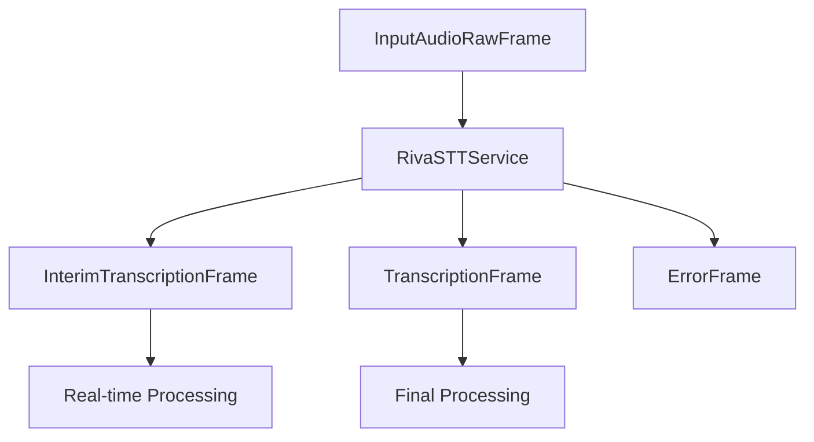

## Overview

`RivaSTTService` provides real-time speech-to-text capabilities using NVIDIA's Riva Parakeet model. It supports interim results and configurable recognition parameters for enhanced accuracy. `RivaSegmentedSTTService` provides speech-to-text capabilities via NVIDIA's Riva Canary model.

## Installation

To use `RivaSTTService` or `RivaSegmentedSTTService`, install the required dependencies:

```bash
pip install "pipecat-ai[riva]"
```

You'll also need to set up your NVIDIA API key as an environment variable: `NVIDIA_API_KEY`.

<Tip>
  You can obtain an NVIDIA API key by signing up through [NVIDIA's developer
  portal](https://developer.nvidia.com).
</Tip>

## RivaSTTService

### Configuration

<ParamField path="api_key" type="str" required>
  Your NVIDIA API key
</ParamField>

<ParamField path="server" type="str" default="grpc.nvcf.nvidia.com:443">
  NVIDIA Riva server address
</ParamField>

<ParamField
  path="model_function_map"
  type="Mapping [str, str]"
  default='{
    "function_id": "1598d209-5e27-4d3c-8079-4751568b1081",
    "model_name": "parakeet-ctc-1.1b-asr",
  }'
>
  A mapping of the NVIDIA function identifier for the STT service with the model name.
</ParamField>

<ParamField path="sample_rate" type="int" default="None">
  Audio sample rate in Hz
</ParamField>

<ParamField path="params" type="InputParams" default="InputParams()">
  Additional configuration parameters
</ParamField>

#### InputParams

<ParamField path="language" type="Language" default="Language.EN_US">
  The language for speech recognition
</ParamField>

### Input

The service processes audio frames containing:

- Raw PCM audio data
- 16-bit depth
- Single channel (mono)

### Output Frames

#### TranscriptionFrame

Generated for final transcriptions, containing:

<ParamField path="text" type="string">
  Transcribed text
</ParamField>

<ParamField path="user_id" type="string">
  User identifier
</ParamField>

<ParamField path="timestamp" type="string">
  ISO 8601 formatted timestamp
</ParamField>

<ParamField path="language" type="Language">
  Language used for transcription
</ParamField>

#### InterimTranscriptionFrame

Generated during ongoing speech, containing same fields as TranscriptionFrame but with preliminary results.

## RivaSegmentedSTTService

### Configuration

<ParamField path="api_key" type="str" required>
  Your NVIDIA API key
</ParamField>

<ParamField path="server" type="str" default="grpc.nvcf.nvidia.com:443">
  NVIDIA Riva server address
</ParamField>

<ParamField
  path="model_function_map"
  type="Mapping [str, str]"
  default='{
    "function_id": "ee8dc628-76de-4acc-8595-1836e7e857bd",
    "model_name": "canary-1b-asr",
  }'
>
  A mapping of the NVIDIA function identifier for the STT service with the model name.
</ParamField>

<ParamField path="sample_rate" type="int" default="None">
  Audio sample rate in Hz
</ParamField>

<ParamField path="params" type="InputParams" default="InputParams()">
  Additional configuration parameters
</ParamField>

#### InputParams

<ParamField path="language" type="Language" default="Language.EN_US">
  The language for speech recognition
</ParamField>

### Input

The service processes audio frames containing:

- Raw audio bytes in WAV format

### Output Frames

#### TranscriptionFrame

Generated for final transcriptions, containing:

<ParamField path="text" type="string">
  Transcribed text
</ParamField>

<ParamField path="user_id" type="string">
  User identifier
</ParamField>

<ParamField path="timestamp" type="string">
  ISO 8601 formatted timestamp
</ParamField>

<ParamField path="language" type="Language">
  Language used for transcription
</ParamField>

#### InterimTranscriptionFrame

Generated during ongoing speech, containing same fields as TranscriptionFrame but with preliminary results.

## Methods

See the [STT base class methods](/server/base-classes/speech#methods) for additional functionality.

## Models

| Model                     | Pipecat Class           | Model Card Link                                                                      |    
| ------------------------- | ----------------------- | ------------------------------------------------------------------------------------ |
| `parakeet-ctc-1.1b-asr`   | RivaSTTService          | [NVIDIA Model Card](https://build.nvidia.com/nvidia/parakeet-ctc-1_1b-asr/modelcard) |
| `canary-1b-asr`           | RivaSegmentedSTTService | [NVIDIA Model Card](https://build.nvidia.com/nvidia/canary-1b-asr/modelcard)         |

## Usage Examples

### RivaSTTService

```python
from pipecat.services.riva.stt import RivaSTTService
from pipecat.transcriptions.language import Language

# Configure service
stt = RivaSTTService(
    api_key="your-nvidia-api-key",
    params=RivaSTTService.InputParams(
        language=Language.EN_US
    )
)

# Use in pipeline
pipeline = Pipeline([
    transport.input(),
    stt,
    llm,
    ...
])
```

### RivaSegmentedSTTService

```python
from pipecat.services.riva.stt import RivaSegmentedSTTService
from pipecat.transcriptions.language import Language

# Configure service
stt = RivaSegmentedSTTService(
    api_key="your-nvidia-api-key",
    params=RivaSegmentedSTTService.InputParams(
        language=Language.EN_US
    )
)

# Use in pipeline
pipeline = Pipeline([
    transport.input(),
    stt,
    llm,
    ...
])
```

## Language Support

Riva model `parakeet-ctc-1.1b-asr` (default) primarily supports English with various regional accents:

| Language Code    | Description  | Service Codes |
| ---------------- | ------------ | ------------- |
| `Language.EN_US` | English (US) | `en-US`       |

## Frame Flow



## Advanced Configuration

The service supports several advanced configuration options that can be adjusted:

<ParamField path="_profanity_filter" type="bool" default="False">
  Filter profanity from transcription
</ParamField>

<ParamField path="_automatic_punctuation" type="bool" default="False">
  Automatically add punctuation
</ParamField>

<ParamField path="_no_verbatim_transcripts" type="bool" default="False">
  Whether to disable verbatim transcripts
</ParamField>

<ParamField path="_boosted_lm_words" type="list" default="None">
  List of words to boost in the language model
</ParamField>

<ParamField path="_boosted_lm_score" type="float" default="4.0">
  Score applied to boosted words
</ParamField>

## Example with Advanced Configuration

```python
# Configure service with advanced parameters
stt = RivaSTTService(
    api_key="your-nvidia-api-key",
    params=RivaSTTService.InputParams(
        language=Language.EN_US
    )
)

# Configure advanced options
stt._profanity_filter = True
stt._automatic_punctuation = True
stt._boosted_lm_words = ["PipeCat", "AI", "speech"]
```

## Notes

- Uses NVIDIA's Riva AI Services platform
- Handles streaming audio input
- Provides real-time transcription results
- Manages connection lifecycle
- Uses asyncio for asynchronous processing
- Automatically cleans up resources on stop/cancel
