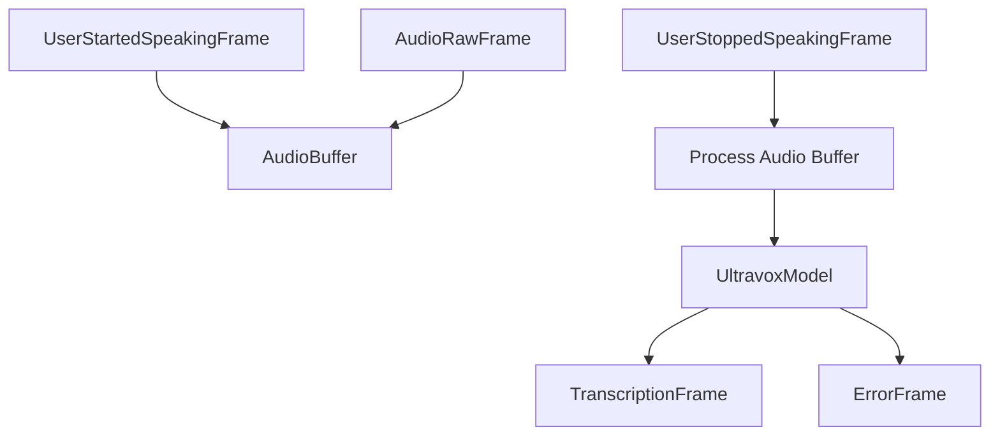

## Overview

`UltravoxSTTService` provides real-time speech-to-text capabilities using the Ultravox multimodal model running locally. Ultravox directly encodes audio into the LLM's embedding space, eliminating the need for a separate ASR component and providing faster, more efficient transcription.

## Installation

To use `UltravoxSTTService`, install the required dependencies:

```bash
pip install "pipecat-ai[ultravox]"
```

## Configuration

### Constructor Parameters

<ParamField
  path="model_size"
  type="str"
  default="fixie-ai/ultravox-v0_4_1-llama-3_1-8b"
>
  The Ultravox model to use. Defaults to the 8B parameter model based on Llama
  3.1.
</ParamField>

<ParamField path="hf_token" type="str" optional>
  Your Hugging Face token for accessing the model. Will use the HF_TOKEN
  environment variable if not provided.
</ParamField>

<ParamField path="temperature" type="float" default="0.7">
  Temperature for text generation, controlling creativity vs. determinism.
</ParamField>

<ParamField path="max_tokens" type="int" default="100">
  Maximum number of tokens to generate for each transcription.
</ParamField>

## Input

The service processes `AudioRawFrame` instances containing:

- Raw PCM audio data
- 16-bit depth (int16)
- 16kHz sample rate (recommended)
- Single channel (mono)

The service intelligently buffers audio between `UserStartedSpeakingFrame` and `UserStoppedSpeakingFrame` events.

## Output Frames

The service produces the following frame during transcription:

### TranscriptionFrame

Generated when speech processing is complete, containing:

<ParamField path="text" type="string">
  Transcribed text
</ParamField>

<ParamField path="user_id" type="string">
  User identifier
</ParamField>

<ParamField path="timestamp" type="string">
  ISO 8601 formatted timestamp
</ParamField>

## Usage Example

```python
from pipecat.services.ultravox.stt import UltravoxSTTService
import os

# Configure service
stt = UltravoxSTTService(
    model_size="fixie-ai/ultravox-v0_4_1-llama-3_1-8b",
    hf_token=os.environ.get("HF_TOKEN"),
    temperature=0.5,
    max_tokens=150,
)

# Use in pipeline
pipeline = Pipeline([
    transport.input(),
    stt,
    llm,
    ...
])
```

## Internal Architecture

`UltravoxSTTService` uses the following internal components:

### AudioBuffer

Collects audio frames during speech events for batch processing:

- Manages frames between `UserStartedSpeakingFrame` and `UserStoppedSpeakingFrame`
- Tracks speech start timestamp
- Prevents concurrent processing with status flag

### UltravoxModel

Handles loading and running the Ultravox model:

- Initializes vLLM engine for optimal GPU inference
- Manages model tokenization and prompt formatting
- Provides streaming text generation from audio input

## Frame Flow



## Metrics Support

The service supports metrics collection:

- Time to First Byte (TTFB)
- Total processing duration
- Buffer collection time

## Error Handling

The service produces ErrorFrames in the following scenarios:

- Empty audio buffer
- Invalid audio data
- Model inference errors
- Timeout during processing

## Available Models

| Model ID                               | Parameters | Base LLM  | Min VRAM | Languages                     |
| -------------------------------------- | ---------- | --------- | -------- | ----------------------------- |
| fixie-ai/ultravox-v0_4_1-llama-3_1-8b  | 8B         | Llama 3.1 | 16GB     | English, limited multilingual |
| fixie-ai/ultravox-v0_4_1-llama-3_1-70b | 70B        | Llama 3.1 | 80GB+    | English, broader multilingual |
| fixie-ai/ultravox-v0_4-mistral-7b      | 7B         | Mistral   | 14GB     | English                       |

See the [Fixie.ai Hugging Face page](https://huggingface.co/fixie-ai) for the latest model availability.

<Note>
  Ensure your environment has sufficient GPU resources for the selected model.
</Note>

## Memory Considerations

The Ultravox model requires GPU resources:

- For the 8B parameter model (`fixie-ai/ultravox-v0_4_1-llama-3_1-8b`):
  - Benchmarked on A100-40GB GPUs
  - Can run on consumer GPUs with appropriate memory (at least 8GB VRAM, but performance may vary)
- For larger variants like the 70B parameter model:
  - Requires significantly more memory (40GB+ VRAM recommended)
- Audio buffer size grows with speech duration
- Processing occurs in batches, not streaming

<Note>
  According to the Hugging Face card, the 8B model achieves a
  time-to-first-token of approximately 150ms and generates 50-100 tokens per
  second on an A100-40GB GPU.
</Note>
