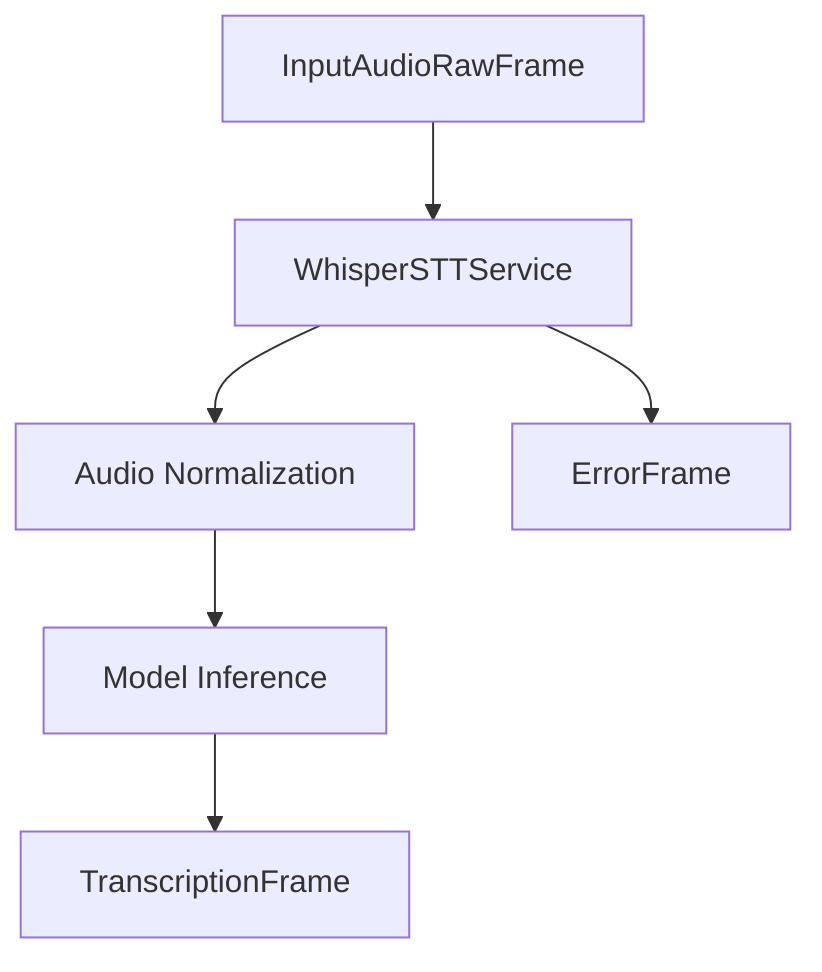

## Overview

`WhisperSTTService` provides speech-to-text capabilities using OpenAI's Whisper models running locally. It supports multiple model sizes and configurations for offline transcription.

## Installation

To use `WhisperSTTService`, install the required dependencies:

```bash
pip install pipecat-ai[whisper]
```

## Configuration

### Constructor Parameters

<ParamField path="model" type="str | Model" default="Model.DISTIL_MEDIUM_EN">
  Whisper model to use. Can be a string or Model enum value
</ParamField>

<ParamField path="device" type="str" default="auto">
  Device to run the model on ('cpu', 'cuda', or 'auto')
</ParamField>

<ParamField path="compute_type" type="str" default="default">
  Computation type for model inference
</ParamField>

<ParamField path="no_speech_prob" type="float" default="0.4">
  Threshold for filtering out non-speech segments
</ParamField>

### Available Models

```python
class Model(Enum):
    TINY = "tiny"                   # Smallest, fastest model
    BASE = "base"                   # Basic model
    MEDIUM = "medium"               # Medium-sized model
    LARGE = "large-v3"              # Largest, most accurate model
    DISTIL_LARGE_V2 = "Systran/faster-distil-whisper-large-v2"
    DISTIL_MEDIUM_EN = "Systran/faster-distil-whisper-medium.en"
```

## Input

The service processes raw audio data with the following requirements:

- PCM audio format
- 16-bit depth
- Single channel (mono)
- Normalized to float32 range [-1.0, 1.0]

## Output Frames

### TranscriptionFrame

Generated for transcriptions, containing:

<ParamField path="text" type="string">
  Transcribed text
</ParamField>

<ParamField path="user_id" type="string">
  User identifier
</ParamField>

<ParamField path="timestamp" type="string">
  ISO 8601 formatted timestamp
</ParamField>

### ErrorFrame

Generated when transcription errors occur, containing error details.

## Usage Example

```python
from pipecat.services.whisper import WhisperSTTService, Model

# Configure service with default model
stt_service = WhisperSTTService(
    model=Model.DISTIL_MEDIUM_EN,
    device="cuda",
    no_speech_prob=0.4
)

# Or use a custom model path
stt_service = WhisperSTTService(
    model="path/to/custom/model",
    device="cpu"
)

# Use in pipeline
pipeline = Pipeline([
    transport.input(),
    stt,
    llm,
    ...
])
```

## Methods

See the [STT base class methods](/server/base-classes/speech#methods) for additional functionality.

## Model Selection Guide

| Model              | Size  | Speed   | Accuracy       | Memory Usage |
| ------------------ | ----- | ------- | -------------- | ------------ |
| `TINY`             | 39M   | Fastest | Basic          | Minimal      |
| `BASE`             | 74M   | Fast    | Good           | Low          |
| `MEDIUM`           | 769M  | Medium  | Better         | Moderate     |
| `LARGE`            | 1.5GB | Slow    | Best           | High         |
| `DISTIL_MEDIUM_EN` | ~400M | Fast    | Good (English) | Moderate     |
| `DISTIL_LARGE_V2`  | ~750M | Medium  | Better         | Moderate     |

## Frame Flow



## Metrics Support

The service collects processing metrics:

- Time to First Byte (TTFB)
- Processing duration
- Model loading time
- Inference time

## Notes

- Runs completely offline after model download
- First run requires model download
- Supports CPU and CUDA acceleration
- Processes audio in segments
- Filters out non-speech segments
- Thread-safe processing
- Automatic error handling
