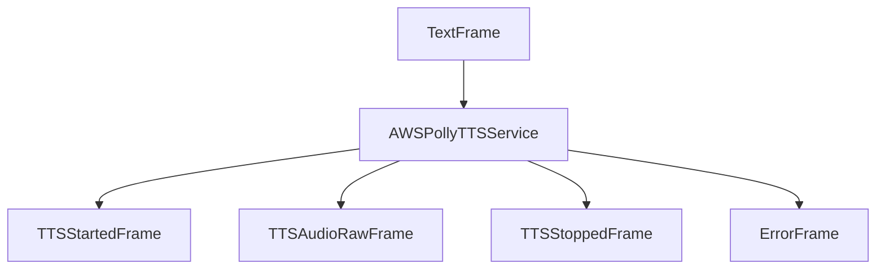

## Overview

`AWSPollyTTSService` provides text-to-speech capabilities using AWS's Polly service. It supports multiple voices, languages, and speech customization options through SSML.

<Note>
  The older `PollyTTSService` class is still available but has been deprecated.
  Use `AWSPollyTTSService` instead.
</Note>

## Installation

To use `AWSPollyTTSService`, install the required dependencies:

```bash
pip install "pipecat-ai[aws]"
```

You'll also need to set up your AWS credentials as environment variables:

- `AWS_SECRET_ACCESS_KEY`
- `AWS_ACCESS_KEY_ID`
- `AWS_SESSION_TOKEN` (if using temporary credentials)
- `AWS_REGION` (defaults to "us-east-1")

## Configuration

### Constructor Parameters

<ParamField path="api_key" type="str" optional>
  AWS secret access key (can also use environment variable)
</ParamField>

<ParamField path="aws_access_key_id" type="str" optional>
  AWS access key ID (can also use environment variable)
</ParamField>

<ParamField path="aws_session_token" type="str" optional>
  AWS session token for temporary credentials (can also use environment
  variable)
</ParamField>

<ParamField path="region" type="str" optional>
  AWS region name (defaults to "us-east-1" if not provided)
</ParamField>

<ParamField path="voice_id" type="str" default="Joanna">
  AWS Polly voice identifier
</ParamField>

<ParamField path="sample_rate" type="int" default="None">
  Output audio sample rate in Hz (resampled from Polly's 16kHz)
</ParamField>

<ParamField path="text_filter" type="BaseTextFilter" default="None">
  Modifies text provided to the TTS. [Learn
  more](/server/base-classes/text#text-filters) about the available filters.
</ParamField>

<ParamField path="params" type="InputParams" optional>
  TTS configuration parameters
</ParamField>

### Input Parameters

```python
class InputParams(BaseModel):
    engine: Optional[str] = None      # Polly engine type ("standard", "neural", or "generative")
    language: Optional[Language] = Language.EN
    pitch: Optional[str] = None       # SSML pitch adjustment
    rate: Optional[str] = None        # SSML rate adjustment
    volume: Optional[str] = None      # SSML volume adjustment
```

## Output Frames

### Control Frames

<ParamField path="TTSStartedFrame" type="Frame">
  Signals start of speech synthesis
</ParamField>

<ParamField path="TTSStoppedFrame" type="Frame">
  Signals completion of speech synthesis
</ParamField>

### Audio Frames

<ParamField path="TTSAudioRawFrame" type="Frame">
  
Contains generated audio data with:

- PCM audio format
- Sample rate as specified (resampled from 16kHz)
- Single channel (mono)

</ParamField>

### Error Frames

<ParamField path="ErrorFrame" type="Frame">
  Contains AWS Polly error information
</ParamField>

## Methods

See the [TTS base class methods](/server/base-classes/speech#ttsservice) for additional functionality.

## Language Support

Supports an extensive range of languages and regional variants:

| Language Code     | Description            | Service Code |
| ----------------- | ---------------------- | ------------ |
| `Language.AR`     | Arabic                 | `arb`        |
| `Language.AR_AE`  | Arabic (UAE)           | `ar-AE`      |
| `Language.CA`     | Catalan                | `ca-ES`      |
| `Language.ZH`     | Chinese (Mandarin)     | `cmn-CN`     |
| `Language.YUE`    | Chinese (Cantonese)    | `yue-CN`     |
| `Language.YUE_CN` | Chinese (Cantonese)    | `yue-CN`     |
| `Language.CS`     | Czech                  | `cs-CZ`      |
| `Language.DA`     | Danish                 | `da-DK`      |
| `Language.NL`     | Dutch                  | `nl-NL`      |
| `Language.NL_BE`  | Dutch (Belgium)        | `nl-BE`      |
| `Language.EN`     | English (US)           | `en-US`      |
| `Language.EN_AU`  | English (Australia)    | `en-AU`      |
| `Language.EN_GB`  | English (UK)           | `en-GB`      |
| `Language.EN_IN`  | English (India)        | `en-IN`      |
| `Language.EN_NZ`  | English (New Zealand)  | `en-NZ`      |
| `Language.EN_US`  | English (US)           | `en-US`      |
| `Language.EN_ZA`  | English (South Africa) | `en-ZA`      |
| `Language.FI`     | Finnish                | `fi-FI`      |
| `Language.FR`     | French                 | `fr-FR`      |
| `Language.FR_BE`  | French (Belgium)       | `fr-BE`      |
| `Language.FR_CA`  | French (Canada)        | `fr-CA`      |
| `Language.DE`     | German                 | `de-DE`      |
| `Language.DE_AT`  | German (Austria)       | `de-AT`      |
| `Language.DE_CH`  | German (Switzerland)   | `de-CH`      |
| `Language.HI`     | Hindi                  | `hi-IN`      |
| `Language.IS`     | Icelandic              | `is-IS`      |
| `Language.IT`     | Italian                | `it-IT`      |
| `Language.JA`     | Japanese               | `ja-JP`      |
| `Language.KO`     | Korean                 | `ko-KR`      |
| `Language.NO`     | Norwegian              | `nb-NO`      |
| `Language.NB`     | Norwegian (Bokmål)     | `nb-NO`      |
| `Language.NB_NO`  | Norwegian (Bokmål)     | `nb-NO`      |
| `Language.PL`     | Polish                 | `pl-PL`      |
| `Language.PT`     | Portuguese             | `pt-PT`      |
| `Language.PT_BR`  | Portuguese (Brazil)    | `pt-BR`      |
| `Language.PT_PT`  | Portuguese (Portugal)  | `pt-PT`      |
| `Language.RO`     | Romanian               | `ro-RO`      |
| `Language.RU`     | Russian                | `ru-RU`      |
| `Language.ES`     | Spanish                | `es-ES`      |
| `Language.ES_MX`  | Spanish (Mexico)       | `es-MX`      |
| `Language.ES_US`  | Spanish (US)           | `es-US`      |
| `Language.SV`     | Swedish                | `sv-SE`      |
| `Language.TR`     | Turkish                | `tr-TR`      |
| `Language.CY`     | Welsh                  | `cy-GB`      |
| `Language.CY_GB`  | Welsh                  | `cy-GB`      |

## Usage Example

```python
from pipecat.services.aws.tts import AWSPollyTTSService
from pipecat.transcriptions.language import Language

# Configure service using environment variables for credentials
tts = AWSPollyTTSService(
    region="us-west-2",
    voice_id="Joanna",
    params=AWSPollyTTSService.InputParams(
        engine="neural",
        language=Language.EN,
        rate="+10%",
        volume="loud"
    )
)

# Or provide credentials directly
tts = AWSPollyTTSService(
    aws_access_key_id="YOUR_ACCESS_KEY_ID",
    api_key="YOUR_SECRET_ACCESS_KEY",
    region="us-west-2",
    voice_id="Joanna",
    params=AWSPollyTTSService.InputParams(
        engine="generative",  # For newer generative voices
        language=Language.EN,
        rate="1.1"            # Generative engine rate format
    )
)

# Use in pipeline
pipeline = Pipeline([
    ...,
    llm,
    tts,
    transport.output(),
])
```

## SSML Support

The service automatically constructs SSML tags for advanced speech control:

```python
# Example with SSML controls
service = AWSPollyTTSService(
    # ... other params ...
    params=AWSPollyTTSService.InputParams(
        engine="neural",
        rate="+20%",      # Increase speed
        pitch="low",      # Lower pitch
        volume="loud"     # Increase volume
    )
)
```

<Note>
  Prosody tags (pitch, rate, volume) have different behaviors based on the
  engine: - Standard engine: Supports all prosody tags - Neural engine: Full
  prosody support - Generative engine: Only rate is supported, with a different
  format (e.g., "1.1" for 10% faster)
</Note>

## Frame Flow



## Metrics Support

The service collects processing metrics:

- Time to First Byte (TTFB)
- Processing duration
- Character usage
- API calls

## Notes

- Supports all AWS Polly engines:
  - Standard (non-neural voices)
  - Neural (improved quality voices)
  - Generative (high-quality, natural-sounding voices)
- Automatic audio resampling from 16kHz to any desired rate
- Thread-safe processing
- Automatic error handling
- Manages AWS client lifecycle
