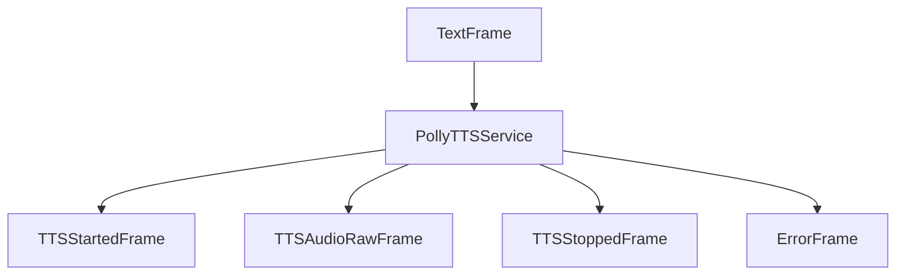

## Overview

`PollyTTSService` provides text-to-speech capabilities using Amazon's Polly service. It supports multiple voices, languages, and speech customization options through SSML.

## Installation

To use `PollyTTSService`, install the required dependencies:

```bash
pip install pipecat-ai[aws]
```

You'll also need to set up your AWS credentials as environment variables:

- `AWS_SECRET_ACCESS_KEY`
- `AWS_ACCESS_KEY_ID`
- `AWS_REGION`

## Configuration

### Constructor Parameters

<ParamField path="api_key" type="str" required>
  AWS secret access key
</ParamField>

<ParamField path="aws_access_key_id" type="str" required>
  AWS access key ID
</ParamField>

<ParamField path="region" type="str" required>
  AWS region name
</ParamField>

<ParamField path="voice_id" type="str" default="Joanna">
  AWS Polly voice identifier
</ParamField>

<ParamField path="sample_rate" type="int" default="24000">
  Output audio sample rate in Hz
</ParamField>

<ParamField path="text_filter" type="BaseTextFilter" default="None">
  Modifies text provided to the TTS. [Learn
  more](/server/base-classes/text#text-filters) about the available filters.
</ParamField>

### Input Parameters

```python
class InputParams(BaseModel):
    engine: Optional[str] = None      # Polly engine type
    language: Optional[Language] = Language.EN
    pitch: Optional[str] = None       # SSML pitch adjustment
    rate: Optional[str] = None        # SSML rate adjustment
    volume: Optional[str] = None      # SSML volume adjustment
```

## Output Frames

### Control Frames

<ParamField path="TTSStartedFrame" type="Frame">
  Signals start of speech synthesis
</ParamField>

<ParamField path="TTSStoppedFrame" type="Frame">
  Signals completion of speech synthesis
</ParamField>

### Audio Frames

<ParamField path="TTSAudioRawFrame" type="Frame">
  Contains generated audio data with: - PCM audio format - Specified sample rate
  - Single channel (mono)
</ParamField>

### Error Frames

<ParamField path="ErrorFrame" type="Frame">
  Contains AWS Polly error information
</ParamField>

## Methods

See the [TTS base class methods](/server/base-classes/speech#ttsservice) for additional functionality.

## Language Support

Supports multiple languages and regional variants:

| Language Code    | Description           | Service Code |
| ---------------- | --------------------- | ------------ |
| `Language.CA`    | Catalan               | `ca-ES`      |
| `Language.ZH`    | Chinese (Mandarin)    | `cmn-CN`     |
| `Language.DA`    | Danish                | `da-DK`      |
| `Language.NL`    | Dutch                 | `nl-NL`      |
| `Language.NL_BE` | Dutch (Belgium)       | `nl-BE`      |
| `Language.EN`    | English (US)          | `en-US`      |
| `Language.EN_AU` | English (Australia)   | `en-AU`      |
| `Language.EN_GB` | English (UK)          | `en-GB`      |
| `Language.EN_IN` | English (India)       | `en-IN`      |
| `Language.EN_NZ` | English (New Zealand) | `en-NZ`      |
| `Language.FR`    | French                | `fr-FR`      |
| `Language.FR_CA` | French (Canada)       | `fr-CA`      |
| `Language.DE`    | German                | `de-DE`      |
| `Language.HI`    | Hindi                 | `hi-IN`      |
| `Language.IT`    | Italian               | `it-IT`      |
| `Language.JA`    | Japanese              | `ja-JP`      |
| `Language.KO`    | Korean                | `ko-KR`      |
| `Language.NO`    | Norwegian             | `nb-NO`      |
| `Language.PL`    | Polish                | `pl-PL`      |
| `Language.PT`    | Portuguese            | `pt-PT`      |
| `Language.PT_BR` | Portuguese (Brazil)   | `pt-BR`      |
| `Language.RO`    | Romanian              | `ro-RO`      |
| `Language.RU`    | Russian               | `ru-RU`      |
| `Language.ES`    | Spanish               | `es-ES`      |
| `Language.SV`    | Swedish               | `sv-SE`      |
| `Language.TR`    | Turkish               | `tr-TR`      |

## Usage Example

```python
from pipecat.services.aws import PollyTTSService
from pipecat.transcriptions.language import Language

# Configure service
tts_service = PollyTTSService(
    api_key="your-aws-secret-key",
    aws_access_key_id="your-aws-access-key",
    region="us-east-1",
    voice_id="Joanna",
    params=PollyTTSService.InputParams(
        engine="neural",
        language=Language.EN,
        rate="medium",
        pitch="high"
    )
)

# Use in pipeline
pipeline = Pipeline([
    text_input,         # Produces text
    tts_service,        # Converts text to speech
    audio_output        # Plays audio
])
```

## SSML Support

The service automatically constructs SSML tags for advanced speech control:

```python
# Example with SSML controls
service = PollyTTSService(
    # ... other params ...
    params=PollyTTSService.InputParams(
        rate="+20%",      # Increase speed
        pitch="low",      # Lower pitch
        volume="loud"     # Increase volume
    )
)
```

Note: Prosody tags (rate, pitch, volume) are only supported for standard and neural engines, not the generative engine.

## Frame Flow



## Metrics Support

The service collects processing metrics:

- Time to First Byte (TTFB)
- Processing duration
- Character usage
- API calls

## Notes

- Supports multiple AWS Polly engines (standard, neural, generative)
- Automatic audio resampling
- SSML-based speech customization
- Chunked audio delivery
- Thread-safe processing
- Automatic error handling
- Manages AWS client lifecycle
