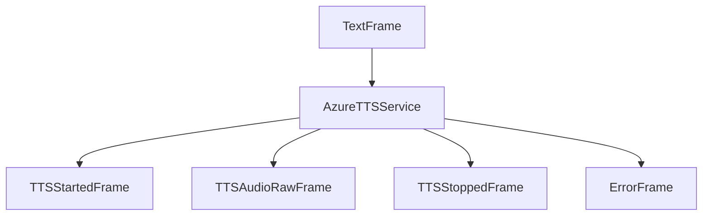

## Overview

`AzureTTSService` provides high-quality text-to-speech synthesis using Azure's Cognitive Services. It supports SSML for advanced voice control and multiple languages.

## Installation

To use `AzureTTSService`, install the required dependencies:

```bash
pip install pipecat-ai[azure]
```

You'll also need to set up the following environment variables:

- `AZURE_API_KEY`
- `AZURE_REGION`

## Configuration

### Constructor Parameters

<ParamField path="api_key" type="str" required>
  Azure Speech Service API key
</ParamField>

<ParamField path="region" type="str" required>
  Azure region identifier
</ParamField>

<ParamField path="voice" type="str" default="en-US-SaraNeural">
  Voice identifier
</ParamField>

<ParamField path="sample_rate" type="int" default="24000">
  Output audio sample rate in Hz
</ParamField>

<ParamField path="text_filter" type="BaseTextFilter" default="None">
  Modifies text provided to the TTS. [Learn
  more](/server/base-classes/text#text-filters) about the available filters.
</ParamField>

### Input Parameters

```python
class InputParams(BaseModel):
    emphasis: Optional[str]
    language: Optional[Language] = Language.EN_US
    pitch: Optional[str]
    rate: Optional[str] = "1.05"
    role: Optional[str]
    style: Optional[str]
    style_degree: Optional[str]
    volume: Optional[str]
```

## Supported Sample Rates

- 8000 Hz: `Raw8Khz16BitMonoPcm`
- 16000 Hz: `Raw16Khz16BitMonoPcm`
- 22050 Hz: `Raw22050Hz16BitMonoPcm`
- 24000 Hz: `Raw24Khz16BitMonoPcm`
- 44100 Hz: `Raw44100Hz16BitMonoPcm`
- 48000 Hz: `Raw48Khz16BitMonoPcm`

## Usage Example

```python
# Configure service
tts_service = AzureTTSService(
    api_key="your-api-key",
    region="eastus",
    voice="en-US-JennyNeural",
    params=AzureTTSService.InputParams(
        language=Language.EN_US,
        rate="1.1",
        style="cheerful"
    )
)

# Use in pipeline
pipeline = Pipeline([
    ...,
    llm,
    tts,
    transport.output(),
])
```

## Methods

See the [TTS base class methods](/server/base-classes/speech#ttsservice) for additional functionality.

## Language Support

Azure Speech Services support the following languages and regional variants:

| Language Code    | Description           | Service Code |
| ---------------- | --------------------- | ------------ |
| `Language.BG`    | Bulgarian             | `bg-BG`      |
| `Language.CA`    | Catalan               | `ca-ES`      |
| `Language.ZH`    | Chinese (Simplified)  | `zh-CN`      |
| `Language.ZH_TW` | Chinese (Traditional) | `zh-TW`      |
| `Language.CS`    | Czech                 | `cs-CZ`      |
| `Language.DA`    | Danish                | `da-DK`      |
| `Language.NL`    | Dutch (Netherlands)   | `nl-NL`      |
| `Language.NL_BE` | Dutch (Belgium)       | `nl-BE`      |
| `Language.EN`    | English (US)          | `en-US`      |
| `Language.EN_US` | English (US)          | `en-US`      |
| `Language.EN_AU` | English (Australia)   | `en-AU`      |
| `Language.EN_GB` | English (UK)          | `en-GB`      |
| `Language.EN_NZ` | English (New Zealand) | `en-NZ`      |
| `Language.EN_IN` | English (India)       | `en-IN`      |
| `Language.ET`    | Estonian              | `et-EE`      |
| `Language.FI`    | Finnish               | `fi-FI`      |
| `Language.FR`    | French (France)       | `fr-FR`      |
| `Language.FR_CA` | French (Canada)       | `fr-CA`      |
| `Language.DE`    | German (Germany)      | `de-DE`      |
| `Language.DE_CH` | German (Switzerland)  | `de-CH`      |
| `Language.EL`    | Greek                 | `el-GR`      |
| `Language.HI`    | Hindi                 | `hi-IN`      |
| `Language.HU`    | Hungarian             | `hu-HU`      |
| `Language.ID`    | Indonesian            | `id-ID`      |
| `Language.IT`    | Italian               | `it-IT`      |
| `Language.JA`    | Japanese              | `ja-JP`      |
| `Language.KO`    | Korean                | `ko-KR`      |
| `Language.LV`    | Latvian               | `lv-LV`      |
| `Language.LT`    | Lithuanian            | `lt-LT`      |
| `Language.MS`    | Malay                 | `ms-MY`      |
| `Language.NO`    | Norwegian             | `nb-NO`      |
| `Language.PL`    | Polish                | `pl-PL`      |
| `Language.PT`    | Portuguese (Portugal) | `pt-PT`      |
| `Language.PT_BR` | Portuguese (Brazil)   | `pt-BR`      |
| `Language.RO`    | Romanian              | `ro-RO`      |
| `Language.RU`    | Russian               | `ru-RU`      |
| `Language.SK`    | Slovak                | `sk-SK`      |
| `Language.ES`    | Spanish               | `es-ES`      |
| `Language.SV`    | Swedish               | `sv-SE`      |
| `Language.TH`    | Thai                  | `th-TH`      |
| `Language.TR`    | Turkish               | `tr-TR`      |
| `Language.UK`    | Ukrainian             | `uk-UA`      |
| `Language.VI`    | Vietnamese            | `vi-VN`      |

### Usage Examples

#### TTS Configuration

```python
# Configure TTS with specific language
tts_service = AzureTTSService(
    api_key="your-api-key",
    region="eastus",
    params=AzureTTSService.InputParams(
        language=Language.FR_CA,  # Canadian French
        voice="fr-CA-SylvieNeural"
    )
)
```

### Regional Considerations

- Each language code includes both language and region (e.g., `fr-FR` for French in France)
- Some languages have multiple regional variants (e.g., English has US, UK, Australian, Indian, and New Zealand variants)
- Voice availability may vary by region and language
- Neural voices are available for most language/region combinations
- Some features (like custom pronunciation) may be limited to specific languages

Note: Voice selection should match the specified language code for optimal results. Check Azure's documentation for the latest list of available voices for each language/region combination.

## SSML Support

The service supports rich SSML customization:

```python
# Example with multiple SSML features
params = AzureTTSService.InputParams(
    emphasis="strong",
    pitch="+2st",
    rate="1.2",
    style="cheerful",
    style_degree="2",
    volume="loud"
)
```

## Frame Flow



## Metrics Support

The service collects processing metrics:

- Time to First Byte (TTFB)
- Processing duration
- Character usage
- API calls

## Notes

- SSML-based speech customization
- Chunked audio delivery
- Thread-safe processing
- Automatic error handling
- Manages Azure client lifecycle
