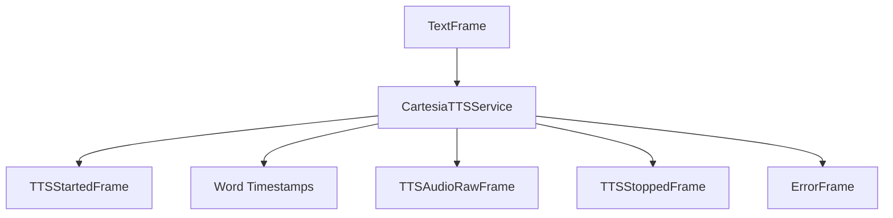
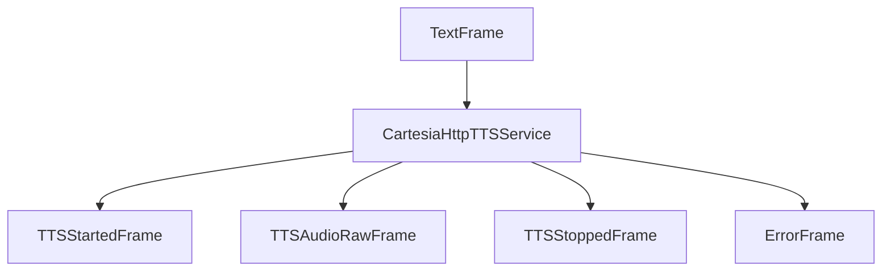

## Overview

Cartesia provides two TTS service implementations:

- `CartesiaTTSService`: WebSocket-based service with word-level timestamps and streaming
- `CartesiaHttpTTSService`: HTTP-based service for simpler, non-streaming synthesis

## Installation

To use Cartesia services, install the required dependencies:

```bash
pip install pipecat-ai[cartesia]
```

You'll also need to set up your Cartesia API key as an environment variable: `CARTESIA_API_KEY`.

<Tip>
  You can obtain a Cartesia API key by signing up at
  [Cartesia](https://play.cartesia.ai/sign-up).
</Tip>

## Choosing a Cartesia service

Cartesia has two supported services:

- `CartesiaTTSService` which is a websocket-based implementation
- `CartesiaHttpTTSService`, which is an HTTP-based implementation

### CartesiaTTSService

The `CartesiaTTSService` is recommended for real-time streaming and interactive applications. It offers:

- Streaming audio in chunks
- Word-level timestamps
- Text frame generation aligned with audio playback
- Sophisticated interruption handling
- Continuous session management through websocket connection
- Non-blocking operation that allows other frames to be processed while audio is being generated

### CartesiaHttpTTSService

The `CartesiaHttpTTSService` is simpler and more straightforward, suitable for non-interactive use cases. It:

- Processes the entire text in one request
- Returns audio in a single frame
- Has simpler implementation and fewer moving parts
- May be more suitable for batch processing
- Blocks during the HTTP request, preventing other frames from being processed until the audio is fully generated

Both services support usage metrics and start/stop frame events, but they differ in how they handle the audio streaming process and interaction capabilities. Choose the websocket-based service if you need real-time responsiveness, or the HTTP service if you prefer simplicity and don't mind the blocking behavior.

## Input Parameters

Both services use the same input parameters structure:

<ParamField path="language" type="Language" default="Language.EN">
  The language to use for synthesis. See [Language Support](#language-support)
  section for available options.
</ParamField>

<ParamField path="speed" type="Union[str, float]" default="">
Controls the speech rate.

Can be specified as either:
- String options: `"slowest"`, `"slow"`, `"normal"`, `"fast"`, `"fastest"`
- Float value: Between `-1.0` (slowest) and `1.0` (fastest), where `0.0` is normal speed

</ParamField>

<ParamField path="emotion" type="List[str]" default="[]">
List of emotion controls to apply.

Each emotion can be specified as:

- Simple emotion: `"anger"`, `"positivity"`, `"surprise"`, `"sadness"`, `"curiosity"`
- Emotion with level: "emotion:level" where level can be `"lowest"`, `"low"`, `"high"`,
  `"highest"`

Example: `["positivity:high", "curiosity"]`

Note: Emotion controls are additive and their effects may vary by voice and content.

</ParamField>

## CartesiaTTSService

WebSocket-based implementation supporting real-time streaming and word timestamps.

### Constructor Parameters

<ParamField path="api_key" type="str" required>
  Cartesia API key
</ParamField>

<ParamField path="voice_id" type="str" required>
  Voice identifier
</ParamField>

<ParamField path="cartesia_version" type="str" default="2024-06-10">
  API version
</ParamField>

<ParamField path="url" type="str" default="wss://api.cartesia.ai/tts/websocket">
  WebSocket endpoint URL
</ParamField>

<ParamField path="model" type="str" default="sonic">
  Model identifier
</ParamField>

<ParamField path="sample_rate" type="int" default="None">
  Output audio sample rate in Hz
</ParamField>

<ParamField path="encoding" type="str" default="pcm_s16le">
  Audio encoding format
</ParamField>

<ParamField path="container" type="str" default="raw">
  Audio container format
</ParamField>

<ParamField path="text_filter" type="BaseTextFilter" default="None">
  Modifies text provided to the TTS. [Learn
  more](/server/base-classes/text#text-filters) about the available filters.
</ParamField>

## CartesiaHttpTTSService

HTTP-based implementation for simpler synthesis requirements.

### Constructor Parameters

<ParamField path="api_key" type="str" required>
  Cartesia API key
</ParamField>

<ParamField path="voice_id" type="str" required>
  Voice identifier
</ParamField>

<ParamField path="model" type="str" default="sonic">
  Model identifier
</ParamField>

<ParamField path="base_url" type="str" default="https://api.cartesia.ai">
  API base URL
</ParamField>

<ParamField path="sample_rate" type="int" default="None">
  Output audio sample rate in Hz
</ParamField>

<ParamField path="encoding" type="str" default="pcm_s16le">
  Audio encoding format
</ParamField>

<ParamField path="container" type="str" default="raw">
  Audio container format
</ParamField>

<ParamField path="text_filter" type="class">
  Modifies text provided to the TTS. [Learn
  more](/server/base-classes/text#text-filters) about the available filters.
</ParamField>

## Output Frames

### Control Frames

<ParamField path="TTSStartedFrame" type="Frame">
  Signals start of synthesis
</ParamField>

<ParamField path="TTSStoppedFrame" type="Frame">
  Signals completion of synthesis
</ParamField>

### Audio Frames

<ParamField path="TTSAudioRawFrame" type="Frame">
  Contains generated audio data
</ParamField>

### Error Frames

<ParamField path="ErrorFrame" type="Frame">
  Contains error information
</ParamField>

## Methods

See the [TTS base class methods](/server/base-classes/speech#ttsservice) for additional functionality.

## Language Support

Supports multiple languages through the `Language` enum:

| Language Code | Description        | Service Code |
| ------------- | ------------------ | ------------ |
| `Language.DE` | German             | `de`         |
| `Language.EN` | English            | `en`         |
| `Language.ES` | Spanish            | `es`         |
| `Language.FR` | French             | `fr`         |
| `Language.HI` | Hindi              | `hi`         |
| `Language.IT` | Italian            | `it`         |
| `Language.JA` | Japanese           | `ja`         |
| `Language.KO` | Korean             | `ko`         |
| `Language.NL` | Dutch              | `nl`         |
| `Language.PL` | Polish             | `pl`         |
| `Language.PT` | Portuguese         | `pt`         |
| `Language.RU` | Russian            | `ru`         |
| `Language.SV` | Swedish            | `sv`         |
| `Language.TR` | Turkish            | `tr`         |
| `Language.ZH` | Chinese (Mandarin) | `zh`         |

## Usage Examples

### WebSocket Service

```python
# Configure WebSocket service
tts = CartesiaTTSService(
    api_key="your-api-key",
    voice_id="voice-id",
    model="sonic",
    params=CartesiaTTSService.InputParams(
        language=Language.EN,
        speed="normal",
        emotion=[
          "positivity:high",
          "curiosity"
        ]
    )
)

# Use in pipeline
pipeline = Pipeline([
    ...,
    llm,
    tts,
    transport.output(),
])
```

### HTTP Service

```python
# Configure HTTP service
http_service = CartesiaHttpTTSService(
    api_key="your-api-key",
    voice_id="voice-id",
    model="sonic",
    params=CartesiaHttpTTSService.InputParams(
        language=Language.EN,
        speed=1.0
    )
)
```

## Frame Flow

### WebSocket Service



### HTTP Service


