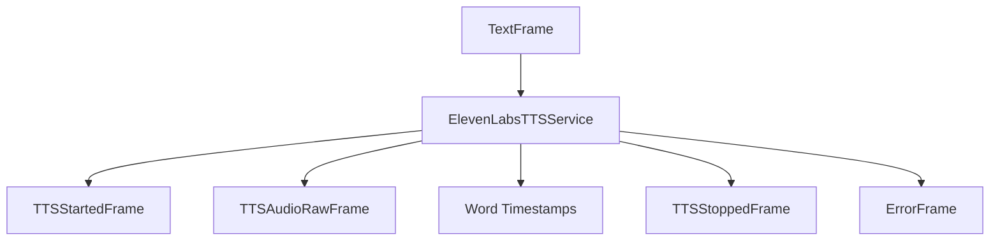

## Overview

`ElevenLabsTTSService` provides high-quality text-to-speech synthesis using ElevenLabs' WebSocket API. It supports real-time streaming, word-level timing, and various voice customization options.

## Installation

To use `ElevenLabsTTSService`, install the required dependencies:

```bash
pip install pipecat-ai[elevenlabs]
```

You'll also need to set up your ElevenLabs API key as an environment variable: `ELEVENLABS_API_KEY`.

<Tip>
  You can obtain a ElevenLabs API key by signing up at
  [ElevenLabs](https://elevenlabs.io/app/sign-up).
</Tip>

## Configuration

### Constructor Parameters

<ParamField path="api_key" type="str" required>
  ElevenLabs API key
</ParamField>

<ParamField path="voice_id" type="str" required>
  Voice identifier
</ParamField>

<ParamField path="model" type="str" default="eleven_turbo_v2_5">
  Model identifier
</ParamField>

<ParamField path="url" type="str" default="wss://api.elevenlabs.io">
  API endpoint URL
</ParamField>

<ParamField
  path="output_format"
  type="ElevenLabsOutputFormat"
  default="pcm_24000"
>
  Audio output format: - "pcm_16000" - "pcm_22050" - "pcm_24000" - "pcm_44100"
</ParamField>

<ParamField path="text_filter" type="BaseTextFilter" default="None">
  Modifies text provided to the TTS. [Learn
  more](/server/base-classes/text#text-filters) about the available filters.
</ParamField>

### Input Parameters

```python
class InputParams(BaseModel):
    language: Optional[Language] = Language.EN
    optimize_streaming_latency: Optional[str]
    stability: Optional[float]
    similarity_boost: Optional[float]
    style: Optional[float]
    use_speaker_boost: Optional[bool]
```

## Voice Settings

Voice characteristics can be configured using:

<ParamField path="stability" type="float">
  Voice stability (requires similarity_boost)
</ParamField>

<ParamField path="similarity_boost" type="float">
  Voice similarity boost (requires stability)
</ParamField>

<ParamField path="style" type="float" optional>
  Style intensity (requires stability and similarity_boost)
</ParamField>

<ParamField path="use_speaker_boost" type="bool" optional>
  Enable speaker boost (requires stability and similarity_boost)
</ParamField>

## Output Frames

### Control Frames

<ParamField path="TTSStartedFrame" type="Frame">
  Signals start of synthesis
</ParamField>

<ParamField path="TTSStoppedFrame" type="Frame">
  Signals completion of synthesis
</ParamField>

### Audio Frames

<ParamField path="TTSAudioRawFrame" type="Frame">
  Contains generated audio data: - PCM encoded audio - Configured sample rate -
  Mono channel
</ParamField>

## Usage Examples

### Basic Usage

```python
# Configure service
tts_service = ElevenLabsTTSService(
    api_key="your-api-key",
    voice_id="voice-id",
    output_format="pcm_24000",
    params=ElevenLabsTTSService.InputParams(
        language=Language.EN
    )
)

# Use in pipeline
pipeline = Pipeline([
    text_input,
    tts_service,
    audio_output
])
```

### With Voice Settings

```python
# Configure with voice customization
service = ElevenLabsTTSService(
    api_key="your-api-key",
    voice_id="voice-id",
    params=ElevenLabsTTSService.InputParams(
        stability=0.7,
        similarity_boost=0.8,
        style=0.5,
        use_speaker_boost=True
    )
)
```

## Methods

See the [TTS base class methods](/server/base-classes/speech#ttsservice) for additional functionality.

## Language Support

ElevenLabs supports the following languages and their variants:

| Language Code    | Description           | Service Code |
| ---------------- | --------------------- | ------------ |
| `Language.BG`    | Bulgarian             | `bg`         |
| `Language.ZH`    | Chinese               | `zh`         |
| `Language.CS`    | Czech                 | `cs`         |
| `Language.DA`    | Danish                | `da`         |
| `Language.NL`    | Dutch                 | `nl`         |
| `Language.EN`    | English               | `en`         |
| `Language.EN_US` | English (US)          | `en`         |
| `Language.EN_AU` | English (Australia)   | `en`         |
| `Language.EN_GB` | English (UK)          | `en`         |
| `Language.EN_NZ` | English (New Zealand) | `en`         |
| `Language.EN_IN` | English (India)       | `en`         |
| `Language.FI`    | Finnish               | `fi`         |
| `Language.FR`    | French                | `fr`         |
| `Language.FR_CA` | French (Canada)       | `fr`         |
| `Language.DE`    | German                | `de`         |
| `Language.DE_CH` | German (Swiss)        | `de`         |
| `Language.EL`    | Greek                 | `el`         |
| `Language.HI`    | Hindi                 | `hi`         |
| `Language.HU`    | Hungarian             | `hu`         |
| `Language.ID`    | Indonesian            | `id`         |
| `Language.IT`    | Italian               | `it`         |
| `Language.JA`    | Japanese              | `ja`         |
| `Language.KO`    | Korean                | `ko`         |
| `Language.MS`    | Malay                 | `ms`         |
| `Language.NO`    | Norwegian             | `no`         |
| `Language.PL`    | Polish                | `pl`         |
| `Language.PT`    | Portuguese            | `pt-PT`      |
| `Language.PT_BR` | Portuguese (Brazil)   | `pt-BR`      |
| `Language.RO`    | Romanian              | `ro`         |
| `Language.RU`    | Russian               | `ru`         |
| `Language.SK`    | Slovak                | `sk`         |
| `Language.ES`    | Spanish               | `es`         |
| `Language.SV`    | Swedish               | `sv`         |
| `Language.TR`    | Turkish               | `tr`         |
| `Language.UK`    | Ukrainian             | `uk`         |
| `Language.VI`    | Vietnamese            | `vi`         |

Note: Language support may vary based on the selected model.

### Usage Example

```python
# Configure service with specific language
service = ElevenLabsTTSService(
    api_key="your-api-key",
    voice_id="voice-id",
    params=ElevenLabsTTSService.InputParams(
        language=Language.FR  # French
    )
)
```

## Word Timing

The service provides word-level timing information:

```python
# Word timing calculation
word_times = calculate_word_times(
    alignment_info,
    cumulative_time
)
```

## Frame Flow



## Features

### Sentence Aggregation

- Aggregates sentences for better audio quality
- Maintains natural speech flow
- Reduces artifacts

### Word Timing

- Provides word-level timestamps
- Enables text-audio synchronization
- Supports interruption handling

### Connection Management

- WebSocket-based streaming
- Automatic reconnection
- Keepalive handling
- Clean disconnection

## Notes

- Supports real-time streaming
- Provides word-level timing
- Handles interruptions gracefully
- Maintains WebSocket connection
- Includes metrics collection
- Supports voice customization
- Thread-safe processing
- Automatic language mapping
