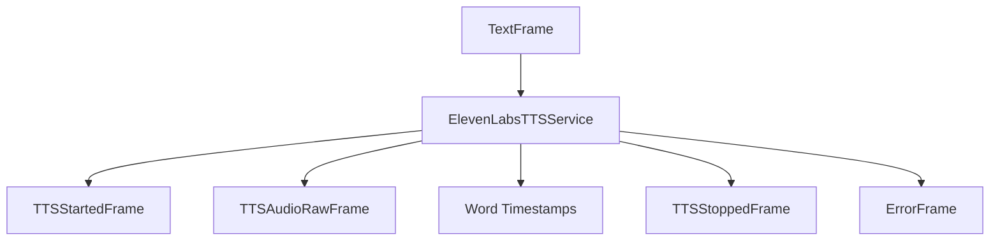

## Overview

ElevenLabs TTS provides high-quality text-to-speech synthesis through two service implementations:

- `ElevenLabsTTSService`: WebSocket-based implementation with word-level timing and interruption support
- `ElevenLabsHttpTTSService`: HTTP-based implementation for simpler use cases

## Installation

To use `ElevenLabsTTSService`, install the required dependencies:

```bash
pip install "pipecat-ai[elevenlabs]"
```

You'll also need to set up your ElevenLabs API key as an environment variable: `ELEVENLABS_API_KEY`.

<Tip>
  You can obtain a ElevenLabs API key by signing up at
  [ElevenLabs](https://elevenlabs.io/app/sign-up).
</Tip>

## ElevenLabsTTSService (WebSocket)

### Configuration

<ParamField path="api_key" type="str" required>
  ElevenLabs API key
</ParamField>

<ParamField path="voice_id" type="str" required>
  Voice identifier
</ParamField>

<ParamField path="model" type="str" default="eleven_flash_v2_5">
  Model identifier
</ParamField>

<ParamField path="url" type="str" default="wss://api.elevenlabs.io">
  API endpoint URL
</ParamField>

<ParamField path="sample_rate" type="int" default="None">
  Output audio sample rate in Hz
</ParamField>

<ParamField path="params" type="InputParams" default="InputParams()">
  Additional configuration parameters
</ParamField>

<ParamField path="text_filter" type="BaseTextFilter" default="None">
  Modifies text provided to the TTS. [Learn
  more](/server/base-classes/text#text-filters) about the available filters.
</ParamField>

### InputParams

<ParamField path="language" type="Language" default="None">
  The language of the text to be synthesized
</ParamField>

<ParamField path="optimize_streaming_latency" type="str" default="None">
  Optimization level for streaming latency
</ParamField>

<ParamField path="stability" type="float" default="None">
  Defines the stability for voice settings
</ParamField>

<ParamField path="similarity_boost" type="float" default="None">
  Defines the similarity boost for voice settings
</ParamField>

<ParamField path="style" type="float" default="None">
  Defines the style for voice settings. Available on V2+ models
</ParamField>

<ParamField path="use_speaker_boost" type="bool" default="None">
  Defines whether to use speaker boost for voice settings. Available on V2+
  models
</ParamField>

<ParamField path="speed" type="float" default="None">
  Speech rate multiplier. Higher values increase speech speed
</ParamField>

<ParamField path="auto_mode" type="bool" default="True">
  This parameter focuses on reducing the latency by disabling the chunk schedule
  and buffers. Recommended when sending full sentences or phrases
</ParamField>

## ElevenLabsHttpTTSService (HTTP)

### Configuration

<ParamField path="api_key" type="str" required>
  ElevenLabs API key
</ParamField>

<ParamField path="voice_id" type="str" required>
  Voice identifier
</ParamField>

<ParamField path="aiohttp_session" type="aiohttp.ClientSession" required>
  aiohttp ClientSession for HTTP requests
</ParamField>

<ParamField path="model" type="str" default="eleven_flash_v2_5">
  Model identifier
</ParamField>

<ParamField path="base_url" type="str" default="https://api.elevenlabs.io">
  API base URL
</ParamField>

<ParamField path="sample_rate" type="int" default="None">
  Output audio sample rate in Hz
</ParamField>

<ParamField path="params" type="InputParams" default="InputParams()">
  Additional configuration parameters (similar to WebSocket implementation)
</ParamField>

## Output Frames

### TTSStartedFrame

Signals the start of audio generation.

### TTSAudioRawFrame

Contains generated audio data:

<ParamField path="audio" type="bytes">
  Raw audio data chunk
</ParamField>

<ParamField path="sample_rate" type="int">
  Audio sample rate
</ParamField>

<ParamField path="num_channels" type="int">
  Number of audio channels (1 for mono)
</ParamField>

### TTSStoppedFrame

Signals the completion of audio generation.

### ErrorFrame (HTTP implementation)

Sent when an error occurs during HTTP TTS generation:

<ParamField path="error" type="str">
  Error message describing what went wrong
</ParamField>

## Usage Examples

### Basic Usage

```python
# Configure service
tts = ElevenLabsTTSService(
    api_key="your-api-key",
    voice_id="voice-id",
    sample_rate=24000,
    params=ElevenLabsTTSService.InputParams(
        language=Language.EN
    )
)

# Use in pipeline
pipeline = Pipeline([
    ...,
    llm,
    tts,
    transport.output()
])
```

### With Voice Settings

```python
# Configure with voice customization
tts = ElevenLabsTTSService(
    api_key="your-api-key",
    voice_id="voice-id",
    params=ElevenLabsTTSService.InputParams(
        stability=0.7,
        similarity_boost=0.8,
        style=0.5,
        use_speaker_boost=True
    )
)
```

## Methods

See the [TTS base class methods](/server/base-classes/speech#ttsservice) for additional functionality.

## Language Support

ElevenLabs supports the following languages and their variants:

| Language Code  | Description | Service Code |
| -------------- | ----------- | ------------ |
| `Language.AR`  | Arabic      | `ar`         |
| `Language.BG`  | Bulgarian   | `bg`         |
| `Language.CS`  | Czech       | `cs`         |
| `Language.DA`  | Danish      | `da`         |
| `Language.DE`  | German      | `de`         |
| `Language.EL`  | Greek       | `el`         |
| `Language.EN`  | English     | `en`         |
| `Language.ES`  | Spanish     | `es`         |
| `Language.FI`  | Finnish     | `fi`         |
| `Language.FIL` | Filipino    | `fil`        |
| `Language.FR`  | French      | `fr`         |
| `Language.HI`  | Hindi       | `hi`         |
| `Language.HR`  | Croatian    | `hr`         |
| `Language.HU`  | Hungarian   | `hu`         |
| `Language.ID`  | Indonesian  | `id`         |
| `Language.IT`  | Italian     | `it`         |
| `Language.JA`  | Japanese    | `ja`         |
| `Language.KO`  | Korean      | `ko`         |
| `Language.MS`  | Malay       | `ms`         |
| `Language.NL`  | Dutch       | `nl`         |
| `Language.NO`  | Norwegian   | `no`         |
| `Language.PL`  | Polish      | `pl`         |
| `Language.PT`  | Portuguese  | `pt`         |
| `Language.RO`  | Romanian    | `ro`         |
| `Language.RU`  | Russian     | `ru`         |
| `Language.SK`  | Slovak      | `sk`         |
| `Language.SV`  | Swedish     | `sv`         |
| `Language.TA`  | Tamil       | `ta`         |
| `Language.TR`  | Turkish     | `tr`         |
| `Language.UK`  | Ukrainian   | `uk`         |
| `Language.VI`  | Vietnamese  | `vi`         |
| `Language.ZH`  | Chinese     | `zh`         |

Note: Language support may vary based on the selected model. See the [ElevenLabs docs](https://elevenlabs.io/docs/product/speech-synthesis/models) for more details.

### Usage Example

```python
# Configure service with specific language
service = ElevenLabsTTSService(
    api_key="your-api-key",
    voice_id="voice-id",
    params=ElevenLabsTTSService.InputParams(
        language=Language.FR  # French
    )
)
```

## Frame Flow



## Notes

- WebSocket implementation includes a 10-second keepalive mechanism
- Sample rate must be one of: 16000, 22050, 24000, or 44100 Hz
- Voice settings require both `stability` and `similarity_boost` to be set
- The `language` parameter only works with multilingual models
- WebSocket implementation pauses frame processing during speech generation
- HTTP implementation requires an external aiohttp ClientSession
