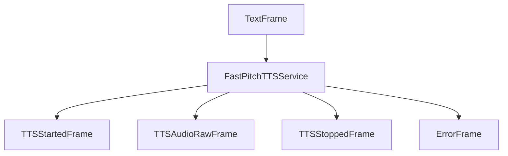

## Overview

`FastPitchTTSService` converts text to speech using NVIDIA's Riva FastPitch TTS model. It provides high-quality text-to-speech synthesis with configurable voice options.

## Installation

To use `FastPitchTTSService`, install the required dependencies:

```bash
pip install "pipecat-ai[riva]"
```

You'll also need to set up your NVIDIA API key as an environment variable: `NVIDIA_API_KEY`

## Configuration

### Constructor Parameters

<ParamField path="api_key" type="str" required>
  Your NVIDIA API key
</ParamField>

<ParamField path="server" type="str" default="grpc.nvcf.nvidia.com:443">
  NVIDIA Riva server address
</ParamField>

<ParamField path="voice_id" type="str" default="English-US.Female-1">
  Voice identifier to use for synthesis
</ParamField>

<ParamField path="sample_rate" type="int" default="None">
  Output audio sample rate in Hz
</ParamField>

<ParamField
  path="function_id"
  type="str"
  default="0149dedb-2be8-4195-b9a0-e57e0e14f972"
>
  NVIDIA function identifier for the TTS service
</ParamField>

<ParamField path="params" type="InputParams" default="InputParams()">
  Additional configuration parameters (language and quality)
</ParamField>

### InputParams

<ParamField path="language" type="Language" default="Language.EN_US">
  The language for TTS generation
</ParamField>

<ParamField path="quality" type="int" default="20">
  Quality level for the generated audio
</ParamField>

## Input

The service accepts text input through its TTS pipeline.

## Output Frames

### TTSStartedFrame

Signals the start of audio generation.

### TTSAudioRawFrame

Contains generated audio data:

<ParamField path="audio" type="bytes">
  Raw audio data chunk
</ParamField>

<ParamField path="sample_rate" type="int">
  Audio sample rate
</ParamField>

<ParamField path="num_channels" type="int">
  Number of audio channels (1 for mono)
</ParamField>

### TTSStoppedFrame

Signals the completion of audio generation.

## Methods

See the [TTS base class methods](/server/base-classes/speech#ttsservice) for additional functionality.

## Language Support

FastPitch TTS primarily supports English with various regional accents:

| Language Code    | Description  | Service Codes |
| ---------------- | ------------ | ------------- |
| `Language.EN_US` | English (US) | `en-US`       |

## Usage Example

```python
from pipecat.services.riva import FastPitchTTSService
from pipecat.transcriptions.language import Language

# Configure service
tts = FastPitchTTSService(
    api_key="your-nvidia-api-key",
    voice_id="English-US.Female-1",
    params=FastPitchTTSService.InputParams(
        language=Language.EN_US,
        quality=20
    )
)

# Use in pipeline
pipeline = Pipeline([
    ...,
    llm,
    tts,
    transport.output(),
])
```

## Frame Flow



## Metrics Support

The service supports metrics collection:

- Time to First Byte (TTFB)
- TTS usage metrics
- Processing duration

## Audio Processing

- Processes audio through the Riva API
- Generates mono audio output
- Handles asynchronous audio streaming
- Configurable sampling rate

## Notes

- Uses NVIDIA's Riva AI Services platform
- Streams audio in chunks
- Requires valid NVIDIA API key
- Thread-safe processing with asyncio
