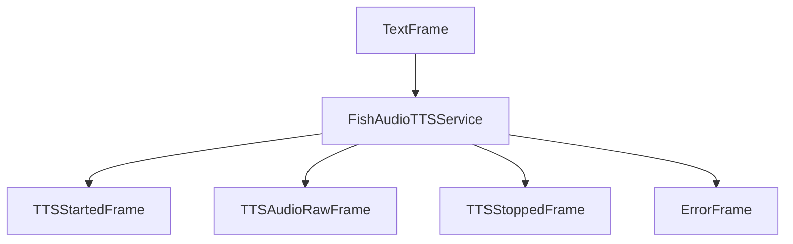

## Overview

The `FishAudioTTSService` provides real-time text-to-speech synthesis using Fish Audio's WebSocket API. It supports streaming audio output, multiple voices, and various audio formats.

## Installation

To use Fish Audio, install the required dependencies:

```bash
pip install pipecat-ai[fish]
```

You'll need to set up your Fish Audio API key as an environment variable: `FISH_API_KEY`.

## Constructor Parameters

<ParamField path="api_key" type="str" required>
  Fish Audio API key
</ParamField>

<ParamField path="model" type="str" required>
  Reference ID for the voice model
</ParamField>

<ParamField path="output_format" type="str" default="pcm">
  Audio output format. Options: "opus", "mp3", "pcm", "wav"
</ParamField>

<ParamField path="sample_rate" type="int" default="24000">
  Output audio sample rate in Hz
</ParamField>

### Basic Usage

```python
tts = FishAudioTTSService(
    api_key=os.getenv("FISH_API_KEY"),
    model="your-model-id",  # Get this from Fish Audio playground
    output_format="pcm",    # Choose output format
    sample_rate=24000,      # Set sample rate
    params=FishAudioTTSService.InputParams(
        latency="normal",
        prosody_speed=1.0
    )
)
```

## Input Parameters

<ParamField path="language" type="Language" default="Language.EN">
  Language for speech synthesis. See Language Support section for available
  options.
</ParamField>

<ParamField path="latency" type="str" default="normal">
  Latency mode for synthesis. Options: "normal" or "balanced"
</ParamField>

<ParamField path="prosody_speed" type="float" default="1.0">
  Speech speed adjustment. Range: 0.5 to 2.0
</ParamField>

<ParamField path="prosody_volume" type="int" default="0">
  Volume adjustment in decibels (dB)
</ParamField>

```python
tts = FishAudioTTSService(
    api_key=os.getenv("FISH_API_KEY"),
    model="your-model-id",
    params=InputParams(
        language=Language.EN,
        latency="normal",     # Balance between quality and speed
        prosody_speed=1.2,    # Slightly faster speech
        prosody_volume=0      # Default volume
    )
)
```

## Output Frames

### Control Frames

<ParamField path="TTSStartedFrame" type="Frame">
  Signals start of synthesis
</ParamField>

<ParamField path="TTSStoppedFrame" type="Frame">
  Signals completion of synthesis
</ParamField>

### Audio Frames

<ParamField path="TTSAudioRawFrame" type="Frame">
  Contains generated audio data with: - Specified format (PCM, WAV, MP3, or
  Opus) - Configured sample rate - Single channel (mono)
</ParamField>

### Error Frames

<ParamField path="ErrorFrame" type="Frame">
  Contains Fish Audio error information
</ParamField>

## Language Support

Supports multiple languages through the Language enum:

| Language Code | Service Code |
| ------------- | ------------ |
| Language.EN   | en-US        |
| Language.ZH   | zh-CN        |

## Usage Example

```python
from pipecat.services.fish import FishAudioTTSService
from pipecat.transcriptions.language import Language

# Configure service
tts = FishAudioTTSService(
    api_key=os.getenv("FISH_API_KEY"),
    model="e58b0d7efca34eb38d5c4985e378abcb",  # Example model ID
    output_format="pcm",
    params=FishAudioTTSService.InputParams(
        language=Language.EN,
        latency="normal",
        prosody_speed=1.0,
        prosody_volume=0
    )
)

# Use in pipeline
pipeline = Pipeline([
    ...,
    llm,
    tts,
    transport.output(),
])
```

## Frame Flow



## Metrics Support

The service collects processing metrics:

- Time to First Byte (TTFB)
- Processing duration
- Character usage
- API calls
