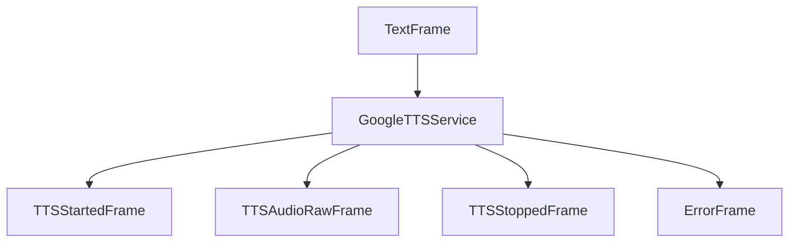

## Overview

`GoogleTTSService` provides high-quality text-to-speech synthesis using Google Cloud's Text-to-Speech API. It supports SSML for advanced voice control and multiple languages.

## Installation

To use `GoogleTTSService`, install the required dependencies:

```bash
pip install pipecat-ai[google]
```

You'll also need to set up Google Cloud credentials through either:

- Environment variable: `GOOGLE_APPLICATION_CREDENTIALS`
- Direct credentials JSON
- Credentials file path

## Configuration

### Constructor Parameters

<ParamField path="credentials" type="str | None" optional>
  Google Cloud credentials JSON string
</ParamField>

<ParamField path="credentials_path" type="str | None" optional>
  Path to credentials JSON file
</ParamField>

<ParamField path="voice_id" type="str" default="en-US-Neural2-A">
  Voice identifier
</ParamField>

<ParamField path="sample_rate" type="int" default="24000">
  Output audio sample rate in Hz
</ParamField>

<ParamField path="text_filter" type="BaseTextFilter" default="None">
  Modifies text provided to the TTS. [Learn
  more](/server/base-classes/text#text-filters) about the available filters.
</ParamField>

### Input Parameters

```python
class InputParams(BaseModel):
    pitch: Optional[str]
    rate: Optional[str]
    volume: Optional[str]
    emphasis: Optional[Literal["strong", "moderate", "reduced", "none"]]
    language: Optional[Language] = Language.EN
    gender: Optional[Literal["male", "female", "neutral"]]
    google_style: Optional[Literal["apologetic", "calm", "empathetic", "firm", "lively"]]
```

## Output Frames

### Control Frames

<ParamField path="TTSStartedFrame" type="Frame">
  Signals start of synthesis
</ParamField>

<ParamField path="TTSStoppedFrame" type="Frame">
  Signals completion of synthesis
</ParamField>

### Audio Frames

<ParamField path="TTSAudioRawFrame" type="Frame">
  Contains generated audio data: - PCM encoded audio - Configured sample rate -
  Mono channel
</ParamField>

### Error Frames

<ParamField path="ErrorFrame" type="Frame">
  Contains error information
</ParamField>

## Usage Examples

### Basic Usage

```python
# Configure service
tts_service = GoogleTTSService(
    credentials_path="path/to/credentials.json",
    voice_id="en-US-Neural2-A",
    params=GoogleTTSService.InputParams(
        language=Language.EN,
        gender="female",
        google_style="empathetic"
    )
)

# Use in pipeline
pipeline = Pipeline([
    text_input,
    tts_service,
    audio_output
])
```

### With SSML Controls

```python
# Configure with voice controls
service = GoogleTTSService(
    credentials=credentials_json,
    params=GoogleTTSService.InputParams(
        pitch="+2st",
        rate="1.2",
        volume="loud",
        emphasis="moderate"
    )
)
```

## Methods

See the [TTS base class methods](/server/base-classes/speech#ttsservice) for additional functionality.

## Language Support

Google Cloud Text-to-Speech supports the following languages and regional variants:

| Language Code    | Description           | Service Code |
| ---------------- | --------------------- | ------------ |
| `Language.BG`    | Bulgarian             | `bg-BG`      |
| `Language.CA`    | Catalan               | `ca-ES`      |
| `Language.ZH`    | Chinese (Mandarin)    | `cmn-CN`     |
| `Language.ZH_TW` | Chinese (Taiwan)      | `cmn-TW`     |
| `Language.CS`    | Czech                 | `cs-CZ`      |
| `Language.DA`    | Danish                | `da-DK`      |
| `Language.NL`    | Dutch (Netherlands)   | `nl-NL`      |
| `Language.NL_BE` | Dutch (Belgium)       | `nl-BE`      |
| `Language.EN`    | English (US)          | `en-US`      |
| `Language.EN_US` | English (US)          | `en-US`      |
| `Language.EN_AU` | English (Australia)   | `en-AU`      |
| `Language.EN_GB` | English (UK)          | `en-GB`      |
| `Language.EN_IN` | English (India)       | `en-IN`      |
| `Language.ET`    | Estonian              | `et-EE`      |
| `Language.FI`    | Finnish               | `fi-FI`      |
| `Language.FR`    | French (France)       | `fr-FR`      |
| `Language.FR_CA` | French (Canada)       | `fr-CA`      |
| `Language.DE`    | German                | `de-DE`      |
| `Language.EL`    | Greek                 | `el-GR`      |
| `Language.HI`    | Hindi                 | `hi-IN`      |
| `Language.HU`    | Hungarian             | `hu-HU`      |
| `Language.ID`    | Indonesian            | `id-ID`      |
| `Language.IT`    | Italian               | `it-IT`      |
| `Language.JA`    | Japanese              | `ja-JP`      |
| `Language.KO`    | Korean                | `ko-KR`      |
| `Language.LV`    | Latvian               | `lv-LV`      |
| `Language.LT`    | Lithuanian            | `lt-LT`      |
| `Language.MS`    | Malay                 | `ms-MY`      |
| `Language.NO`    | Norwegian             | `nb-NO`      |
| `Language.PL`    | Polish                | `pl-PL`      |
| `Language.PT`    | Portuguese (Portugal) | `pt-PT`      |
| `Language.PT_BR` | Portuguese (Brazil)   | `pt-BR`      |
| `Language.RO`    | Romanian              | `ro-RO`      |
| `Language.RU`    | Russian               | `ru-RU`      |
| `Language.SK`    | Slovak                | `sk-SK`      |
| `Language.ES`    | Spanish               | `es-ES`      |
| `Language.SV`    | Swedish               | `sv-SE`      |
| `Language.TH`    | Thai                  | `th-TH`      |
| `Language.TR`    | Turkish               | `tr-TR`      |
| `Language.UK`    | Ukrainian             | `uk-UA`      |
| `Language.VI`    | Vietnamese            | `vi-VN`      |

### Usage Example

```python
# Configure service with specific language and region
service = GoogleTTSService(
    credentials_path="path/to/credentials.json",
    voice_id="en-US-Neural2-A",
    params=GoogleTTSService.InputParams(
        language=Language.EN_GB,  # British English
        gender="female"
    )
)
```

### Regional Considerations

- Each language code includes both language and region (e.g., `fr-FR` for French in France)
- Some languages have multiple regional variants (e.g., English has US, UK, Australian, and Indian variants)
- Voice availability may vary by region
- Neural voices may not be available for all language/region combinations

Note: Voice selection should match the specified language code for optimal results.

## Frame Flow



## Notes

- Supports SSML markup
- Multiple voice styles
- Gender selection
- Prosody control
- Emphasis levels
- Regional language variants
- Metrics collection
- Chunked audio output
- Thread-safe processing
