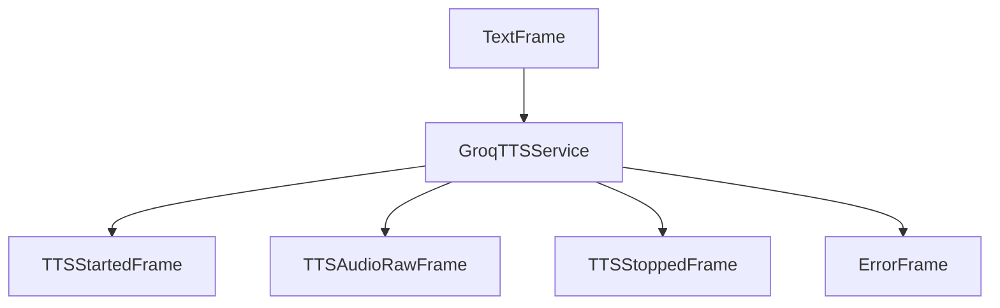

## Overview

`GroqTTSService` converts text to speech using Groq's TTS API. It supports real-time audio generation with multiple voices.

## Installation

To use `GroqTTSService`, install the required dependencies:

```bash
pip install "pipecat-ai[groq]"
```

You'll also need to set up your Groq API key as an environment variable: `GROQ_API_KEY`.

<Tip>
  You can obtain a Groq Cloud API key by signing up at
  [Groq](https://console.groq.com/login).
</Tip>

## Configuration

### Constructor Parameters

<ParamField path="api_key" type="str" required>
  Your Groq API key
</ParamField>

<ParamField path="output_format" type="str" default="wav">
  Audio output format
</ParamField>

<ParamField path="params" type="InputParams" default="InputParams()">
  Configuration parameters for speech generation
</ParamField>

<ParamField path="model_name" type="str" default="playai-tts">
  TTS model to use. See the Groq Cloud docs for [available
  models](https://console.groq.com/docs/text-to-speech).
</ParamField>

<ParamField path="voice_id" type="str" default="Celeste-PlayAI">
  Voice identifier to use for synthesis
</ParamField>

### Input Parameters

<ParamField path="language" type="Language" default="Language.EN">
  Language for speech synthesis
</ParamField>

<ParamField path="speed" type="float" default="1.0">
  Speech rate multiplier (higher values produce faster speech)
</ParamField>

<ParamField path="seed" type="Optional[int]" default="None">
  Random seed for reproducible audio generation
</ParamField>

## Input

The service accepts text input through the pipeline, including streaming text from an LLM service.

## Output Frames

### TTSStartedFrame

Signals the start of audio generation.

### TTSAudioRawFrame

Contains generated audio data:

<ParamField path="audio" type="bytes">
  Raw audio data chunk
</ParamField>

<ParamField path="sample_rate" type="int">
  Audio sample rate, based on the constructor setting
</ParamField>

<ParamField path="num_channels" type="int">
  Number of audio channels (1 for mono)
</ParamField>

### TTSStoppedFrame

Signals the completion of audio generation.

## Methods

See the [TTS base class methods](/server/base-classes/speech#ttsservice) for additional functionality.

## Language Support

`GroqTTSService` supports the following languages:

| Language Code | Description | Service Codes |
| ------------- | ----------- | ------------- |
| `Language.EN` | English     | `en`          |

## Usage Example

```python
from pipecat.services.groq.tts import GroqTTSService
from pipecat.transcriptions.language import Language

# Configure service
tts = GroqTTSService(
    api_key="your-api-key",
    model_name="playai-tts",
    voice_id="Celeste-PlayAI",
    params=GroqTTSService.InputParams(
        language=Language.EN,
        speed=1.0,
        seed=42
    )
)

# Use in pipeline
pipeline = Pipeline([
    ...,
    llm,
    tts,
    transport.output(),
])
```

## Frame Flow



## Metrics Support

The service supports metrics collection:

- Time to First Byte (TTFB)
- Processing duration

## Audio Processing

- Streams audio in chunks
- Outputs mono audio at the defined sample rate
- Handles WAV header removal automatically
- Supports WAV format by default

## Notes

- Requires a Groq Cloud API key
- Streams audio in chunks for efficient processing
- Automatically handles WAV headers in the response
- Provides metrics collection
- Supports configurable speech parameters
