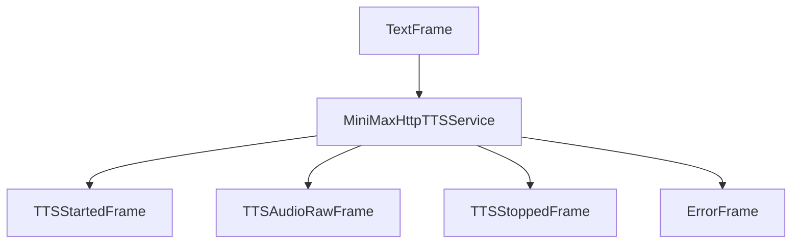

## Overview

`MiniMaxHttpTTSService` provides text-to-speech capabilities using MiniMax's T2A (Text-to-Audio) API. It supports multiple voices, emotions, languages, and speech customization options.

## Installation

To use `MiniMaxHttpTTSService`, no additional dependencies are required.

You'll also need MiniMax API credentials (API key and Group ID).

## Configuration

### Constructor Parameters

<ParamField path="api_key" type="str" required>
  MiniMax API key for authentication
</ParamField>

<ParamField path="group_id" type="str" required>
  MiniMax Group ID to identify your project
</ParamField>

<ParamField path="model" type="str" default="speech-02-turbo">

MiniMax TTS model to use. Available options include:

- `speech-02-hd`: HD model with superior rhythm and stability
- `speech-02-turbo`: Turbo model with enhanced multilingual capabilities
- `speech-01-hd`: Rich voices with expressive emotions
- `speech-01-turbo`: Low-latency model with regular updates

</ParamField>

<ParamField path="voice_id" type="str" default="Calm_Woman">

MiniMax voice identifier. Options include:

- `Wise_Woman`
- `Friendly_Person`
- `Inspirational_girl`
- `Deep_Voice_Man`
- `Calm_Woman`
- `Casual_Guy`
- `Lively_Girl`
- `Patient_Man`
- `Young_Knight`
- `Determined_Man`
- `Lovely_Girl`
- `Decent_Boy`
- `Imposing_Manner`
- `Elegant_Man`
- `Abbess`
- `Sweet_Girl_2`
- `Exuberant_Girl`

See the [MiniMax documentation](https://www.minimax.io/platform/document/T2A%20V2?key=66719005a427f0c8a5701643) for a complete list of available voices.

</ParamField>

<ParamField path="aiohttp_session" type="aiohttp.ClientSession" required>
  Aiohttp session for API communication
</ParamField>

<ParamField path="sample_rate" type="int" default="None">
  Output audio sample rate in Hz
</ParamField>

<ParamField path="params" type="InputParams" optional>
  TTS configuration parameters
</ParamField>

### Input Parameters

<ParamField path="language" type="Language" default="Language.EN" optional>
  Language for TTS generation
</ParamField>

<ParamField path="speed" type="float" default="1.0" optional>
  Speech speed (range: 0.5 to 2.0). Values greater than 1.0 increase speed, less
  than 1.0 decrease speed.
</ParamField>

<ParamField path="volume" type="float" default="1.0" optional>
  Speech volume (range: 0 to 10). Values greater than 1.0 increase volume.
</ParamField>

<ParamField path="pitch" type="float" default="0" optional>
  Pitch adjustment (range: -12 to 12). Positive values raise pitch, negative
  values lower pitch.
</ParamField>

<ParamField path="emotion" type="str" optional>
  Emotional tone of the speech. Options include: "happy", "sad", "angry",
  "fearful", "disgusted", "surprised", and "neutral".
</ParamField>

<ParamField path="english_normalization" type="bool" optional>
  Whether to apply English text normalization, which improves performance in
  number-reading scenarios at the cost of slightly increased latency.
</ParamField>

## Output Frames

### Control Frames

<ParamField path="TTSStartedFrame" type="Frame">
  Signals start of speech synthesis
</ParamField>

<ParamField path="TTSStoppedFrame" type="Frame">
  Signals completion of speech synthesis
</ParamField>

### Audio Frames

<ParamField path="TTSAudioRawFrame" type="Frame">
  
Contains generated audio data with:

- PCM audio format
- Sample rate as specified
- Single channel (mono)

</ParamField>

### Error Frames

<ParamField path="ErrorFrame" type="Frame">
  Contains MiniMax API error information
</ParamField>

## Methods

See the [TTS base class methods](/server/base-classes/speech#ttsservice) for additional functionality.

## Language Support

Supports a wide range of languages through the `language_boost` parameter:

| Language Code  | Service Code  | Description         |
| -------------- | ------------- | ------------------- |
| `Language.AR`  | `Arabic`      | Arabic              |
| `Language.CS`  | `Czech`       | Czech               |
| `Language.DE`  | `German`      | German              |
| `Language.EL`  | `Greek`       | Greek               |
| `Language.EN`  | `English`     | English             |
| `Language.ES`  | `Spanish`     | Spanish             |
| `Language.FI`  | `Finnish`     | Finnish             |
| `Language.FR`  | `French`      | French              |
| `Language.HI`  | `Hindi`       | Hindi               |
| `Language.ID`  | `Indonesian`  | Indonesian          |
| `Language.IT`  | `Italian`     | Italian             |
| `Language.JA`  | `Japanese`    | Japanese            |
| `Language.KO`  | `Korean`      | Korean              |
| `Language.NL`  | `Dutch`       | Dutch               |
| `Language.PL`  | `Polish`      | Polish              |
| `Language.PT`  | `Portuguese`  | Portuguese          |
| `Language.RO`  | `Romanian`    | Romanian            |
| `Language.RU`  | `Russian`     | Russian             |
| `Language.TH`  | `Thai`        | Thai                |
| `Language.TR`  | `Turkish`     | Turkish             |
| `Language.UK`  | `Ukrainian`   | Ukrainian           |
| `Language.VI`  | `Vietnamese`  | Vietnamese          |
| `Language.YUE` | `Chinese,Yue` | Chinese (Cantonese) |
| `Language.ZH`  | `Chinese`     | Chinese (Mandarin)  |

## Usage Example

```python
import aiohttp
import os
from pipecat.services.minimax.tts import MiniMaxHttpTTSService
from pipecat.transcriptions.language import Language

async def create_tts_service():
    # Create an HTTP session
    session = aiohttp.ClientSession()

    # Configure service with credentials
    tts = MiniMaxHttpTTSService(
        api_key=os.getenv("MINIMAX_API_KEY"),
        group_id=os.getenv("MINIMAX_GROUP_ID"),
        model="speech-02-turbo",
        voice_id="Patient_Man",
        aiohttp_session=session,
        params=MiniMaxHttpTTSService.InputParams(
            language=Language.EN,
            speed=1.1,         # Slightly faster speech
            volume=1.2,        # Slightly louder
            pitch=0,           # Default pitch
            emotion="neutral"  # Neutral emotional tone
        )
    )

    return tts

# Use in pipeline
pipeline = Pipeline([
    ...,
    llm,
    tts,
    transport.output(),
])
```

## Frame Flow



## Metrics Support

The service collects processing metrics:

- Time to First Byte (TTFB)
- Processing duration
- Character usage

## Notes

- Uses streaming audio generation for faster initial response
- Processes audio in chunks for efficient memory usage
- Supports real-time applications with low latency
- Automatically handles API authentication
- Provides PCM audio compatible with most audio pipelines
