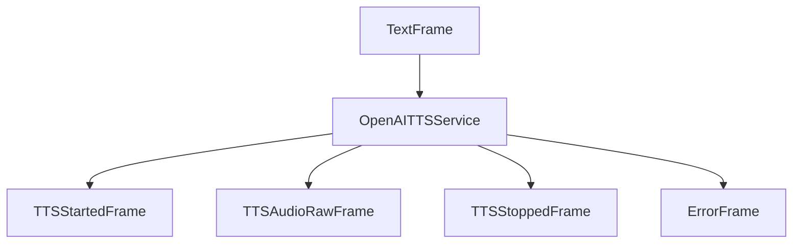

## Overview

`OpenAITTSService` converts text to speech using OpenAI's TTS API. It supports multiple voices and provides high-quality audio output at 24kHz.

## Installation

To use `OpenAITTSService`, install the required dependencies:

```bash
pip install pipecat-ai[openai]
```

You'll also need to set up your OpenAI API key as an environment variable: `OPENAI_API_KEY`

## Configuration

### Constructor Parameters

<ParamField path="api_key" type="str | None" optional>
  OpenAI API key (defaults to environment variable)
</ParamField>

<ParamField path="voice" type="str" default="alloy">
  Voice identifier. Options: - "alloy" - "echo" - "fable" - "onyx" - "nova" -
  "shimmer"
</ParamField>

<ParamField path="model" type="str" default="tts-1">
  Model to use. Options: - "tts-1" - "tts-1-hd"
</ParamField>

<ParamField path="sample_rate" type="int" default="24000">
  Output audio sample rate in Hz
</ParamField>

<ParamField path="text_filter" type="BaseTextFilter" default="None">
  Modifies text provided to the TTS. [Learn
  more](/server/base-classes/text#text-filters) about the available filters.
</ParamField>

## Output Frames

### Control Frames

<ParamField path="TTSStartedFrame" type="Frame">
  Signals start of audio generation
</ParamField>

<ParamField path="TTSStoppedFrame" type="Frame">
  Signals completion of audio generation
</ParamField>

### Audio Frames

<ParamField path="TTSAudioRawFrame" type="Frame">
  Contains generated audio data: - PCM encoded audio - 24kHz sample rate - Mono
  channel
</ParamField>

### Error Frames

<ParamField path="ErrorFrame" type="Frame">
  Contains error information if TTS fails
</ParamField>

## Methods

See the [TTS base class methods](/server/base-classes/speech#ttsservice) for additional functionality.

## Language Support

OpenAI TTS supports the following languages and regional variants:

| Language Code | Description | Service Codes |
| ------------- | ----------- | ------------- |
| `Language.EN` | English     | `en`          |

## Usage Example

```python
from pipecat.services.openai import OpenAITTSService

# Configure service
tts_service = OpenAITTSService(
    voice="nova",
    model="tts-1-hd",
    sample_rate=24000
)

# Use in pipeline
pipeline = Pipeline([
    text_input,         # Produces text for synthesis
    tts_service,        # Converts text to speech
    audio_output        # Handles audio playback
])
```

## Transport Configuration

When using with DailyTransport, configure matching sample rate:

```python
DailyParams(
    audio_out_enabled=True,
    audio_out_sample_rate=24_000,
)
```

## Frame Flow



## Metrics Support

The service supports metrics collection:

- Time to First Byte (TTFB)
- TTS usage metrics
- Processing duration

## Error Handling

```python
try:
    async for frame in service.run_tts(text):
        if isinstance(frame, ErrorFrame):
            logger.error(f"TTS error: {frame.error}")
            # Handle error
except Exception as e:
    logger.error(f"TTS error: {e}")
```

## Notes

- Outputs PCM audio at 24kHz
- Streams audio in 8KB chunks
- Supports multiple voices
- Provides HD model option
- Includes metrics collection
- Thread-safe processing
- Handles empty text gracefully
