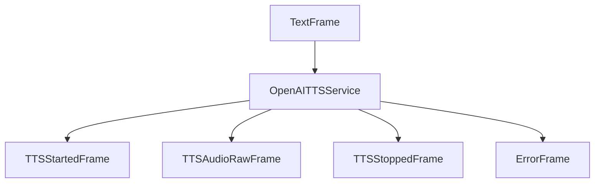

## Overview

`OpenAITTSService` converts text to speech using OpenAI's TTS API. It supports multiple voices and provides high-quality audio output at 24kHz using both traditional TTS models and the gpt-4o TTS models.

## Installation

To use `OpenAITTSService`, install the required dependencies:

```bash
pip install "pipecat-ai[openai]"
```

You'll also need to set up your OpenAI API key as an environment variable: `OPENAI_API_KEY`

## Configuration

### Constructor Parameters

<ParamField path="api_key" type="str | None" optional>
  OpenAI API key
</ParamField>

<ParamField path="voice" type="str" default="alloy">
  
Voice identifier.

Options:

- `"alloy"`
- `"echo"`
- `"fable"`
- `"onyx"`
- `"nova"`
- `"shimmer"`

</ParamField>

<ParamField path="model" type="str" default="gpt-4o-mini-tts">
  
Model to use.

Options:

- `"gpt-4o-mini-tts"`
- `"tts-1"`
- `"tts-1-hd"`

</ParamField>

<ParamField path="sample_rate" type="int" default="None">
  Output audio sample rate in Hz. Supports only `24000` Hz.
</ParamField>

<ParamField path="text_filter" type="BaseTextFilter" default="None">
  Modifies text provided to the TTS. [Learn
  more](/server/base-classes/text#text-filters) about the available filters.
</ParamField>

## Output Frames

### Control Frames

<ParamField path="TTSStartedFrame" type="Frame">
  Signals start of audio generation
</ParamField>

<ParamField path="TTSStoppedFrame" type="Frame">
  Signals completion of audio generation
</ParamField>

### Audio Frames

<ParamField path="TTSAudioRawFrame" type="Frame">

Contains generated audio data:

- PCM encoded audio
- 24kHz sample rate
- Mono channel

</ParamField>

### Error Frames

<ParamField path="ErrorFrame" type="Frame">
  Contains error information if TTS fails
</ParamField>

## Methods

See the [TTS base class methods](/server/base-classes/speech#ttsservice) for additional functionality.

## Models

| Model             | Description                | Best For                                                            |
| ----------------- | -------------------------- | ------------------------------------------------------------------- |
| `gpt-4o-mini-tts` | Latest GPT-based TTS model | Faster generation, improved prosody, recommended for most use cases |
| `tts-1`           | Original TTS model         | Standard quality speech                                             |
| `tts-1-hd`        | High-definition TTS model  | Premium quality speech with higher fidelity                         |

## Language Support

OpenAI TTS supports the following languages and regional variants:

| Language Code | Description | Service Codes |
| ------------- | ----------- | ------------- |
| `Language.EN` | English     | `en`          |

## Usage Example

```python
from pipecat.services.openai.tts import OpenAITTSService

# Configure service
tts = OpenAITTSService(
    voice="nova",
    model="gpt-4o-mini-tts",
)

# Use in pipeline
pipeline = Pipeline([
    ...,
    llm,
    tts,
    transport.output(),
])
```

## Frame Flow



## Metrics Support

The service supports metrics collection:

- Time to First Byte (TTFB)
- TTS usage metrics
- Processing duration

## Notes

- Outputs PCM audio at 24kHz
- Streams audio in 1KB chunks
- Supports multiple voices
- Uses GPT-4o Mini TTS by default for improved quality
- Includes metrics collection
- Thread-safe processing
- Handles empty text gracefully
