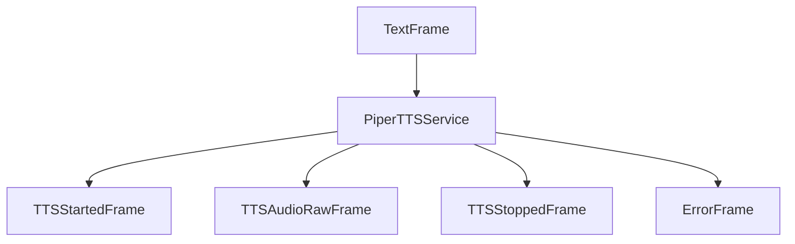

## Overview

`PiperTTSService` converts text to speech using the Piper TTS server. This service provides integration with a locally-running Piper TTS service, offering self-hosted speech synthesis capabilities.

## Installation

To use `PiperTTSService`, no additional dependencies in Pipecat are required.

You'll also need to set up a running Piper TTS server following the [Piper HTTP server documentation](https://github.com/rhasspy/piper/blob/master/src/python_run/README_http.md).

## Configuration

### Constructor Parameters

<ParamField path="base_url" type="str" required>
  API base URL for the Piper TTS server (without a trailing slash)
</ParamField>

<ParamField path="aiohttp_session" type="aiohttp.ClientSession" required>
  aiohttp ClientSession for making HTTP requests
</ParamField>

<ParamField path="sample_rate" type="Optional[int]" default="None">
  Output sample rate in Hz. When None, the sample rate depends on the voice
  model being used by the Piper server.
</ParamField>

<ParamField path="text_filter" type="BaseTextFilter" default="None">
  Modifies text provided to the TTS. [Learn
  more](/server/base-classes/text#text-filters) about the available filters.
</ParamField>

## Input

The service accepts text input through its TTS pipeline.

## Output Frames

### TTSStartedFrame

Signals the start of audio generation.

### TTSAudioRawFrame

Contains generated audio data:

<ParamField path="audio" type="bytes">
  Raw audio data chunk
</ParamField>

<ParamField path="sample_rate" type="int">
  Audio sample rate (depends on the Piper model)
</ParamField>

<ParamField path="num_channels" type="int">
  Number of audio channels (1 for mono)
</ParamField>

### TTSStoppedFrame

Signals the completion of audio generation.

### ErrorFrame

Signals that an error occurred during audio generation:

<ParamField path="error" type="str">
  Error message
</ParamField>

## Methods

See the [TTS base class methods](/server/base-classes/speech#ttsservice) for additional functionality.

## Usage Example

```python
import aiohttp
from pipecat.services.piper.tts import PiperTTSService

# Create aiohttp session
session = aiohttp.ClientSession()

# Configure service
tts = PiperTTSService(
    base_url="http://localhost:5000/api/tts",
    aiohttp_session=session,
    sample_rate=22050  # Optional: specify if you know the model's sample rate
)

# Use in pipeline
pipeline = Pipeline([
    ...,
    llm,
    tts,
    transport.output(),
])
```

## Frame Flow



## Metrics Support

The service supports metrics collection:

- Time to First Byte (TTFB)
- TTS usage metrics
- Processing duration

## Audio Processing

- Streams audio in 1KB chunks
- Automatically handles WAV headers in the response
- Outputs mono audio
- Supports the sample rate specified by your Piper voice model

## Notes

- Requires a running Piper TTS server
- Self-hosted solution with no external API dependencies
- Streams audio in chunks for efficient processing
- Automatically handles WAV headers in the response
- Provides metrics collection
