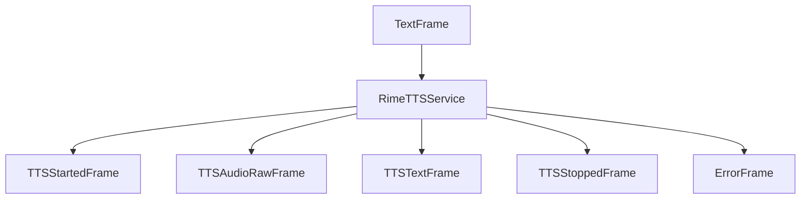

## Overview

Rime AI provides two TTS service implementations:

- `RimeTTSService`: WebSocket-based implementation with word-level timing and interruption support
- `RimeHttpTTSService`: HTTP-based implementation for simpler use cases

## Installation

To use Rime services, install the required dependencies:

```bash
pip install "pipecat-ai[rime]"
```

<Tip>
  You can obtain a Rime API key by signing up at [Rime](https://rime.ai/signup).
</Tip>

## Choosing a Rime service

Rime has two supported services:

- `RimeTTSService` which is a websocket-based implementation
- `RimeHttpTTSService`, which is an HTTP-based implementation

### RimeTTSService

The `RimeTTSService` is recommended for real-time interactive applications. It offers:

- Word-level timing information for precise synchronization
- Support for interruptions and context management
- Context tracking across multiple messages within a turn
- Non-blocking operation that allows other frames to be processed while audio is being generated

### RimeHttpTTSService

The `RimeHttpTTSService` is simpler and more suitable for non-interactive use cases. It:

- Processes the entire text in one request
- Supports advanced text control features (pauses, phonemes, inline speed)
- Blocks during the HTTP request, preventing other frames from being processed until the audio is fully generated

## Input Parameters

Both services use the same base input parameters structure:

<ParamField path="language" type="Language" default="Language.EN">
  The language to use for synthesis. See [Language Support](#language-support)
  section for available options.
</ParamField>

<ParamField path="speed_alpha" type="float" default="1.0">
  Speech rate multiplier. Values less than 1.0 increase speed, values greater
  than 1.0 decrease speed.
</ParamField>

<ParamField path="reduce_latency" type="bool" default="false">
  Trade accuracy for lower latency
</ParamField>

<ParamField path="pause_between_brackets" type="bool" default="false">
  When set to `true`, adds pauses between words enclosed in angle brackets. The number inside the brackets specifies the pause duration in milliseconds.

Example: `"Hi. <200> I'd love to have a conversation with you."` adds a 200ms pause between the first and second sentences.

</ParamField>

<ParamField path="phonemize_between_brackets" type="bool" default="false">
  When set to true, you can specify the phonemes for a word enclosed in curly brackets.

Example: `"{h'El.o} World" will pronounce "Hello"` as expected. See [Rime's docs](https://rimelabs.mintlify.app/api-reference/endpoint/streaming-pcm) for more details.

</ParamField>

## RimeTTSService (WebSocket)

Uses Rime's WebSocket JSON API for real-time speech synthesis with word-level timing information.

### Constructor Parameters

<ParamField path="api_key" type="str" required>
  Rime API key
</ParamField>

<ParamField path="voice_id" type="str" required>
  Rime voice identifier
</ParamField>

<ParamField path="url" type="str" default="wss://users.rime.ai/ws2">
  Rime WebSocket API endpoint
</ParamField>

<ParamField path="model" type="str" default="mistv2">
  Model ID to use for synthesis
</ParamField>

<ParamField path="sample_rate" type="int" default="None">
  Output audio sample rate in Hz
</ParamField>

<ParamField path="params" type="InputParams" default="InputParams()">
  Speech generation parameters (see Input Parameters section above)
</ParamField>

<ParamField
  path="text_aggregator"
  type="BaseTextAggregator"
  default="SkipTagsAggregator"
>
  Text aggregator for processing input text. Defaults to skipping content
  between `spell(` and `)` tags.
</ParamField>

### Features

- Word-level timing information with cumulative timing across messages
- Support for interruptions with context clearing
- Context tracking across multiple messages within a turn
- Real-time audio streaming
- Proper sentence aggregation with skip tags support

## RimeHttpTTSService (HTTP)

HTTP-based implementation for simpler synthesis requirements.

### Constructor Parameters

<ParamField path="api_key" type="str" required>
  Rime API key
</ParamField>

<ParamField path="voice_id" type="str" required>
  Rime voice identifier. See [Rime's
  documentation](https://rimelabs.mintlify.app/api-reference/voices) for
  supported voices.
</ParamField>

<ParamField path="aiohttp_session" type="aiohttp.ClientSession" required>
  HTTP session for making requests
</ParamField>

<ParamField path="model" type="str" default="mistv2">
  Choose `mistv2` for hyper-realistic conversational voices, `mist` for Rime's
  previous generation model, or the latest `arcana` model.
</ParamField>

<ParamField path="sample_rate" type="int" default="None">
  Output audio sample rate in Hz
</ParamField>

<ParamField path="params" type="InputParams" default="InputParams()">
  Speech generation parameters
  <Expandable title="additional properties">
    <ParamField path="inline_speed_alpha" type="str" default="None">
      Comma-separated list of speed values applied to words in square brackets. Values < 1.0 speed up speech, > 1.0 slow it down. 
      
      Example: `"This sentence is [really] [fast]"` with `inline_speed_alpha` set to `"0.5, 3"` will make "really" slow and "fast" fast.
    </ParamField>
  </Expandable>
</ParamField>

## Output Frames

Both services generate the following frames:

### Control Frames

<ParamField path="TTSStartedFrame" type="Frame">
  Signals start of speech synthesis
</ParamField>

<ParamField path="TTSStoppedFrame" type="Frame">
  Signals completion of speech synthesis
</ParamField>

### Audio Frames

<ParamField path="TTSAudioRawFrame" type="Frame">
  Contains generated audio data: PCM audio format, specified sample rate, single
  channel (mono)
</ParamField>

### Error Frames

<ParamField path="ErrorFrame" type="Frame">
  Contains Rime TTS error information
</ParamField>

## Language Support

Supports multiple languages through the `Language` enum:

| Language Code | Description | Service Code |
| ------------- | ----------- | ------------ |
| `Language.DE` | German      | `ger`        |
| `Language.EN` | English     | `eng`        |
| `Language.ES` | Spanish     | `spa`        |
| `Language.FR` | French      | `fra`        |

## Usage Examples

### WebSocket Service

```python
from pipecat.services.rime.tts import RimeTTSService
from pipecat.transcriptions.language import Language

# Configure WebSocket service
ws_tts = RimeTTSService(
    api_key="your-rime-api-key",
    voice_id="cove",
    model="mistv2",
    params=RimeTTSService.InputParams(
        language=Language.EN,
        speed_alpha=1.0,
        reduce_latency=False
    )
)

# Use in pipeline
pipeline = Pipeline([
    ...,
    llm,
    tts,
    transport.output(),
])
```

### HTTP Service

```python
import aiohttp
from pipecat.services.rime.tts import RimeHttpTTSService

# Configure HTTP service
async with aiohttp.ClientSession() as session:
    http_tts = RimeHttpTTSService(
        api_key="your-rime-api-key",
        voice_id="eva",
        aiohttp_session=session,
        model="mistv2",
        params=RimeHttpTTSService.InputParams(
            speed_alpha=1.2,
            reduce_latency=True,
            pause_between_brackets=True,
            inline_speed_alpha="0.8,1.5"
        )
    )
```

## Frame Flow



## Metrics Support

Both services collect processing metrics:

- Time to First Byte (TTFB)
- Character usage statistics

## Service Comparison

| Feature              | WebSocket | HTTP |
| -------------------- | --------- | ---- |
| Word timing          | ✓         | -    |
| Interruption support | ✓         | -    |
| Context tracking     | ✓         | -    |
| Bracket-based pauses | ✓         | ✓    |
| Phoneme control      | ✓         | ✓    |
| Inline speed control | -         | ✓    |
| Streaming audio      | ✓         | ✓    |
| Arcana model support | -         | ✓    |
