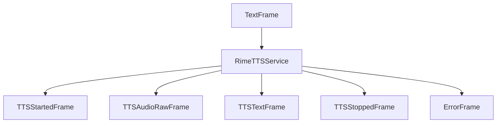

## Overview

Rime AI's text-to-speech capabilities are available through two service implementations:

- `RimeTTSService`: WebSocket-based implementation with word-level timing and interruption support
- `RimeHttpTTSService`: HTTP-based implementation for simpler use cases

<Tip>
  You can obtain a Rime API key by signing up at [Rime](https://rime.ai/signup).
</Tip>

## RimeTTSService (WebSocket Service)

Uses Rime's WebSocket JSON API for real-time speech synthesis with word-level timing information.

### Constructor Parameters

<ParamField path="api_key" type="str" required>
  Rime API key
</ParamField>

<ParamField path="voice_id" type="str" required>
  Rime voice identifier
</ParamField>

<ParamField path="url" type="str" default="wss://users-ws.rime.ai/ws2">
  Rime WebSocket API endpoint
</ParamField>

<ParamField path="model" type="str" default="mistv2">
  Model ID to use for synthesis
</ParamField>

<ParamField path="sample_rate" type="int" default="None">
  Output audio sample rate in Hz
</ParamField>

<ParamField path="params" type="InputParams" default="InputParams()">
  Speech generation parameters
  <Expandable title="properties">
    <ParamField path="language" type="Language" default="Language.EN">
      Target language for synthesis
    </ParamField>

    <ParamField path="speed_alpha" type="float" default="1.0">
      Speech rate multiplier (1.0 is normal speed)
    </ParamField>

    <ParamField path="reduce_latency" type="bool" default="false">
      Trade accuracy for lower latency
    </ParamField>

  </Expandable>
</ParamField>

### Features

- Word-level timing information
- Support for interruptions
- Context tracking across multiple messages
- Real-time audio streaming
- Proper sentence aggregation

## RimeHttpTTSService (HTTP Service)

### Constructor Parameters

<ParamField path="api_key" type="str" required>
  Rime API key
</ParamField>

<ParamField path="voice_id" type="str" default="eva">
  Rime voice identifier. See [Rime's
  documentation](https://rimelabs.mintlify.app/api-reference/voices) for
  supported voices.
</ParamField>

<ParamField path="model" type="str" default="mist">
  Choose `mist` for hyper-realistic conversational voices or `v1` for Rime’s
  first-gen model.
</ParamField>

<ParamField path="sample_rate" type="int" default="None">
  Output audio sample rate in Hz
</ParamField>

<ParamField path="params" type="InputParams" default="InputParams()">
  Speech generation parameters
  <Expandable title="properties">
    <ParamField path="pause_between_brackets" type="bool" default="false">
      When set to `true`, adds pauses between words enclosed in angle brackets. The number inside the brackets specifies the pause duration in milliseconds.

      Example: `“Hi. <200> I’d love to have a conversation with you.”` adds a 200ms pause between the first and second sentences.
    </ParamField>

    <ParamField path="phonemize_between_brackets" type="bool" default="false">
      When set to true, you can specify the phonemes for a word enclosed in curly brackets.

      Example: `“{h’El.o} World” will pronounce “Hello”` as expected. See [Rime's docs](https://rimelabs.mintlify.app/api-reference/endpoint/streaming-pcm) for more details.
    </ParamField>

    <ParamField path="inline_speed_alpha" type="str" default="None">
      Comma-separated list of speed values applied to words in square brackets. Values < 1.0 speed up speech, > 1.0 slow it down. Example: `“This sentence is [really] [fast]”` with `inline_speed_alpha` set to `“0.5, 3”` will make “really” slow and “fast” fast.
    </ParamField>

    <ParamField path="speed_alpha" type="float" default="1.0">
      Adjusts the speed of speech. Lower than 1.0 is faster than default. Higher than 1.0 is slower than default.
    </ParamField>

    <ParamField path="reduce_latency" type="bool" default="false">
      Reduces the latency of response, at the cost of some possible mispronunciation of digits and abbreviations.
    </ParamField>

  </Expandable>
</ParamField>

## Output Frames

Both services generate the following frames:

### Control Frames

<ParamField path="TTSStartedFrame" type="Frame">
  Signals start of speech synthesis
</ParamField>

<ParamField path="TTSStoppedFrame" type="Frame">
  Signals completion of speech synthesis
</ParamField>

### Audio Frames

<ParamField path="TTSAudioRawFrame" type="Frame">
  Contains generated audio data: - PCM audio format - Specified sample rate -
  Single channel (mono)
</ParamField>

### Text Frames (WebSocket only)

<ParamField path="TTSTextFrame" type="Frame">
  Contains word-level text with timing information
</ParamField>

### Error Frames

<ParamField path="ErrorFrame" type="Frame">
  Contains Rime TTS error information
</ParamField>

## Usage Example

```python
# WebSocket Service
from pipecat.services.rime import RimeTTSService

ws_tts = RimeTTSService(
    api_key="your-rime-api-key",
    voice_id="cove",
    model="mistv2",
    params=RimeTTSService.InputParams(
        language=Language.EN,
        speed_alpha=1.0
    )
)

# HTTP Service
from pipecat.services.rime import RimeHttpTTSService

http_tts = RimeHttpTTSService(
    api_key="your-rime-api-key",
    voice_id="eva",
    model="mist",
    params=RimeHttpTTSService.InputParams(
        speed_alpha=1.2,
        reduce_latency=True
    )
)

# Use in pipeline
pipeline = Pipeline([
    ...,
    llm,
    ws_tts,  # or http_tts
    transport.output(),
])
```

## Frame Flow



## Metrics Support

Both services collect processing metrics:

- Time to First Byte (TTFB)
- Character usage statistics

## Service Comparison

| Feature              | WebSocket | HTTP |
| -------------------- | --------- | ---- |
| Word timing          | ✓         | -    |
| Interruption support | ✓         | -    |
| Bracket-based pauses | -         | ✓    |
| Phoneme control      | -         | ✓    |
| Inline speed control | -         | ✓    |
| Streaming audio      | ✓         | ✓    |
